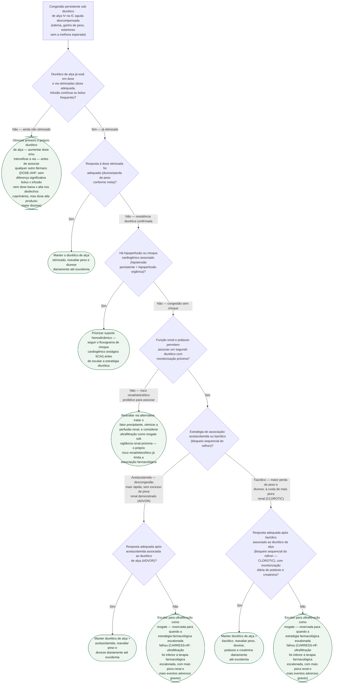

# Fluxograma: Resistência Diurética e Congestão Refratária na IC Aguda

Este fluxograma detalha, em árvore de decisão, a sequência de escalonamento que
`estrategia-diuretica-na-insuficiencia-cardiaca-aguda-descompensada.md` e
`resistencia-diuretica-na-insuficiencia-cardiaca-aguda-mecanismos-e-bloqueio-sequencial-do-nefron.md`
já descrevem em prosa — e que o fluxograma geral de IC aguda já publicado
(`fluxograma-insuficiencia-cardiaca-aguda-descompensada.md`) resume como um
único nó ("escalonar a estratégia diurética"). Aplica-se ao paciente que já
está em diurético de alça intravenoso e não está descongestionando como
esperado.

## Árvore de decisão

## O que não está numa árvore de decisão validada

**Não há corte numérico validado** de débito urinário, natriurese pontual ou
peso para decidir "resposta inadequada" — os dois documentos-fonte já
registram essa ausência de critério formal (`estrategia-diuretica-...`: "Escore
ou critério formal de quando escalar para ultrafiltração — este documento
estabelece a hierarquia... não o gatilho numérico"; `resistencia-diuretica-...`:
"não um algoritmo numérico de decisão validado"). Os nós de decisão deste
fluxograma são deliberadamente qualitativos, fiéis a essa limitação da fonte,
em vez de inventar um corte que a evidência não sustenta.

**Dose e esquema posológico** de cada fármaco (furosemida, acetazolamida,
hidroclorotiazida) não são o objeto deste fluxograma — ver os documentos
`estrategia-diuretica-na-insuficiencia-cardiaca-aguda-descompensada.md` e
`resistencia-diuretica-na-insuficiencia-cardiaca-aguda-mecanismos-e-bloqueio-sequencial-do-nefron.md`
para o que está e não está verificado sobre dose.
