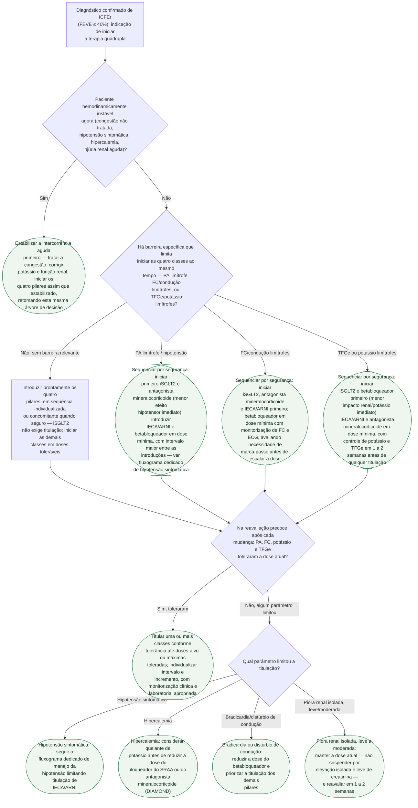

# Fluxograma: Sequenciamento e Titulação da Terapia Quádrupla na ICFEr

A diretriz atual não exige uma ordem fixa de introdução dos quatro pilares da
ICFEr (bloqueio do SRAA, betabloqueador, antagonista mineralocorticoide e
inibidor de SGLT2). A atualização focada 2023 da ESC recomenda estratégia
intensiva de início e rápida titulação da terapia baseada em evidências antes
da alta e nas primeiras seis semanas após internação por IC; o STRONG-HF não
incluiu iSGLT2 como componente obrigatório. Mas
quando o paciente tem uma barreira de segurança já visível na primeira
consulta — pressão arterial limítrofe, frequência cardíaca ou condução
limítrofes, função renal ou potássio limítrofes —, a ordem de introdução deixa
de ser indiferente: cada pilar tem um perfil de efeito adverso diferente, e
usar isso para decidir qual entra primeiro reduz a chance de suspender uma
classe por intolerância evitável.

## Árvore de decisão

## O que a árvore não mostra

**Não há corte numérico validado** de PA, FC ou TFGe que defina "limítrofe" —
a decisão é clínica, apoiada no julgamento do médico à beira do leito, não em
um escore. Onde a evidência já define um número (ex. dose inicial do enalapril
reduzida para 2,5 mg em paciente de alto risco, no CONSENSUS), isso está
registrado nos documentos de origem citados, não repetido aqui.

**Doses exatas e esquemas de titulação por fármaco** não são o objeto deste
fluxograma — consulte os documentos de cada pilar nesta pasta
(`inibicao-do-sraa-na-icfer-consensus-solvd-e-paradigm-hf.md`,
`betabloqueadores-na-icfer-a-base-de-evidencia-cibis-ii-merit-hf-e-copernicus.md`,
`antagonistas-mineralocorticoides-na-icfer-rales-e-emphasis-hf.md`,
`inibidores-de-sglt2-na-icfer-dapa-hf-e-emperor-reduced.md`).

**Interações entre barreiras simultâneas** (ex. paciente com PA limítrofe *e*
potássio limítrofe ao mesmo tempo) não são resolvidas por esta árvore — o
diagrama trata cada barreira isoladamente; a combinação exige julgamento
clínico individualizado, tipicamente priorizando a barreira de maior risco
imediato.

**Reavaliação contínua fora dos pontos marcados na árvore** — sinais de
descompensação, nova intercorrência aguda ou mudança de outro fármaco
concomitante reabrem o processo de decisão a qualquer momento, não apenas nas
consultas de 1-2 semanas representadas no diagrama.
