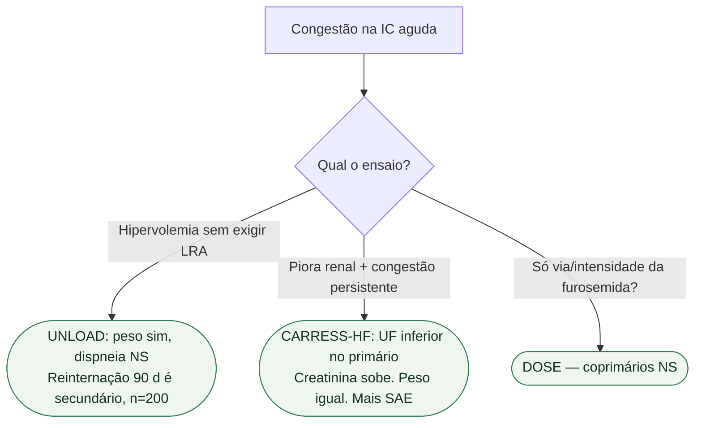

# Fluxograma: máquina versus diurético

```mermaid
flowchart TD
  R0["Congestão na IC aguda"] --> D1{"Qual o ensaio?"}

  D1 -->|"Hipervolemia sem exigir LRA"| C1(["UNLOAD: peso sim, dispneia NS<br/>Reinternação 90 d é secundário, n=200"])

  D1 -->|"Piora renal + congestão persistente"| C2(["CARRESS-HF: UF inferior no primário<br/>Creatinina sobe. Peso igual. Mais SAE"])

  D1 -->|"Só via/intensidade da furosemida?"| C3(["DOSE — coprimários NS"])

  classDef conduta fill:#eef6ef,stroke:#2f7a4f,color:#12301f;
  class C1,C2,C3 conduta;
```

## Mensagem prática

**UNLOAD tira peso; CARRESS mostra custo renal.** Não usar um para apagar o outro.
