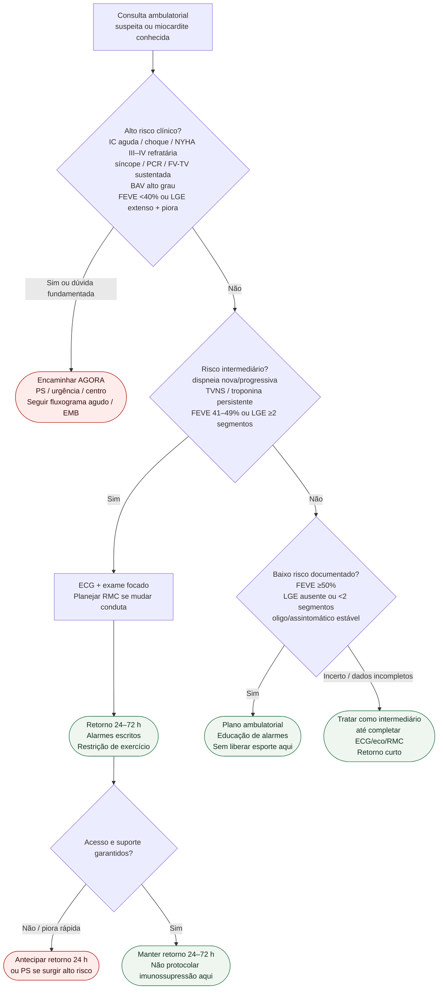

# Fluxograma ambulatorial: miocardite — risco e destino

Prosa: [`sinalizadores-ambulatoriais-miocardite-quando-encaminhar`](sinalizadores-ambulatoriais-miocardite-quando-encaminhar.md). Checklist: [`miocardite-checklist-ambulatorial-de-alarme`](miocardite-checklist-ambulatorial-de-alarme.md). Diagnóstico/EMB: [`miocardite-diagnostico-estratificacao-de-risco-e-biopsia-endomiocardica-esc-2025`](miocardite-diagnostico-estratificacao-de-risco-e-biopsia-endomiocardica-esc-2025.md).

## Árvore de decisão

## Notas

- **D1** = gate de segurança (alto risco ESC 2025).
- **D2** = intermediário → destino clínico precoce + imagem.
- **D3** = baixo risco só com dados suficientes; na dúvida, sobe para intermediário.
- Retorno ao esporte e ICI ficam fora deste fluxograma (anti-colisão).
