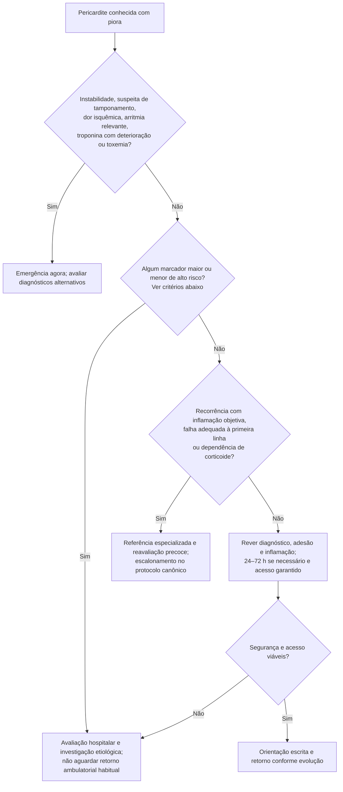

# Fluxograma ambulatorial: pericardite com piora — destino

Prosa: [[sinalizadores-ambulatoriais-pericardite-quando-encaminhar](/biblioteca/sinalizadores-ambulatoriais-pericardite-quando-encaminhar)](/biblioteca/sinalizadores-ambulatoriais-pericardite-quando-encaminhar). Checklist: [[pericardite-checklist-ambulatorial-de-alarme](/biblioteca/pericardite-checklist-ambulatorial-de-alarme)](/biblioteca/pericardite-checklist-ambulatorial-de-alarme). Escalonamento farmacológico: [[fluxograma-pericardite-recorrente-refrataria-escalonamento-terapeutico](/biblioteca/fluxograma-pericardite-recorrente-refrataria-escalonamento-terapeutico)](/biblioteca/fluxograma-pericardite-recorrente-refrataria-escalonamento-terapeutico). Tamponamento: [[fluxograma-tamponamento-cardiaco](/biblioteca/fluxograma-tamponamento-cardiaco)](/biblioteca/fluxograma-tamponamento-cardiaco).

## Árvore de decisão

## Critérios que precedem o retorno ambulatorial

Febre >38 °C, curso subagudo, derrame grande (>20 mm ao eco), tamponamento ou ausência de resposta ao AAS/AINE após tratamento adequado são marcadores maiores; acometimento miocárdico, imunossupressão, trauma e anticoagulação oral são marcadores menores. Qualquer marcador requer avaliação hospitalar e investigação etiológica; estabilidade hemodinâmica não autoriza simplesmente aguardar consulta. Derrame grande estável ou anticoagulação isolada não equivalem a tamponamento: emergência imediata depende de repercussão/instabilidade; organizar hospitalização e avaliação rápida mesmo sem choque.

Não esperar a tríade de Beck: ela é pouco sensível. Integrar sinais vitais, perfusão, pulso paradoxal, sintomas e ecocardiograma urgente quando houver suspeita. Ausência da tríade não exclui tamponamento.

Recorrência precisa de sustentação objetiva; dor isolada não justifica anti-IL-1. Confirmar adesão, dose e duração adequadas da primeira linha no protocolo canônico. Febre/toxemia exige considerar etiologia bacteriana, tuberculose e outras causas. Restringir exercício até remissão, por pelo menos um mês, com duração e retorno individualizados (ESC 2025); envolvimento miocárdico exige orientação específica. Os prazos ambulatoriais só valem na ausência de alto risco e com acesso seguro.
