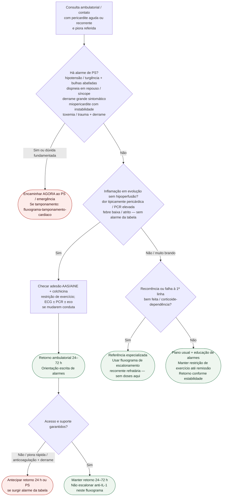

# Fluxograma ambulatorial: pericardite com piora — destino

Prosa: [`sinalizadores-ambulatoriais-pericardite-quando-encaminhar`](sinalizadores-ambulatoriais-pericardite-quando-encaminhar.md). Checklist: [`pericardite-checklist-ambulatorial-de-alarme`](pericardite-checklist-ambulatorial-de-alarme.md). Escalonamento farmacológico: [`fluxograma-pericardite-recorrente-refrataria-escalonamento-terapeutico`](fluxograma-pericardite-recorrente-refrataria-escalonamento-terapeutico.md). Tamponamento: [`fluxograma-tamponamento-cardiaco`](fluxograma-tamponamento-cardiaco.md).

## Árvore de decisão

## Notas

- **D1** = gate de segurança (tamponamento / miopericardite grave / toxemia — ESC 2025).
- **D2** = inflamação ambulatorial controlável → destino clínico precoce.
- **D3** = ponte para o pacote de escalonamento (ICAP para base de colchicina; RHAPSODY/ESC 2025 para anti-IL-1), **sem** decidir fármaco aqui.
- Não decide doses de AINE, colchicina, corticoide nem anti-IL-1.
