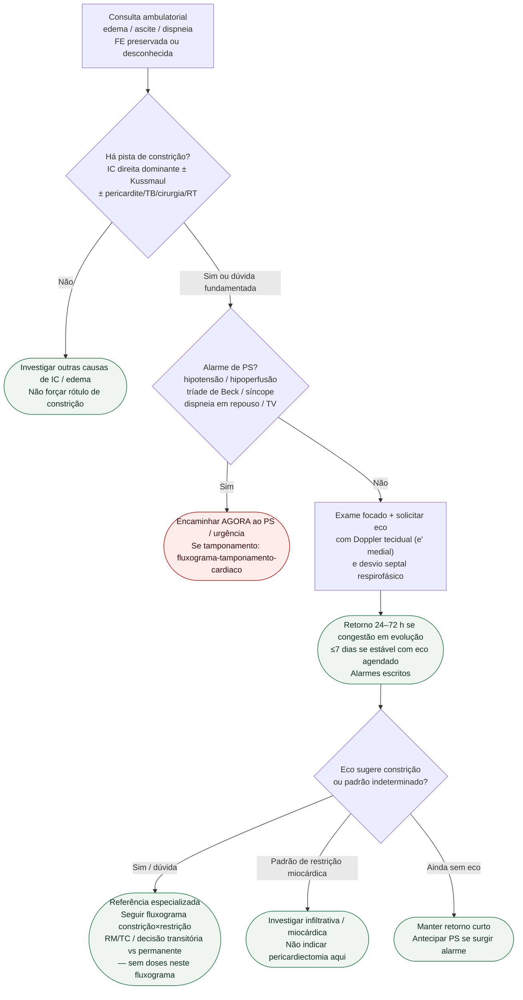

# Fluxograma ambulatorial: suspeita de constrição — destino

Prosa: [`sinalizadores-ambulatoriais-suspeita-constricao-pericardica-quando-encaminhar`](sinalizadores-ambulatoriais-suspeita-constricao-pericardica-quando-encaminhar.md). Checklist: [`constricao-pericardica-checklist-ambulatorial-de-alarme`](constricao-pericardica-checklist-ambulatorial-de-alarme.md). DD imagem: [`fluxograma-pericardite-constritiva-versus-cardiomiopatia-restritiva`](fluxograma-pericardite-constritiva-versus-cardiomiopatia-restritiva.md).

## Árvore de decisão

## Notas

- **D0** = filtro de suspeita clínica (pré-teste), não diagnóstico.
- **D1** = gate de segurança (tamponamento / choque / síncope).
- **D2** = ponte para o pacote de DD imagem já existente (e', interdependência, RM com LGE — Klein 2024 / Feng 2011 / ESC 2025).
- Não decide doses de AINE, colchicina, corticoide nem timing de pericardiectomia.
