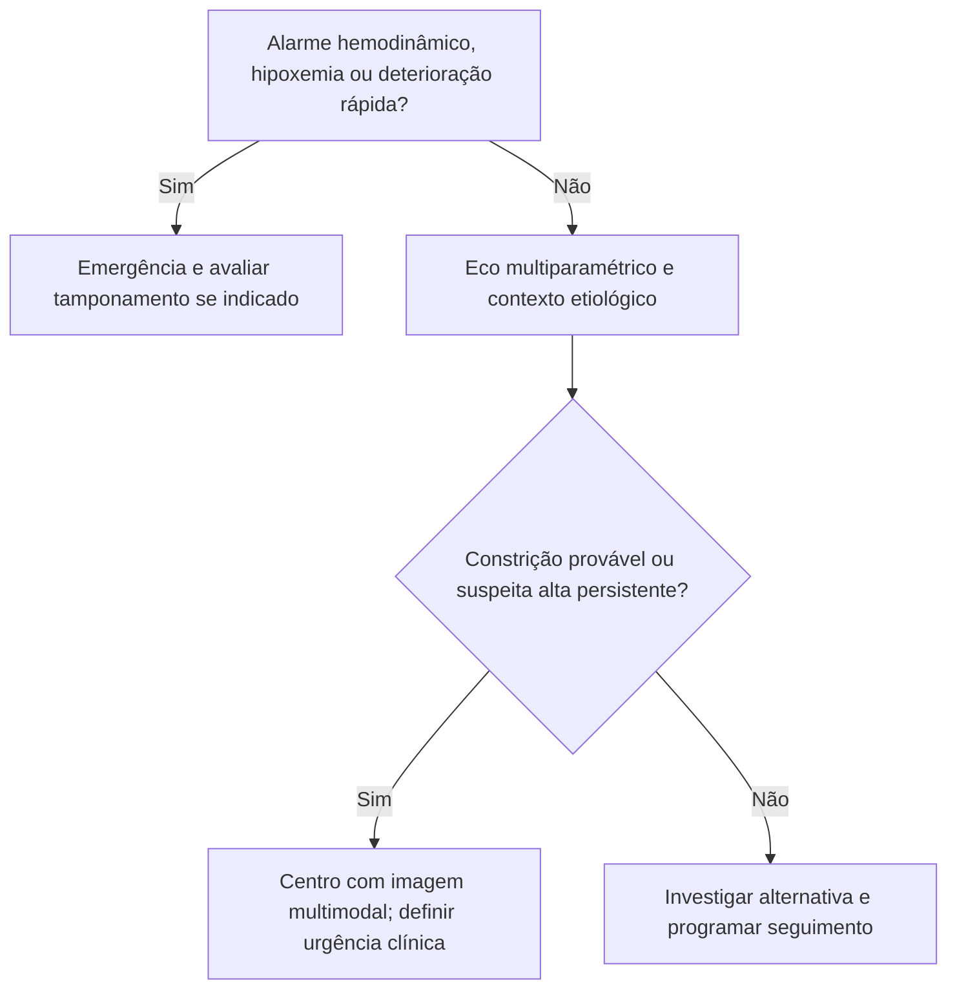

# Fluxograma ambulatorial: suspeita de constrição pericárdica — destino

Consulte o protocolo de sinalizadores do mesmo pacote para critérios e limites. Reavalie o destino após exames e diante de qualquer piora.

## Navegação

- [`sinalizadores-ambulatoriais-suspeita-constricao-pericardica-quando-encaminhar`](/biblioteca/sinalizadores-ambulatoriais-suspeita-constricao-pericardica-quando-encaminhar)
- [`constricao-pericardica-checklist-ambulatorial-de-alarme`](/biblioteca/constricao-pericardica-checklist-ambulatorial-de-alarme)
- [`fluxograma-pericardite-constritiva-versus-cardiomiopatia-restritiva`](/biblioteca/fluxograma-pericardite-constritiva-versus-cardiomiopatia-restritiva)
