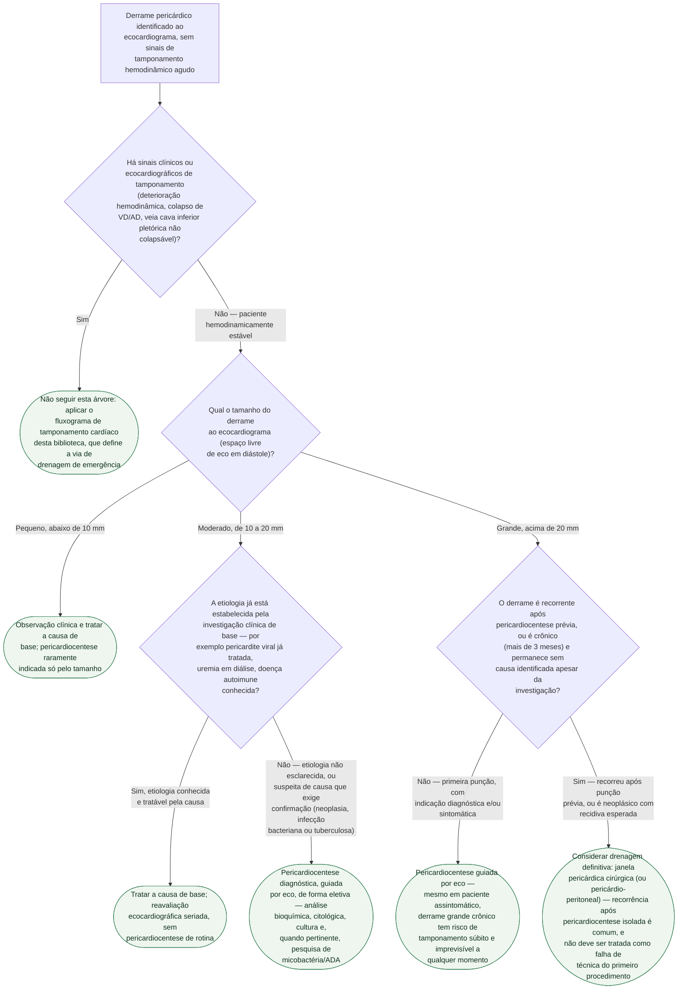

# Fluxograma: Derrame pericárdico — diagnóstico diferencial e indicação de drenagem

Este fluxograma parte do momento em que um derrame pericárdico já foi
identificado ao ecocardiograma, **sem** os sinais de tamponamento agudo que
exigem punção imediata — esse cenário de emergência já tem fluxograma próprio
nesta pasta. Aqui a pergunta é outra: **este derrame precisa ser drenado, e
se precisar, de que forma** — pericardiocentese diagnóstica eletiva,
pericardiocentese terapêutica, ou drenagem cirúrgica definitiva. O tamanho ao
ecocardiograma organiza a primeira triagem, mas não decide sozinho: um
derrame moderado com etiologia obscura pode precisar de punção diagnóstica
antes de um derrame grande de causa já conhecida e tratável.

## Árvore de decisão

## O que a árvore não mostra

**"Bem tolerado por anos" não é sinônimo de "seguro".** A coorte de
Sagristà-Sauleda mostrou que, em 28 pacientes com derrame crônico idiopático
de grande volume (mediana de 3 anos de duração ao diagnóstico), **13 eram
assintomáticos na avaliação inicial** — e ainda assim **8 (29%) evoluíram
para tamponamento cardíaco franco**, de forma inesperada, a qualquer momento
do seguimento. É esse dado que sustenta o ramo "pericardiocentese mesmo
assintomático" para o derrame grande crônico, mesmo sem etiologia definida.

**Pericardiocentese isolada resolve uma minoria dos casos de forma
definitiva.** Na mesma coorte, o derrame desapareceu ou reduziu de forma
marcante em apenas 8 dos 24 pacientes puncionados — em 11, o derrame de
grande volume **recidivou**. A pericardiectomia deve ser considerada sempre
que a recorrência acontecer, não reservada como último recurso depois de
várias tentativas de punção repetida.

**No derrame neoplásico, a escolha entre pericardiocentese e janela cirúrgica
depende do que se espera adiante, não só do primeiro episódio.** A literatura
comparativa mostra taxas de recorrência elevadas (60-100%) com
pericardiocentese isolada no derrame maligno — muitas vezes seguida de
esclerose intrapericárdica com talco ou tetraciclina para tentar reduzir a
recidiva —, enquanto a janela pericárdica cirúrgica tende a oferecer melhor
resultado de longo prazo, com a vantagem adicional de fornecer espécime para
avaliação citohistológica. A via pericárdio-peritoneal é opção quando se
deseja drenagem contínua para a cavidade abdominal.

**Suspeita de pericardite purulenta bacteriana muda a lógica da punção.**
Nesse cenário, a pericardiocentese deixa de ser só diagnóstica — ela é
também o primeiro passo de um tratamento em que a drenagem mecânica é
obrigatória, associada a antibioticoterapia empírica imediata; adiar a
punção esperando confirmação por outro exame piora o desfecho. Este
fluxograma sinaliza a suspeita de causa bacteriana/tuberculosa como
indicação de punção diagnóstica, mas a conduta específica de cada etiologia
tem documento próprio nesta pasta.

**Loculação e localização do bolsão não aparecem na árvore.** Derrame
loculado ou de difícil acesso por pericardiocentese isolada — comum no
pós-operatório de cirurgia cardíaca e em processos infecciosos avançados —
pode exigir drenagem cirúrgica de propósito, independentemente do tamanho
medido pelo eco em um único plano.
