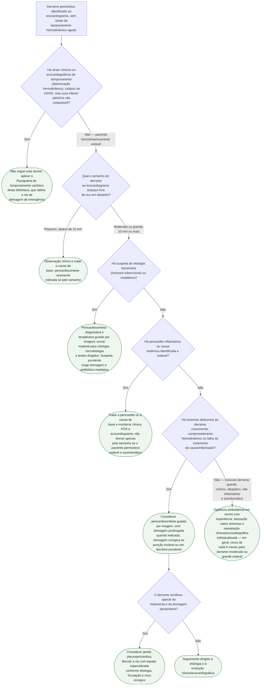

# Fluxograma: Derrame pericárdico — diagnóstico diferencial e indicação de drenagem

Este fluxograma parte do momento em que um derrame pericárdico já foi
identificado ao ecocardiograma, **sem** os sinais de tamponamento agudo que
exigem punção imediata — esse cenário de emergência já tem fluxograma próprio
nesta pasta. Aqui a pergunta é outra: **este derrame precisa ser drenado, e
se precisar, de que forma** — pericardiocentese diagnóstica eletiva,
pericardiocentese terapêutica, ou drenagem cirúrgica definitiva. O tamanho ao
ecocardiograma organiza a primeira triagem, mas não decide sozinho: um
derrame moderado com etiologia obscura pode precisar de punção diagnóstica
antes de um derrame grande de causa já conhecida e tratável.

## Árvore de decisão

## O que a árvore não mostra

**O dado histórico não autoriza drenagem rotineira.** Uma pequena coorte de
1999 encontrou tamponamento inesperado em 8 de 28 pacientes com derrame
idiopático crônico grande. Evidência observacional mais recente, resumida em
revisão de 2024, mostrou que vigilância é uma opção segura para o fenótipo
estritamente assintomático, crônico, idiopático e sem inflamação. A decisão
deve integrar sintomas, hemodinâmica, evolução, inflamação e etiologia — não
o diâmetro isolado.

**Recorrência não significa pericardiectomia automática.** A diretriz ESC
2025 recomenda considerar janela pleuropericárdica quando o derrame recidiva
apesar de tratamento apropriado. A escolha entre nova punção, drenagem
prolongada, janela ou outra abordagem depende de etiologia, loculação,
prognóstico, risco operatório e necessidade de tecido diagnóstico.

**Suspeita de pericardite purulenta bacteriana muda a lógica da punção.**
Nesse cenário, a pericardiocentese deixa de ser só diagnóstica — ela é
também o primeiro passo de um tratamento em que a drenagem mecânica é
obrigatória, associada a antibioticoterapia empírica imediata; adiar a
drenagem esperando confirmação por outro exame é inadequado. Este
fluxograma sinaliza a suspeita bacteriana/tuberculosa como indicação de
drenagem e coleta diagnóstica, mas a escolha da via e a antibioticoterapia
exigem avaliação especializada imediata.

**Loculação e localização do bolsão não aparecem na árvore.** Derrame
loculado ou de difícil acesso por pericardiocentese isolada — comum no
pós-operatório de cirurgia cardíaca e em processos infecciosos avançados —
pode exigir drenagem cirúrgica de propósito, independentemente do tamanho
medido pelo eco em um único plano.
