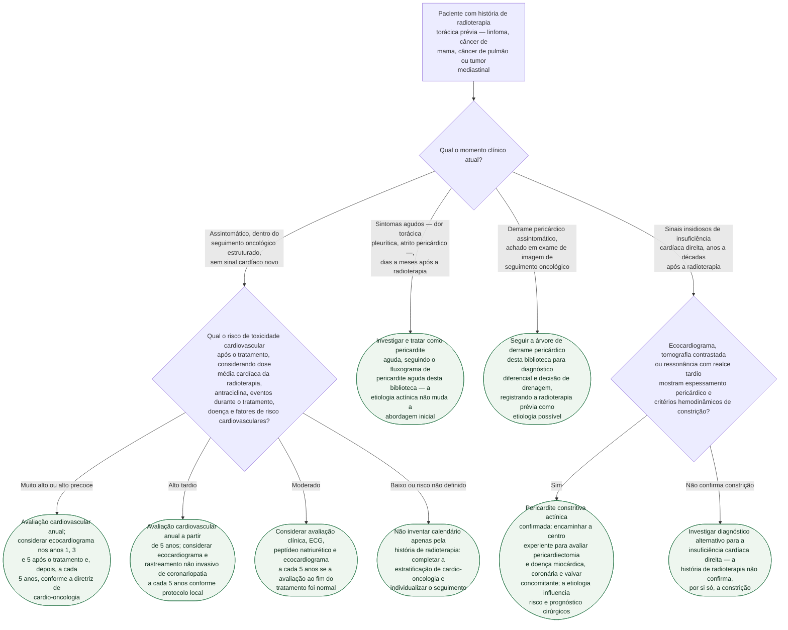

# Fluxograma: Doença pericárdica induzida por radioterapia — da fase aguda à constrição tardia

A radioterapia torácica — usada em linfoma de Hodgkin, câncer de mama
(sobretudo do lado esquerdo), câncer de pulmão e outros tumores mediastinais
— pode lesar o pericárdio em duas janelas temporais bem separadas: **dias a
meses** depois (fase aguda) ou **anos a décadas** depois (fase
crônica/tardia), muitas vezes já fora do acompanhamento oncológico ativo. O
primeiro ramo desta árvore não é uma decisão clínica diante de sintoma, mas
sim **em que momento clínico o paciente está agora** — porque é isso que
decide se a via é vigilância assintomática, tratamento de pericardite aguda,
diferencial de derrame, ou investigação de constrição tardia.

## Árvore de decisão

## O que a árvore não mostra

**O risco atual não pode ser inferido por séries históricas.** Técnicas
modernas reduziram a exposição cardíaca, mas doença pericárdica ainda pode
surgir meses a décadas depois da radioterapia. A incidência depende do campo,
da dose recebida pelas estruturas cardíacas, de terapias concomitantes e da
população; por isso, percentuais antigos não devem ser apresentados como
risco contemporâneo individual.

**A dose média cardíaca é preferível à dose prescrita.** A diretriz ESC 2022
classifica o risco tardio combinando a dose média cardíaca, a dose cumulativa
de antraciclina, eventos ocorridos durante o tratamento, doença cardiovascular
prévia e fatores de risco. Lado irradiado ou dose total prescrita, isolados,
não substituem a dosimetria cardíaca e não fornecem um corte específico para
pericardite.

**Perguntar sobre radioterapia torácica prévia é o passo mais fácil de
pular.** Em paciente com derrame pericárdico de causa não imediatamente
óbvia — sobretudo se anos ou décadas se passaram desde o tratamento
oncológico — a exposição pode nem ser mencionada espontaneamente, e o próprio
paciente pode não relacionar sintomas cardíacos atuais a um tratamento
distante. Constrição de início insidioso em ex-paciente oncológico deve
levantar a hipótese actínica mesmo sem outro fator de risco clássico para
constrição, como tuberculose ou cirurgia cardíaca prévia.

**Os critérios hemodinâmicos específicos de constrição não são repetidos
aqui.** Variação respiratória de fluxo mitral/tricúspide, septal bounce e
acoplamento ventricular seguem os mesmos critérios já publicados nos
documentos desta pasta sobre pericardite efusivo-constritiva e critérios
numéricos de constrição por imagem — não há, na literatura consultada,
particularidade validada que justifique um critério diagnóstico à parte. Isso
não torna a etiologia irrelevante: fibrose miocárdica, coronariopatia e
valvopatia actínicas podem coexistir e devem ser avaliadas antes de decidir
pericardiectomia.
