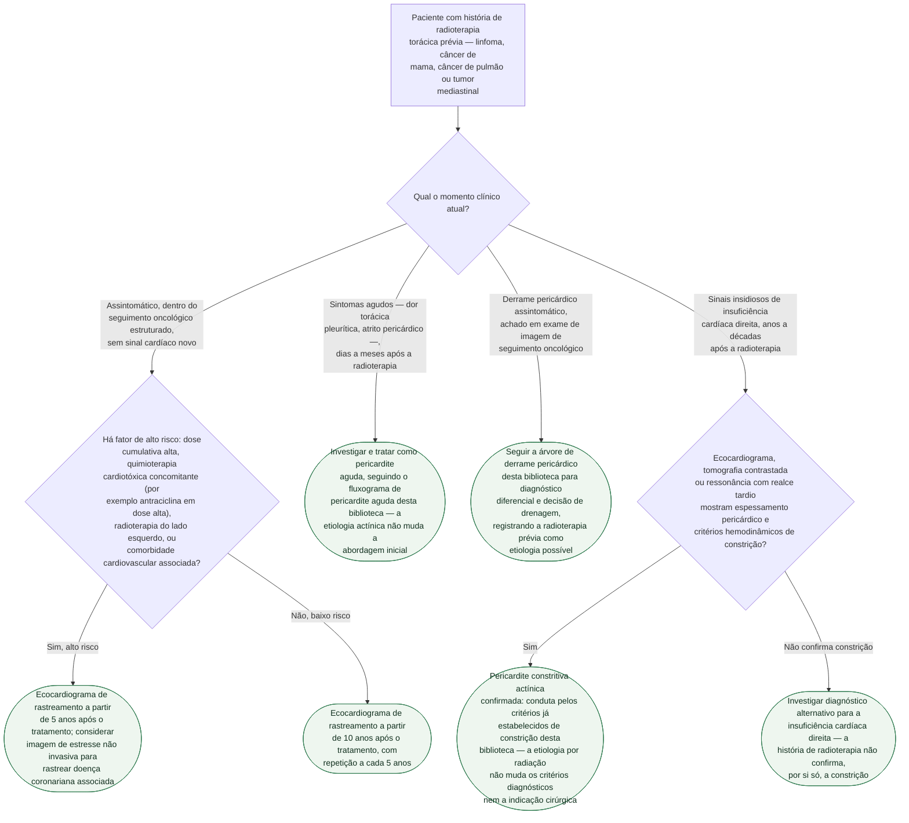

# Fluxograma: Doença pericárdica induzida por radioterapia — da fase aguda à constrição tardia

A radioterapia torácica — usada em linfoma de Hodgkin, câncer de mama
(sobretudo do lado esquerdo), câncer de pulmão e outros tumores mediastinais
— pode lesar o pericárdio em duas janelas temporais bem separadas: **dias a
meses** depois (fase aguda) ou **anos a décadas** depois (fase
crônica/tardia), muitas vezes já fora do acompanhamento oncológico ativo. O
primeiro ramo desta árvore não é uma decisão clínica diante de sintoma, mas
sim **em que momento clínico o paciente está agora** — porque é isso que
decide se a via é vigilância assintomática, tratamento de pericardite aguda,
diferencial de derrame, ou investigação de constrição tardia.

## Árvore de decisão

## O que a árvore não mostra

**Os números antigos assustam mais do que deveriam hoje.** Antes das
técnicas modernas de planejamento (blindagem cardíaca, fracionamento,
radioterapia conformada), a incidência de pericardite pós-radioterapia
chegava a cerca de 70% em pacientes tratados para linfoma e carcinoma. Nas
últimas décadas ela caiu para 6-30% — ainda assim, a doença pericárdica
continua sendo a complicação cardíaca **mais comum** da radioterapia
torácica, o que justifica manter o rastreamento estruturado mesmo com o
risco absoluto reduzido.

**Os limiares de dose citados são para doença cardíaca actínica em geral, não
específicos de pericárdio.** Doses cumulativas acima de 30 Gy e frações
diárias acima de 2 Gy aumentam o risco de RIHD (radiation-induced heart
disease) como categoria ampla; quimioterapia concomitante com antraciclina em
dose alta (450 mg/m²) associada a radioterapia do lado esquerdo eleva o risco
em até 10 vezes. A fonte consultada não fornece um corte de dose isolado só
para pericardite.

**Perguntar sobre radioterapia torácica prévia é o passo mais fácil de
pular.** Em paciente com derrame pericárdico de causa não imediatamente
óbvia — sobretudo se anos ou décadas se passaram desde o tratamento
oncológico — a exposição pode nem ser mencionada espontaneamente, e o próprio
paciente pode não relacionar sintomas cardíacos atuais a um tratamento
distante. Constrição de início insidioso em ex-paciente oncológico deve
levantar a hipótese actínica mesmo sem outro fator de risco clássico para
constrição, como tuberculose ou cirurgia cardíaca prévia.

**Os critérios hemodinâmicos específicos de constrição não são repetidos
aqui.** Variação respiratória de fluxo mitral/tricúspide, septal bounce e
acoplamento ventricular seguem os mesmos critérios já publicados nos
documentos desta pasta sobre pericardite efusivo-constritiva e critérios
numéricos de constrição por imagem — não há, na literatura consultada,
particularidade descrita para a constrição especificamente pós-radiação que
justifique um critério à parte (`VERIFICAÇÃO HUMANA NECESSÁRIA` quanto a essa
ausência de particularidade, que pode refletir apenas lacuna da fonte
revisada, não confirmação de equivalência total).
