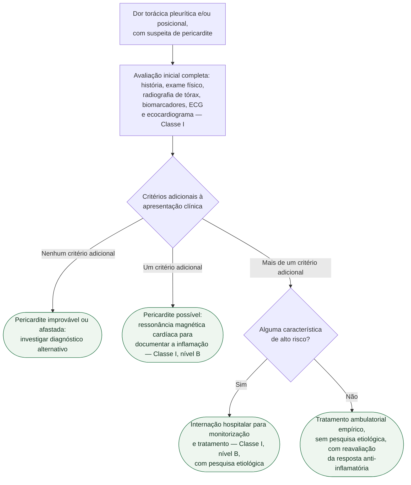
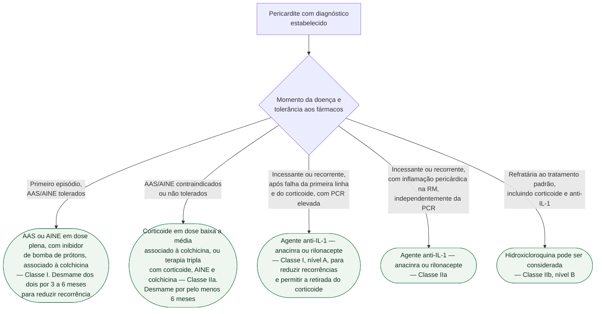

# Fluxograma: Pericardite aguda — diagnóstico, triagem e tratamento (ESC 2025)

A diretriz europeia de 2025 uniu miocardite e pericardite sob o conceito de
**síndrome inflamatória miopericárdica** e mudou duas coisas que a prática ainda
não absorveu:

1. **A colchicina é primeira linha, com Classe I e nível A** — adjuvante ao
   AAS/AINE (ou ao corticoide), para reduzir recorrências. Não é mais opção de
   segunda linha nem recurso para o caso recorrente.
2. **Os agentes anti-IL-1 passaram à frente do corticoide** na pericardite
   recorrente, também com Classe I e nível A, exatamente para permitir a
   retirada do corticoide.

## Árvore de decisão: diagnóstico e triagem

## Árvore de decisão: tratamento

## Os critérios adicionais que definem o diagnóstico

A apresentação clínica sozinha não fecha diagnóstico. O que muda a classificação
é **quantos critérios adicionais** acompanham o quadro:

- **mais de um critério adicional** → pericardite **definida**;
- **um critério adicional** → pericardite **possível**;
- **nenhum** → **improvável/afastada**.

Os critérios adicionais da pericardite são:

| Domínio | Achado |
|---|---|
| Clínico | atrito pericárdico |
| ECG | depressão de PR, supradesnivelamento difuso de ST |
| Biomarcador | elevação de proteína C reativa |
| Imagem | derrame pericárdico novo ou em piora; edema e/ou realce tardio pericárdico à RM |

Dois números da própria diretriz ajustam a expectativa clínica: **dor torácica em
cerca de 80 a 90% dos casos**, mas **atrito pericárdico em até um terço** — e o
atrito pode desaparecer quando surge derrame. Contar com o atrito para
diagnosticar é contar com o achado menos frequente dos quatro.

Vale registrar o que a diretriz diz sobre o ECG: **o pericárdio é eletricamente
silencioso**, de modo que alteração eletrocardiográfica implica inflamação
miocárdica concomitante — e obriga a investigar miocardite associada.

## As características de alto risco que indicam internação

**Maiores** (validados em análise multivariável de coorte prospectiva, com a
razão de risco entre parênteses):

- febre acima de 38 °C (HR 3,56);
- início subagudo (HR 3,97);
- derrame pericárdico grande, acima de 20 mm ao ecocardiograma (HR 2,15);
- tamponamento cardíaco (HR 2,15);
- ausência de resposta a AAS ou AINE após pelo menos 1 semana de tratamento
  (HR 2,50).

**Menores**: pericardite associada a miocardite, imunodepressão, trauma e uso de
anticoagulante oral.

Um único preditor já classifica o paciente como de alto risco: interna e
investiga etiologia. Sem nenhum deles, o caminho é ambulatorial, com tratamento
empírico e sem pesquisa etiológica — e a resposta ao anti-inflamatório funciona
como o próprio teste.

## O que a árvore de tratamento não mostra

**Corticoide como primeira opção é Classe III.** Não é apenas "evitável": a
diretriz recomenda contra, na ausência de indicação específica. As exceções
citadas são concretas — doença inflamatória sistêmica já em corticoterapia de
manutenção, síndromes pós-pericardiotomia, pericardite pós-vacinal, insuficiência
renal grave e uso concomitante de fármacos que interagem com AINE, como o
anticoagulante oral.

**Betabloqueador tem lugar sintomático**: deve ser considerado (Classe IIa) no
paciente que segue sintomático apesar do tratamento anti-inflamatório pleno e com
frequência cardíaca de repouso acima de 75 bpm.

**O desmame é parte da prescrição, não detalhe.** A colchicina é mantida por pelo
menos 3 meses no primeiro episódio e por pelo menos 6 meses nos casos
incessantes/recorrentes, e a retirada é escalonada — reduzir uma dose por semana
a cada mês, ou dose plena em dias alternados por pelo menos 3 meses seguida de
meia dose em dias alternados por mais 3 meses são esquemas descritos na própria
diretriz. Suspender tudo junto na melhora do sintoma é o erro que devolve o
paciente ao pronto-socorro.

**AAS é a escolha preferencial no paciente com doença isquêmica**; a indometacina
costuma ser reservada aos casos incessantes/recorrentes. Na função renal moderada
ou gravemente reduzida, a dose plena de AAS/AINE não se aplica — exige ajuste ou
troca por corticoide.

**Restrição de exercício acompanha todos os ramos** e por isso não aparece no
diagrama.

**Miopericardite e perimiocardite seguem o componente predominante**: quem tem
miopericardite é tratado como pericardite; quem tem perimiocardite, como
miocardite pura.
