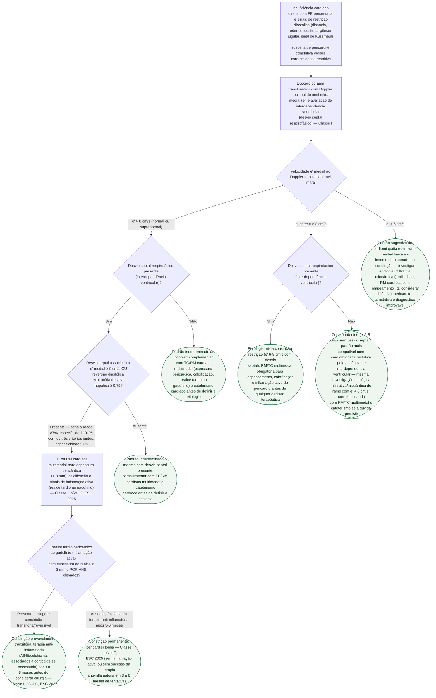

# Fluxograma: Pericardite constritiva versus cardiomiopatia restritiva — diagnóstico diferencial por imagem

As duas condições convergem para o mesmo quadro clínico — insuficiência cardíaca
direita com fração de ejeção preservada, sinais de restrição diastólica — e exigem
condutas radicalmente diferentes: pericardiectomia numa, investigação de doença
miocárdica infiltrativa na outra. A pasta já tem os números que separam as duas
(posicionamento internacional de imagem multimodal de 2024) e a conduta da
constrição confirmada (ESC 2025), mas nenhum documento os organizava como sequência
de decisão diagnóstica. Este fluxograma parte do ponto em que a suspeita clínica já
existe e o ecocardiograma inicial está indicado.

## Árvore de decisão

## O parâmetro que abre a árvore, e por quê

A **velocidade e' medial** ao Doppler tecidual do anel mitral é o achado mais
contraintuitivo do diagnóstico diferencial, e por isso está na raiz da decisão: ela
se comporta como um **gradiente contínuo e invertido** em relação ao que a maioria
espera. Na constrição pericárdica, o miocárdio está preservado e o relaxamento
diastólico é normal ou até acelerado pela pressão intrapericárdica elevada — daí
e' **alta** (> 8 cm/s). Na cardiomiopatia restritiva, o miocárdio em si está doente
(infiltrado, fibrosado), e o relaxamento é lento — daí e' **baixa** (< 6 cm/s). O
**annulus reversus** (e' medial maior que e' lateral) é o achado correlato que mais
desconcerta quem não o espera, porque inverte a relação habitual entre as duas
paredes.

## O critério ecocardiográfico combinado, e o que ele acrescenta ao e' isolado

Nenhum achado isolado fecha diagnóstico — é a mesma advertência já registrada no
documento de critérios numéricos desta pasta. Por isso a árvore não para no e'
medial: quando ele é compatível com constrição (> 8 cm/s) e há desvio septal
respirofásico, o passo seguinte é checar se esse desvio vem acompanhado de e'
medial ≥ 9 cm/s **ou** razão de reversão diastólica expiratória da veia hepática
≥ 0,79 — combinação com sensibilidade de 87% e especificidade de 91%, que sobe a
97% de especificidade quando os três fatores (desvio septal + e' ≥ 9 + reversão
hepática ≥ 0,79) coexistem no mesmo paciente.

## Por que a árvore não termina na imagem multimodal

Confirmar constrição pericárdica por TC/RM (espessura > 3 mm, calcificação, realce
tardio) não encerra a decisão terapêutica — só a diagnóstica. A ESC 2025 separa a
constrição em **transitória** (com inflamação pericárdica ativa concomitante, que
pode regredir com terapia anti-inflamatória) e **permanente** (sem inflamação
ativa, ou refratária após 3 a 6 meses de tratamento clínico otimizado), e as duas
têm recomendação própria Classe I nível C. Tratar toda constrição como cirúrgica
de saída expõe ao risco de uma pericardiectomia evitável; tratar toda constrição
como reversível sem prazo definido posterga uma cirurgia necessária.

## Armadilhas clínicas

- **Ler e' baixa como constrição grave.** É o contrário: e' **alta** (> 8 cm/s) é
  da constrição pericárdica; e' **baixa** (< 6 cm/s) aponta para cardiomiopatia
  restritiva. Inverter essa leitura troca o diagnóstico.
- **Exigir pericárdio espessado para considerar constrição.** O posicionamento
  internacional de 2024 já registrado nesta pasta mostra espessura pericárdica
  normal em até 18% dos casos com constrição comprovada em cirurgia — a ausência
  de espessamento não sai desta árvore como critério de exclusão.
- **Fechar diagnóstico por um achado isolado.** Nem o e' medial sozinho, nem o
  desvio septal sozinho: é a combinação, com os cortes numéricos específicos, que
  sustenta sensibilidade e especificidade relatadas.
- **Indicar pericardiectomia antes de avaliar inflamação ativa.** A distinção
  entre constrição transitória e permanente decide entre tratamento clínico por
  3 a 6 meses e cirurgia — pular essa etapa expõe a uma pericardiectomia evitável.
- **Aplicar os cortes de interdependência ventricular do tamponamento a este
  contexto.** São valores diferentes (30% e 60% no tamponamento, 25% e 40% na
  constrição, conforme já registrado no documento de critérios numéricos desta
  pasta) — não são intercambiáveis.
