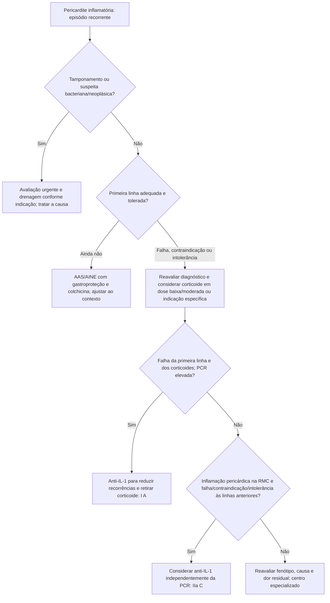

# Fluxograma: pericardite recorrente — ESC 2025

A avaliação deve confirmar atividade inflamatória e investigar causas específicas. Tamponamento, suspeita bacteriana ou neoplásica exigem abordagem própria; não devem aguardar escalada de anti-inflamatórios.

Colchicina é adjunta de primeira linha (I A); AAS/AINE com gastroproteção, I B. Corticoide não é primeira escolha sem indicação específica (III C). As decisões dependem de resposta, contraindicações, função renal/hepática e interações. Recomendação europeia de anti-IL-1 não demonstra registro dessa indicação no Brasil.

## Ensaios que sustentam a escalada

AIRTRIP (PMID 27825009) incluiu 21 pessoas com pelo menos três recorrências, PCR elevada, resistência à colchicina e dependência de corticoide. Após fase aberta, houve recorrência em 2/11 com anakinra e 9/10 com placebo. É estudo pequeno de retirada randomizada em respondedores; reações locais foram frequentes.

RHAPSODY (PMID 33200890) incluiu 86 pessoas na fase inicial e randomizou 61 respondedores após 12 semanas de run-in. Recorrência ocorreu em 2/30 com rilonacept e 23/31 com placebo; HR 0,04 (IC95% 0,01–0,18). Esses resultados não representam todos os pacientes no primeiro episódio nem um confronto direto entre os dois anti-IL-1. Reações no local de aplicação e infecções respiratórias estiveram entre os eventos mais comuns.

No derrame purulento, drenagem cirúrgica é recomendada mesmo quando punção seria tecnicamente possível. No tamponamento instável, a descompressão não deve ser adiada para testar colchicina ou anti-IL-1.

## Tudo com Tudo

- [ESC 2025: miocardite e pericardite — o que muda na porta do pericárdio](/biblioteca/esc-2025-miocardite-e-pericardite-o-que-muda-na-porta-pericardio)
- [ICAP: colchicina no primeiro episódio — não é CORP](/biblioteca/icap-colchicina-no-primeiro-episodio-nao-e-corp)
- [Tamponamento não é a pericardite do ICAP](/biblioteca/tamponamento-nao-e-pericardite-do-icap)
