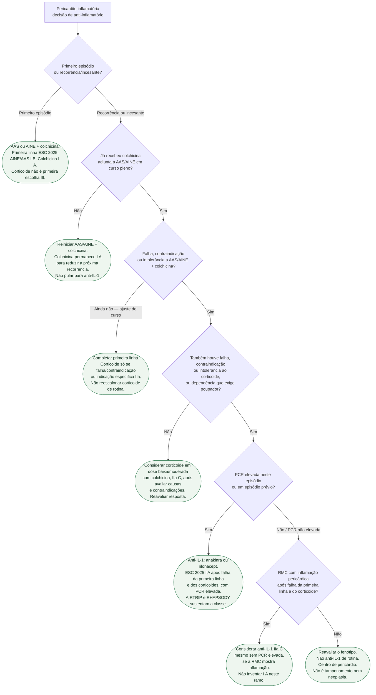

# Fluxograma: pericardite recorrente — ESC 2025, AIRTRIP e RHAPSODY

Pergunta desta árvore: **neste paciente com pericardite, a ESC 2025 (e os ensaios AIRTRIP/RHAPSODY) informam o próximo anti-inflamatório?** Folhas verdes são condutas. A lógica é qualitativa: primeiro episódio com AINE + colchicina; recorrência com a mesma primeira linha; corticoide só se falha ou contraindicação; anti-IL-1 quando há dependência de corticoide e/ou resistência à colchicina. Não copia dose da Tabela 13. Não aplica a tamponamento, a pericardite purulenta nem à neoplásica — esses ramos saem da porta interventiva.

A ESC 2015 já colocava AAS/AINE + colchicina no primeiro episódio e reservava corticoide. A ESC 2025 não reverte isso: colchicina permanece **I A** como primeira linha adjunta; AAS/AINE com IBP ficam **I B**; corticoide **não** é primeira escolha (**III C**). O que entra de novo, com classe, é o anti-IL-1 (anakinra ou rilonacept) depois da falha — sustentado por AIRTRIP e RHAPSODY, não por opinião solta.

## Árvore de decisão

## O que a árvore não mostra

**Doses.** AAS 750–1000 mg, ibuprofeno 600–800 mg, anakinra e rilonacept aparecem na Tabela 13 da ESC 2025. Esta árvore **não** as recita. Abrir o PDF antes de prescrever. Gastroproteção com IBP acompanha o AINE (recomendação **I B** de AAS/AINE com IBP). Duração típica de colchicina no primeiro episódio versus na recorrência também está na Tabela 13 — não improvisar meses.

**Corticoide.** A ESC 2025 reserva dose baixa a moderada para falha/contraindicação da primeira linha ou indicação específica (IIa C). Corticoide **não** é primeira escolha (**III C**). A folha C3 não promove o corticoide a Classe I. Desmame rápido de dose alta é exatamente o que a diretriz quer evitar.

**Anti-IL-1 não é o primeiro recorrente.** A Classe **I A** da ESC 2025 para anakinra ou rilonacept exige falha da primeira linha **e** dos corticoides **e** PCR elevada, para reduzir recorrências e permitir a retirada do corticoide. O ramo C5 (RMC positiva, PCR não elevada) é **IIa C**, não I A. Não promover rilonacept a I A no primeiro episódio nem na primeira recorrência ainda sem colchicina plena.

**Fenótipos que saem da árvore.** Tamponamento e suspeita bacteriana ou neoplásica vão para pericardiocentese (**I C**). Purulenta, para drenagem cirúrgica quando a punção não é factível (**I C**). PCIS tem tabela própria (anti-inflamatório **I B**; anti-IL-1 na PCIS refratária **I B**) — não misturar com a idiopática recorrente. Miopericardite usa colchicina em **IIa B**, não esta árvore de pericardite isolada.

## Números que cabem nas folhas C4

**AIRTRIP** (Brucato et al., *JAMA* 2016; PMID 27825009). n = 21; ≥3 recorrências, PCR elevada, resistência à colchicina e dependência de corticoide. Recorrência: **2/11** (anakinra) vs **9/10** (placebo). Ensaio pequeno de retirada randomizada — informa a classe, não a dose da Tabela 13.

**RHAPSODY** (Klein et al., *N Engl J Med* 2021; PMID 33200890; NCT03737110). 61 randomizados após run-in. Recorrência na retirada: **2/30 (7%)** rilonacept vs **23/31 (74%)** placebo. HR **0,04**; IC95% **0,01–0,18**; P<0,001. Tempo mediano até a primeira recorrência no placebo: 8,6 semanas.

A recomendação ESC não comprova registro ou indicação em bula no Brasil. Antes do uso, conferir o produto e a indicação no portal oficial da Anvisa; esta ficha não afirma aprovação brasileira para pericardite.

## Tudo com Tudo

Pericárdio · Farmacologia · Cardiomiopatias · Cardio-oncologia · Comunicação clínica.

## Limite editorial

PMID 40878297 (ESC 2025), 27825009 (AIRTRIP), 33200890 (RHAPSODY). Classe **I A** de anti-IL-1 só no ramo C4 (falha da primeira linha **e** corticoides **e** PCR elevada). C5 é **IIa C**, não I A. Doses da Tabela 13 não entram na árvore. Não se afirma registro brasileiro; consulta oficial: https://www.gov.br/anvisa/pt-br/sistemas/consulta-a-registro-de-medicamentos .
AIRTRIP e RHAPSODY selecionaram respondedores após fase aberta/run-in para a retirada randomizada; os efeitos não representam início indiscriminado em qualquer recorrência. Monitorar infecção e reações locais e avaliar contraindicações à imunossupressão.
