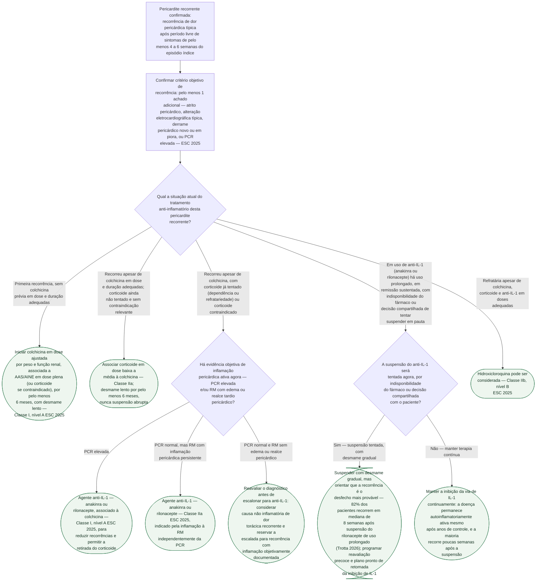

# Fluxograma: Pericardite recorrente refratária — escalonamento terapêutico (ESC 2025)

Os fluxogramas já publicados nesta pasta cobrem o diagnóstico e a primeira
linha de tratamento da pericardite aguda, e tocam de passagem no anti-IL-1 na
doença recorrente. Este fluxograma parte de onde aqueles terminam: o paciente
que **já recorreu apesar da colchicina**, e cuja pergunta deixou de ser "como
tratar o episódio" e passou a ser **"qual o próximo degrau da escalada, e até
quando mantê-lo"**. A ESC 2025 reorganizou essa escada de forma explícita —
o anti-IL-1 passou a vir **antes** do corticoide crônico, não depois dele —,
e um estudo de 2026 respondeu, pela primeira vez com número real, à pergunta
que fica em aberto quando o paciente já está estável havia anos: **o que
acontece se a droga for suspensa?**

## Árvore de decisão

## O que sustenta cada degrau da escada

**A colchicina não é resgate — é a base que precisa estar bem-feita antes de
qualquer coisa.** O ICAP (Imazio et al., NEJM 2013, PMID 23992557) é o
ensaio que consolidou a colchicina como redutora de recorrência quando
associada a AAS/AINE no primeiro episódio, e a ESC 2025 manteve essa
recomendação como Classe I, nível A. Antes de rotular alguém como
"colchicina-resistente", vale confirmar que a dose foi ajustada por peso e
função renal e que a duração — pelo menos 6 meses no episódio incessante ou
recorrente — foi de fato cumprida. Suspensão precoce, por melhora do sintoma,
é uma causa comum e evitável de "falha" que na verdade é subtratamento.

**O corticoide entra como ponte, não como destino.** A ESC 2025 o mantém como
Classe IIa para quem já esgotou colchicina + AAS/AINE, mas o texto da própria
diretriz é explícito sobre o motivo de o anti-IL-1 ter subido de posição na
escada: ele existe **especificamente para permitir a retirada do
corticoide**, não apenas como mais uma opção paralela. É por isso que a
árvore trata "já em corticoide, dependente ou refratário" como o gatilho que
abre a porta para o anti-IL-1, e não como um beco sem saída.

**Anakinra e rilonacepte têm o mesmo lugar na escada, com evidência de
ensaios diferentes.** O AIRTRIP (Brucato et al., JAMA 2016, PMID 27825009)
testou anakinra especificamente na população resistente à colchicina e
dependente de corticoide — a mesma população-alvo desta árvore — com
recorrência de 90% no grupo placebo contra 18,2% no grupo anakinra. O
RHAPSODY (Klein et al., NEJM 2021, PMID 33200890) testou rilonacepte em
desenho randomizado-com-retirada e mostrou HR 0,04 para a primeira
recorrência (recorrência bruta de 7% com rilonacepte contra 74% com
placebo). Os dois ensaios, juntos, são o motivo pelo qual a ESC 2025 deu
Classe I, nível A ao anti-IL-1 nesse cenário — não é extrapolação de
mecanismo, é replicação em dois fármacos da mesma classe.

**A pergunta que a árvore de tratamento da ESC 2025 não responde, e que este
fluxograma cobre: o que fazer quando a droga precisa parar.** Nem toda
suspensão de anti-IL-1 é escolha médica — o rilonacepte não é comercializado
em todos os países, inclusive na Itália, de onde vem a maior parte da
casuística de pericardite recorrente refratária. O estudo de Trotta et al.
(J Am Heart Assoc. 2026, PMID 42517437) acompanhou 17 pacientes que tiveram
de suspender o rilonacepte após anos de controle (duração mediana de uso
contínuo de 28 meses) e mostrou que **82% recorreram**, em mediana de 8
semanas — praticamente o mesmo intervalo do grupo placebo do RHAPSODY
original (8,6 semanas). Isso não significa "a droga falhou": significa que a
doença autoinflamatória de base permanece ativa por baixo do controle
farmacológico, e que suspensão deve vir sempre acompanhada da expectativa
explícita de recorrência precoce, não da esperança de remissão definitiva.
No mesmo estudo, a maioria dos que recorreram (8 de 14) precisou retomar a
inibição da via de IL-1; só 2 de 17 controlaram com AINE/colchicina
isolados — um lembrete de que, na doença já avançada a esse ponto, a
terapia de base isolada raramente basta.

## O que a árvore não mostra

**Restrição de exercício e vigilância de efeitos adversos acompanham todos
os ramos**, por isso não aparecem como nó — valem igualmente do primeiro
episódio ao anti-IL-1 de longo prazo.

**A escolha entre anakinra e rilonacepte não é uma bifurcação clínica
codificada em diretriz** — os dados disponíveis sugerem eficácia e segurança
semelhantes entre os dois, e a escolha na prática depende de disponibilidade
local, via de aplicação preferida pelo paciente (anakinra é diária;
rilonacepte, semanal) e custo. Por isso os dois aparecem juntos em cada nó de
conduta, e não como ramos separados da árvore.

**Reação cutânea local é o efeito adverso mais comum dos dois agentes**, quase
sempre transitória: 95,2% dos pacientes no braço ativo do AIRTRIP tiveram
reação no local da injeção, sem nenhuma descontinuação permanente por esse
motivo; o RHAPSODY relatou reação local e infecção de via aérea superior como
os eventos mais frequentes, com 4 suspensões por evento adverso já na fase de
rodagem aberta.

**A dose e a via de administração de cada fármaco não entram na árvore** —
são parâmetros de prescrição, não pontos de decisão ramificada, e variam
conforme o fármaco escolhido e a resposta individual.

O estudo de suspensão de 2026 (Trotta et al.) tem amostra pequena (n=17), é
retrospectivo, sem grupo controle, e toda a casuística vem de centros italianos
de referência. Por isso, a taxa de 82% não é estimativa populacional nem define
conduta; serve apenas como sinal exploratório de recorrência frequente e precoce
após a suspensão.
