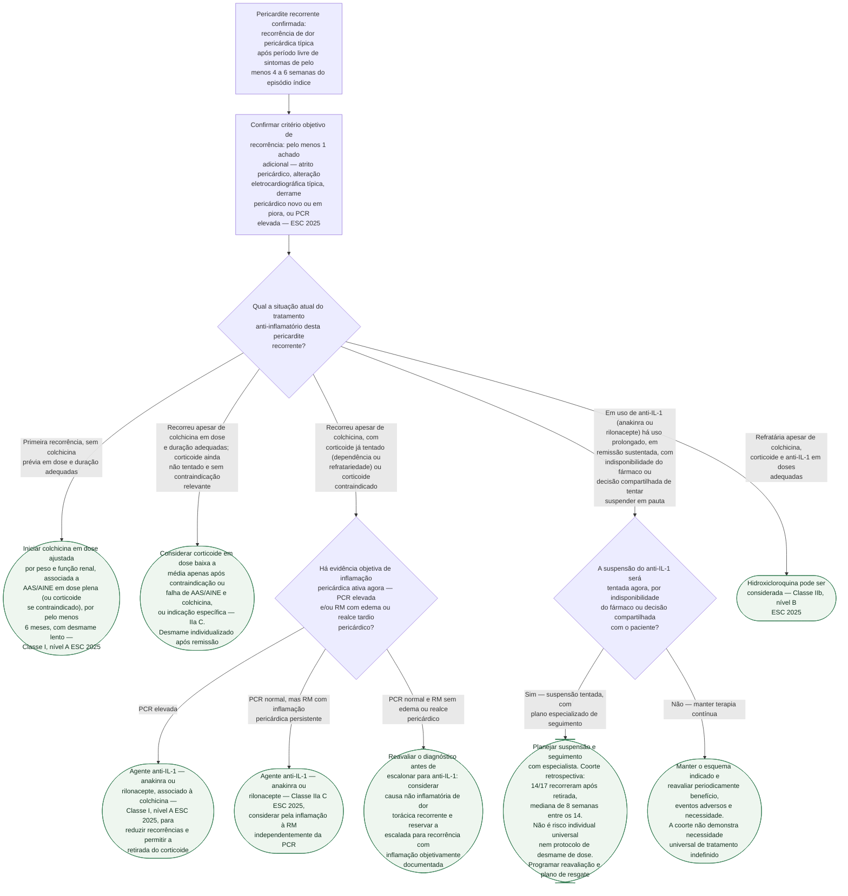

# Fluxograma: Pericardite recorrente refratária — escalonamento terapêutico (ESC 2025)

Este fluxograma aborda pericardite recorrente com resposta insuficiente ao tratamento. Antes de escalonar, confirmar atividade pericárdica, adesão, etiologia e segurança dos medicamentos. A tabela 10 da ESC 2025 distingue falha da primeira linha, indicação de corticosteroides e seleção de anti-IL-1 conforme atividade inflamatória; não estabelece anti-IL-1 universal antes de corticosteroides.

## Árvore de decisão

## Base das decisões
Colchicina é adjuvante de primeira linha (I A) e deve ser mantida por pelo menos seis meses nas recorrências, conforme tolerância e evolução. Aspirina/AINE em dose anti-inflamatória exige avaliação renal, hemorrágica e de interações, com proteção gástrica quando indicada. Corticosteroide não é primeira opção sem indicação específica; pode ser considerado após falha ou contraindicação da primeira linha (IIa C).

A ESC 2025 recomenda anti-IL-1 em pericardite recorrente após falha da primeira linha e corticosteroides, com PCR elevada (I A). Na doença incessante/recorrente com inflamação na RMC, após falha, contraindicação ou intolerância dessas terapias, pode-se considerar anti-IL-1 independentemente da PCR (IIa C). Excluir infecção relevante antes de imunomodulação. Um resultado isolado de PCR ou realce não dispensa interpretação clínica e etiológica.

AIRTRIP e RHAPSODY demonstraram menos recorrências em ensaios de retirada de pacientes selecionados que haviam respondido inicialmente. Não comparam diretamente os dois agentes nem provam que toda primeira recorrência deva receber biológico.

**Suspensão após controle prolongado.** Trotta et al. (2026, PMID 42517437) avaliaram retrospectivamente 17 pacientes italianos após interrupção do rilonacepte. Houve recorrência em 14/17; a mediana até recorrência foi 8 semanas entre os 14 que recorreram. O estudo descreve suspensão com eliminação gradual passiva do medicamento, não um esquema validado de redução progressiva de dose. Oito recorrências foram manejadas com inibição de IL-1, quatro com corticosteroides e duas com AINE/colchicina. Essa escolha observacional não compara eficácia das estratégias. Os resultados justificam seguimento e plano de resgate, sem definir terapia indefinida para todos.

## O que a árvore não mostra

**Restrição de exercício e vigilância de efeitos adversos acompanham todos
os ramos**, por isso não aparecem como nó — valem igualmente do primeiro
episódio ao anti-IL-1 de longo prazo.

**A escolha entre anakinra e rilonacepte exige individualização.** Ensaios separados não estabelecem equivalência de eficácia ou segurança. Considerar perfil clínico, contraindicações, disponibilidade e preferência, com avaliação especializada.

**Reação cutânea local é o efeito adverso mais comum dos dois agentes**, geralmente transitória: 95,2% dos pacientes no braço ativo do AIRTRIP tiveram
reação no local da injeção, sem nenhuma descontinuação permanente por esse
motivo; o RHAPSODY relatou reação local e infecção de via aérea superior como
os eventos mais frequentes, com 4 suspensões por evento adverso já na fase de
rodagem aberta.

**A dose e a via de administração de cada fármaco não entram na árvore** —
são parâmetros de prescrição, não pontos de decisão ramificada, e variam
conforme o fármaco escolhido e a resposta individual.

O estudo de suspensão de 2026 (Trotta et al.) tem amostra pequena (n=17), é
retrospectivo, sem grupo controle, e toda a casuística vem de centros italianos
de referência. Por isso, a taxa de 82% não é estimativa populacional nem define
conduta; serve apenas como sinal exploratório de recorrência frequente e precoce
após a suspensão.
