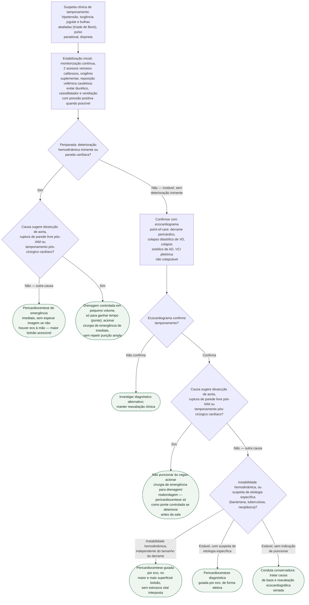

# Tamponamento cardíaco

Protocolo de conduta imediata, não de investigação diagnóstica ampla. O
gatilho é a suspeita clínica — hipotensão com turgência jugular e bulhas
abafadas (tríade de Beck), pulso paradoxal — e o que decide o próximo passo é
se o paciente está periparada e se a causa por trás do tamponamento é uma
daquelas em que puncionar às cegas pode matar em vez de salvar.

## Árvore de decisão

## O que vale para todo ramo, e por isso não está na árvore

**Reposição volêmica é ponte, não tratamento.** Em paciente hipotenso (PA
sistólica abaixo de 100 mmHg), um volume baixo — 250 a 500 mL de soro
fisiológico — costuma melhorar a hemodinâmica; volume maior arrisca aumentar
ainda mais a pressão intrapericárdica e piorar o débito cardíaco.

**Diurético intravenoso é contraindicado e pode ser fatal** no tamponamento —
não é um problema de sobrecarga de volume, é compressão mecânica, e reduzir
a pré-carga piora a fisiologia. Vasodilatador (incluindo nitrato) tem o mesmo
efeito de redução de pré-carga e deve ser evitado pelo mesmo motivo.

**Ventilação com pressão positiva reduz débito cardíaco em até 25%** no
tamponamento, por elevar a pressão intratorácica e a pressão de enchimento do
VD — evitar intubação/ventilação mecânica sempre que o paciente sustentar
respiração espontânea.

**Reavaliação contínua** do estado hemodinâmico e do ecocardiograma acompanha
qualquer ramo escolhido, inclusive depois da drenagem — reacúmulo de líquido
exige repetir a decisão.

## Técnica da pericardiocentese, e por que a via às cegas fica reservada à parada

O local de punção ideal é definido pelo ecocardiograma — o ponto em que o
espaço pericárdico está mais próximo da pele e o acúmulo de líquido é maior —
e não, por padrão, o subxifoide. A abordagem apical (1 cm lateral ao ictus,
5º a 7º espaço intercostal) é considerada a mais segura quando o eco aponta
esse trajeto.

A pericardiocentese **às cegas** (sem ecocardiograma nem fluoroscopia) tem
complicação de 15 a 20% (subxifoide, 1 cm inferior à borda xifoidal esquerda,
ângulo de 30°), contra cerca de 2% guiada por imagem — por isso ela só se
justifica em parada cardíaca ou quando não há ultrassom disponível.

## Por que dissecção de aorta e tamponamento pós-cirúrgico não vão para a punção às cegas

**Dissecção de aorta e ruptura de parede livre pós-infarto** são
contraindicação à pericardiocentese com agulha: a descompressão rápida do
pericárdio pode restaurar a pressão arterial o suficiente para reabrir a
comunicação e agravar o sangramento — mortalidade descrita em série de casos
de até 3 de 4 pacientes puncionados, contra sobrevida nos que foram direto
para cirurgia. A exceção é a drenagem controlada em pequenos volumes (5 a
10 mL por vez, mirando pressão sistólica em torno de 90 mmHg) como ponte para
o paciente que não sobrevive até a sala — estratégia temporizadora com
recomendação Classe IIa na diretriz europeia de 2015.

**Tamponamento pós-cirúrgico cardíaco** costuma ter derrame loculado,
frequentemente póstero-lateral, com coágulo ou hematoma intrapericárdico —
achados bem mais comuns nesse contexto do que no tamponamento não cirúrgico e
que tornam a punção subxifoide às cegas pouco confiável; a via é a
reabordagem cirúrgica, com drenagem guiada por imagem reservada a casos
selecionados e sem esses achados.

## Principais causas de tamponamento, em ordem de frequência

Mais comuns: neoplasia/malignidade, causa iatrogênica ou traumática,
pericardite, tuberculose (a mais comum em países em desenvolvimento). Menos
comuns: doença vascular do colágeno (lúpus, artrite reumatoide,
esclerodermia), síndrome de lesão pericárdica, infarto agudo do miocárdio,
dissecção de aorta, uremia, infecção bacteriana, pneumopericárdio. É essa
suspeita etiológica — junto da instabilidade hemodinâmica — que orienta tanto
a via cirúrgica das causas de risco quanto a indicação diagnóstica da punção
nas causas infecciosas ou neoplásicas.
