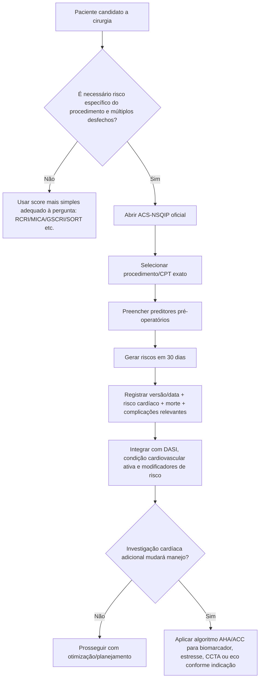

# ACS-NSQIP Surgical Risk Calculator

## Por que a Corvia não deve copiar a fórmula

O ACS-NSQIP é uma ferramenta **dinâmica**, atualizada pelo American College of Surgeons. Na consulta de 07/08/2026, a ferramenta oficial informava **versão 4.0.4** e **última atualização de parâmetros em abril de 2026**.

Ao contrário de RCRI ou SORT, não existe vantagem clínica em congelar na Corvia uma cópia local de coeficientes que podem mudar. A integração correta é:

1. abrir o calculador oficial;
2. usar os dados pré-operatórios do paciente e o procedimento/CPT correto;
3. registrar no documento os resultados relevantes, a versão/data e o endpoint;
4. não recalcular localmente um modelo antigo como se fosse a versão ACS vigente.

## O que a ferramenta estima

O ACS informa que seu modelo usa preditores do paciente e o procedimento planejado por **CPT** para estimar múltiplos desfechos em 30 dias. Entre os resultados estão:

- complicação grave;
- qualquer complicação;
- pneumonia;
- **complicação cardíaca — parada cardíaca ou IAM**;
- infecção de sítio cirúrgico;
- ITU;
- TEV;
- insuficiência renal;
- readmissão não planejada;
- retorno não planejado ao centro cirúrgico;
- morte;
- destino para instituição de reabilitação/cuidados;
- sepse;
- duração prevista de internação;
- desfechos específicos de alguns procedimentos.

## Árvore de uso

## O que não fazer

- não copiar o percentual de “qualquer complicação” e chamá-lo de risco cardíaco;
- não usar CPT aproximado sem registrar a aproximação;
- não reutilizar um resultado calculado meses antes se o procedimento/estado clínico mudou;
- não combinar matematicamente o ACS-NSQIP com RCRI, MICA ou SORT;
- não incorporar silenciosamente coeficientes de uma versão antiga em uma calculadora local.

## Proposta de integração na Corvia

Na tela de Avaliação Pré-Operatória, o ACS-NSQIP deve aparecer como **“calculador oficial externo”**, com campos opcionais para registrar:

- versão do ACS;
- data do cálculo;
- CPT/procedimento;
- risco de complicação cardíaca;
- risco de morte;
- complicação grave;
- outros desfechos relevantes.

Assim a Corvia preserva rastreabilidade sem assumir manutenção de um modelo proprietário/dinâmico.
