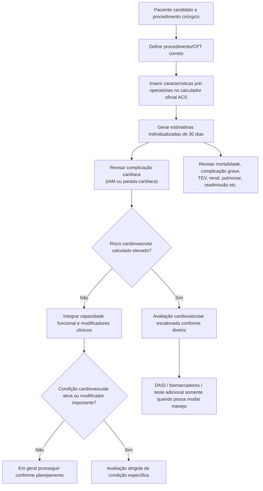

# ACS NSQIP Surgical Risk Calculator

O ACS NSQIP Surgical Risk Calculator é um modelo dinâmico mantido pelo American College of Surgeons. A versão consultada em agosto de 2026 é a **4.0.4**, com última atualização dos parâmetros em **abril de 2026**.

O modelo combina características pré-operatórias do paciente com o **procedimento planejado identificado por código CPT** e estima múltiplos desfechos em 30 dias.

## Árvore de utilização

## O que o modelo estima

A versão oficial atual estima desfechos como:

- complicação grave;
- qualquer complicação;
- pneumonia;
- complicação cardíaca (parada cardíaca ou IAM);
- infecção do sítio cirúrgico;
- TEV;
- insuficiência renal;
- readmissão não planejada;
- retorno não planejado ao centro cirúrgico;
- morte;
- destino para instituição de cuidados/reabilitação;
- tempo de internação previsto;
- outros desfechos específicos de alguns procedimentos.

## Evidência de desenvolvimento

O modelo universal original foi desenvolvido utilizando mais de **1,4 milhão de pacientes** e **1.557 procedimentos CPT**. Na publicação original, apresentou discriminação elevada para mortalidade e morbidade, com estatística C de aproximadamente **0,944 para mortalidade** e **0,816 para morbidade**.

## Por que NÃO reproduzir a fórmula dentro da Corvia

O próprio ACS informa que o calculador é atualizado periodicamente e que plataformas externas podem abrir a página oficial, mas **não permite apresentar o calculador como funcionalidade integrada nem automatizar sua funcionalidade**. Além disso, copiar coeficientes congelaria uma versão que pode ficar rapidamente desatualizada.

Portanto, a estratégia recomendada para a Corvia é:

1. explicar a metodologia e a interpretação;
2. fornecer um botão/link para abrir o calculador oficial em nova janela;
3. permitir que o médico transcreva o resultado relevante para a avaliação pré-operatória;
4. registrar no documento a versão/data do cálculo quando possível;
5. **não automatizar nem incorporar o calculador ACS dentro da plataforma**.

## Regra prática

O ACS NSQIP é mais amplo do que um escore exclusivamente cardíaco. Ele é particularmente útil para **consentimento informado e planejamento global**, enquanto RCRI, Gupta MICA, AUB-HAS2 e GSCRI têm foco cardiovascular mais específico.
