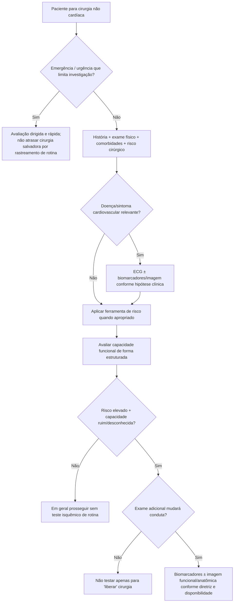
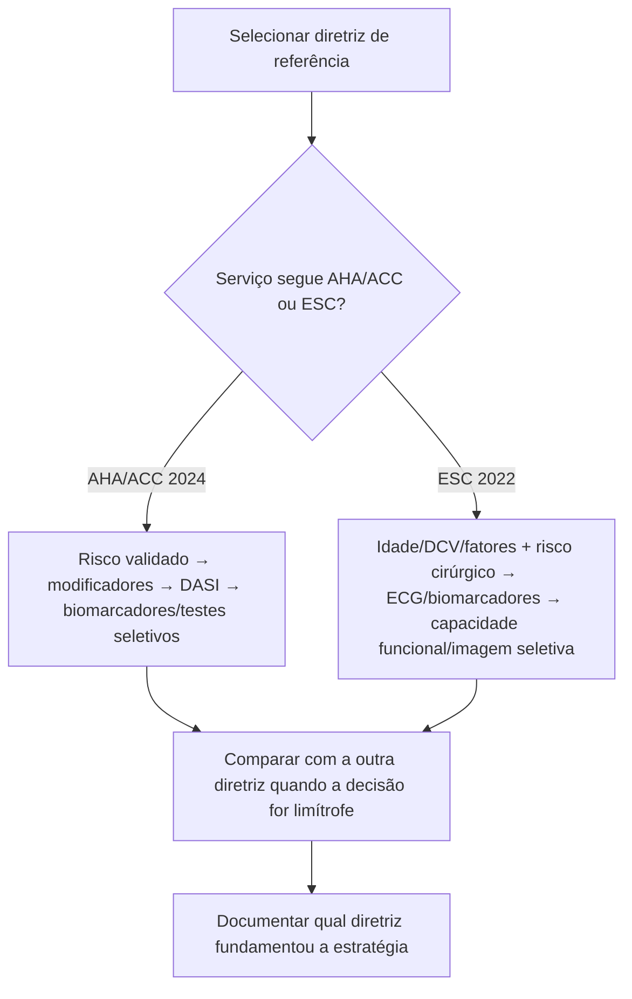

# AHA/ACC 2024 × ESC 2022

As duas diretrizes adotam a mesma ideia central: **não existe bateria universal de exames pré-operatórios**. A avaliação deve integrar risco do paciente, risco do procedimento, sintomas/doença cardiovascular estabelecida, capacidade funcional e utilidade clínica de qualquer exame adicional.

## Árvore de convergência

# Pontos em comum

## 1. Avaliação escalonada

AHA/ACC e ESC recomendam uma abordagem em etapas, começando por história, exame, presença de doença cardiovascular/sintomas e risco da cirurgia.

## 2. Capacidade funcional estruturada

Ambas incorporam o **DASI**. A ESC 2022 discute que DASI <34 se associou a maior probabilidade de morte ou IAM em 30 dias; a AHA/ACC 2024 usa **DASI ≤34** no algoritmo como capacidade funcional ruim.

## 3. Evitar teste isquêmico indiscriminado

A AHA/ACC 2024 afirma que teste de estresse deve ser reservado a pacientes selecionados com risco elevado e capacidade funcional ruim/desconhecida quando o resultado puder modificar manejo. A ESC 2022 também direciona stress imaging aos pacientes com fatores de risco clínico e capacidade funcional ruim e não recomenda stress imaging em cirurgia urgente ou situação clínica instável.

# Diferenças operacionais úteis

## ECG e biomarcadores — ESC

A ESC 2022 organiza a indicação de ECG e biomarcadores de forma fortemente relacionada à idade, presença de doença/fatores de risco cardiovascular e risco da cirurgia. Em pacientes com doença cardiovascular ou fatores de risco, incluindo idade ≥65 anos, submetidos a cirurgia intermediária/alta, a estratégia inclui ECG e biomarcadores conforme o algoritmo.

Na figura de avaliação pré-operatória da ESC:

- **hs-cTn T/I:** Classe I no grupo indicado;
- **BNP/NT-proBNP:** Classe IIa.

A ESC também enfatiza o valor de uma troponina basal para reconhecer injúria miocárdica perioperatória no pós-operatório.

## Biomarcadores — AHA/ACC

A AHA/ACC 2024 incorpora BNP/NT-proBNP e troponina na abordagem escalonada de pacientes selecionados de risco elevado, mas mantém como pergunta central se o resultado levará a avaliação ou manejo adicional.

## Ferramentas de risco

A AHA/ACC 2024 cita explicitamente ferramentas validadas como **RCRI e NSQIP** para informar a decisão. A ESC 2022 também dedica seção aos escores de risco, mas seu algoritmo gráfico inicial combina mais diretamente idade, fatores/doença cardiovascular e risco do procedimento.

# Como a Corvia deve apresentar as duas diretrizes

# O que NÃO deve acontecer

- chamar o paciente de "baixo risco" apenas porque um único escore foi baixo;
- solicitar ecocardiograma em todo paciente cirúrgico;
- pedir teste de esforço por rotina em assintomático de baixo risco;
- interpretar biomarcador elevado sem contexto clínico;
- adiar cirurgia urgente para completar investigação que não mudará a conduta imediata.

## Regra prática

**A diferença entre AHA/ACC e ESC é menos importante que o princípio compartilhado: investigação deve ser proporcional ao risco e clinicamente acionável.** A Corvia deve permitir selecionar a diretriz de referência e mostrar a árvore correspondente, sem misturar classes de recomendação entre sociedades.
