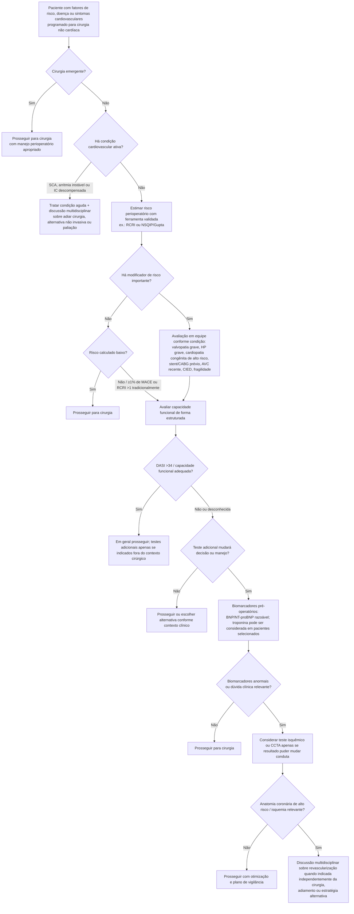

# Avaliação cardiovascular pré-operatória — abordagem escalonada

A diretriz AHA/ACC 2024 recomenda uma avaliação **escalonada**, evitando investigação cardiovascular indiscriminada. O princípio é solicitar exames adicionais apenas quando o resultado puder modificar a decisão de operar, o momento da cirurgia ou o manejo perioperatório.

## Árvore de decisão

## Limiar de risco usado na diretriz

A figura central da AHA/ACC 2024 observa que, tradicionalmente, **RCRI >1** ou risco calculado de **MACE >1%** por ferramenta perioperatória identifica risco elevado. Esse limiar deve ser interpretado em conjunto com modificadores de risco, capacidade funcional e contexto cirúrgico.

## Capacidade funcional

Para cirurgia de risco elevado, a avaliação estruturada com **Duke Activity Status Index (DASI)** é razoável. A diretriz define capacidade funcional ruim como **DASI ≤34** ou capacidade estimada **<4 METs**.

## Biomarcadores

Na figura de decisão da AHA/ACC 2024, os limiares considerados anormais são:

- troponina acima do percentil 99 do limite superior de referência do ensaio;
- BNP >92 ng/L;
- NT-proBNP ≥300 ng/L.

A mensuração de BNP/NT-proBNP é razoável antes de cirurgia não cardíaca de risco elevado em pacientes com doença cardiovascular conhecida, idade ≥65 anos, ou idade ≥45 anos com sintomas sugestivos de doença cardiovascular. Troponina pré-operatória pode ser considerada nesses mesmos grupos.

## Quando NÃO pedir teste isquêmico de rotina

Teste de estresse não deve ser usado rotineiramente em pacientes de baixo risco, com boa capacidade funcional ou submetidos a procedimentos de baixo risco. Em pacientes de risco elevado com capacidade funcional ruim ou desconhecida, pode ser considerado apenas se o resultado tiver potencial real de modificar decisão ou manejo.

## Regra prática

**O objetivo da avaliação pré-operatória não é “liberar” o paciente por meio de uma bateria de exames.** É identificar doença cardiovascular ativa, estimar risco, reconhecer modificadores de risco e solicitar apenas a investigação que possa mudar a estratégia perioperatória.
