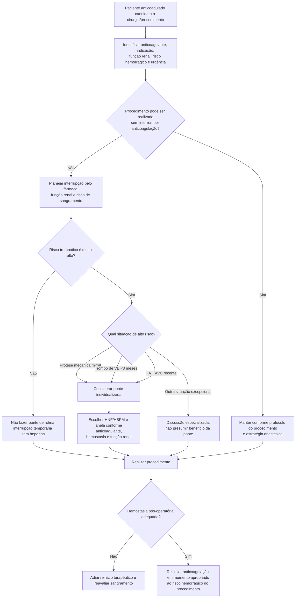

# Anticoagulação perioperatória: interromper não significa fazer ponte

A decisão perioperatória em paciente anticoagulado envolve dois riscos concorrentes:

- **tromboembolismo** quando a anticoagulação é interrompida;
- **sangramento** quando ela é mantida ou substituída por heparina durante o intervalo.

A AHA/ACC 2024 enfatiza que, para a maioria dos pacientes em anticoagulação terapêutica, a estratégia correta é **interromper temporariamente o anticoagulante quando o procedimento exigir e não realizar ponte rotineira**.

## Regra central da diretriz

Para a maioria dos pacientes em uso de DOAC ou varfarina, a ponte com heparina parenteral durante a interrupção **pode causar dano por aumentar sangramento** e não deve ser usada rotineiramente.

A exceção é o paciente com **risco trombótico muito alto**, em quem o risco da interrupção sem cobertura pode superar o risco hemorrágico.

A AHA/ACC 2024 cita explicitamente como exemplos de alto risco:

- **prótese valvar mecânica mitral**;
- **trombo de ventrículo esquerdo nos últimos 3 meses**;
- **fibrilação atrial com AVC recente**.

Nesses cenários, ponte com heparina não fracionada ou heparina de baixo peso molecular **pode reduzir risco tromboembólico** e deve ser individualizada.

## Árvore de decisão

## Por que a ponte rotineira é problemática

A ponte substitui um anticoagulante oral interrompido por anticoagulação parenteral de curta ação. Embora pareça intuitivamente protetora, em pacientes de risco trombótico baixo ou moderado ela tende a acrescentar **sangramento** sem benefício tromboembólico proporcional.

Por isso, a pergunta correta não é “o paciente usa anticoagulante, então precisa de ponte?”, mas:

> **o risco trombótico durante poucos dias sem anticoagulação é alto o suficiente para justificar o risco hemorrágico adicional da heparina?**

Na maioria dos pacientes, a resposta é não.

## DOAC versus varfarina

A estratégia de interrupção não é idêntica:

- DOACs têm meia-vida relativamente curta e, em geral, **não necessitam ponte**;
- varfarina exige tempo maior para redução e recuperação do efeito anticoagulante;
- função renal é especialmente relevante para a duração do efeito de alguns DOACs;
- procedimentos com anestesia neuraxial ou risco de sangramento de consequência grave exigem cronograma específico.

Os intervalos exatos devem ser definidos pelo fármaco, clearance renal e risco hemorrágico do procedimento; não se deve aplicar uma única janela universal a todos os anticoagulantes.

## Situações que merecem especialista/equipe multidisciplinar

- prótese mecânica;
- trombo intracardíaco recente;
- AVC/tromboembolismo recente;
- múltiplos fatores de alto risco trombótico;
- insuficiência renal avançada em DOAC;
- cirurgia com risco hemorrágico muito alto;
- anestesia neuraxial;
- cirurgia urgente que não permite aguardar eliminação do anticoagulante.

## Regra prática

**Interromper anticoagulante não cria automaticamente indicação de ponte.** A ponte deve ser reservada para risco trombótico realmente alto, porque em pacientes comuns ela acrescenta sangramento e pode piorar o balanço benefício–risco.
