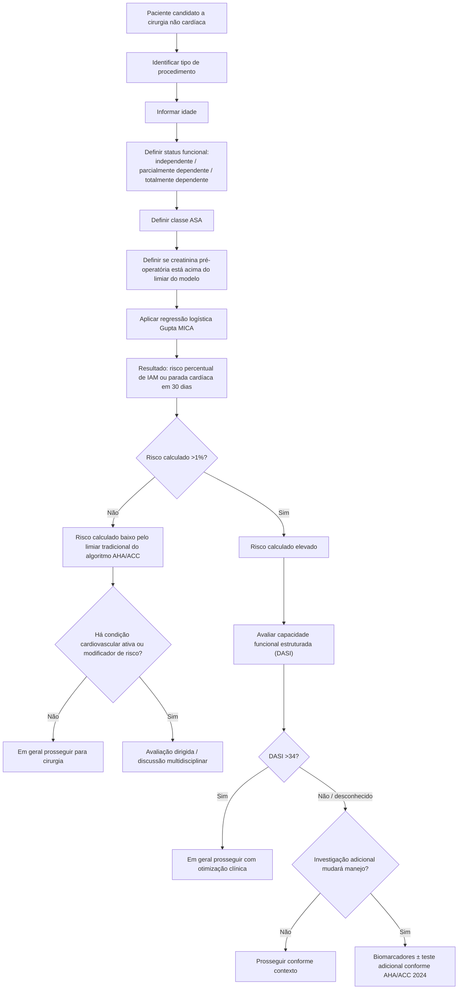

# Gupta MICA

O modelo de Gupta foi desenvolvido a partir do ACS-NSQIP para estimar a probabilidade de **infarto do miocárdio ou parada cardíaca em até 30 dias** após cirurgia. Na derivação, foram identificados cinco preditores independentes:

- tipo de cirurgia;
- status funcional dependente;
- creatinina anormal;
- classe ASA;
- idade crescente.

Na validação de 2008, o modelo apresentou estatística C de **0,874**, enquanto o RCRI aplicado à mesma base apresentou estatística C de **0,747**.

## Árvore da metodologia

## O que o resultado representa

O Gupta MICA estima um desfecho composto específico: **IAM ou parada cardíaca perioperatória em 30 dias**. Ele não estima, isoladamente, mortalidade global, AVC, insuficiência renal, complicação pulmonar ou sangramento.

## Comparação conceitual com o RCRI

- **RCRI:** soma seis fatores binários e produz classes de risco.
- **Gupta MICA:** usa regressão logística, incorpora idade, status funcional, ASA, creatinina e tipo de cirurgia e produz risco percentual individualizado.

## Observação de governança da implementação Corvia

A publicação original confirma os cinco preditores, o tamanho das coortes e o desempenho discriminatório. **Os coeficientes numéricos implementados atualmente no código da Corvia foram documentados como conferidos contra fontes secundárias reproduzindo o modelo.** Portanto, a árvore metodológica é válida, mas os coeficientes devem permanecer sujeitos a revisão humana contra a tabela/modelo original antes de serem tratados como transcrição primária definitiva.

## Regra prática

O valor percentual não substitui o restante da avaliação. Mesmo risco calculado baixo pode ser superado por doença cardiovascular ativa ou modificadores de risco importantes; risco calculado elevado deve levar à avaliação de capacidade funcional e à pergunta central: **um exame adicional realmente mudará a conduta?**
