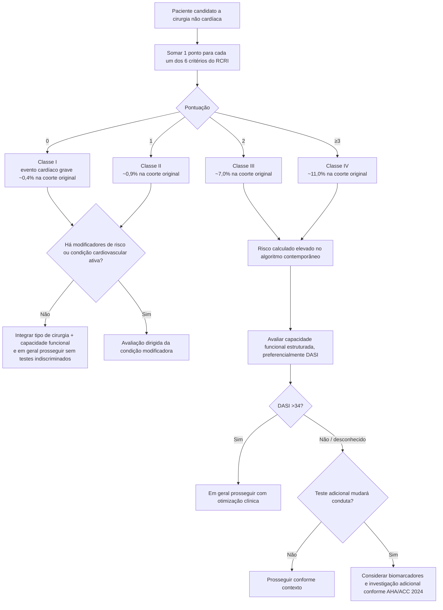

# RCRI — Revised Cardiac Risk Index

O RCRI é um escore simples de **seis variáveis binárias**, desenvolvido por Lee et al. para prever complicações cardíacas em cirurgia não cardíaca. Cada variável vale 1 ponto:

1. cirurgia de alto risco;
2. cardiopatia isquêmica;
3. insuficiência cardíaca;
4. doença cerebrovascular;
5. diabetes tratado com insulina;
6. creatinina sérica pré-operatória >2,0 mg/dL.

## Árvore de cálculo e interpretação

## Como usar hoje

A AHA/ACC 2024 mantém o RCRI entre as ferramentas validadas que podem orientar a avaliação perioperatória. Na figura de abordagem escalonada, **RCRI >1** é citado como limiar tradicional para risco elevado.

Isso não significa que RCRI ≤1 encerre automaticamente a avaliação: valvopatia grave, hipertensão pulmonar grave, cardiopatia congênita de alto risco, stent/CABG prévio, AVC recente, dispositivo cardíaco implantável e fragilidade são modificadores que podem exigir estratégia específica independentemente do número final.

## Limitações

- Não incorpora idade como variável contínua.
- Não mede capacidade funcional.
- Não discrimina bem todos os tipos cirúrgicos modernos.
- Não substitui avaliação de doença cardiovascular ativa.
- As taxas de evento acima são da coorte original; não devem ser apresentadas como probabilidade individual contemporânea exata.

## Regra prática

**RCRI é uma porta de entrada para estratificação, não uma autorização cirúrgica.** Quando o risco é elevado, o próximo passo é decidir se capacidade funcional, biomarcadores ou investigação adicional realmente modificarão o manejo.
