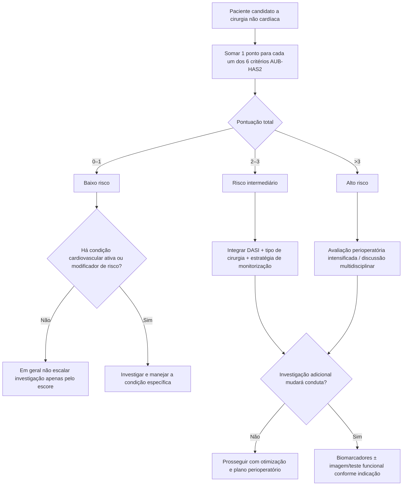

# AUB-HAS2

O AUB-HAS2 foi desenvolvido para fornecer uma estratificação cardiovascular pré-operatória simples em cirurgia não cardíaca. O desfecho primário do estudo original foi **morte, infarto do miocárdio ou AVC em 30 dias**.

Cada um dos seis elementos vale **1 ponto**:

1. história de doença cardíaca;
2. sintomas de doença cardíaca: angina ou dispneia;
3. idade ≥75 anos;
4. anemia: hemoglobina <12 g/dL;
5. cirurgia vascular;
6. cirurgia de emergência.

## Árvore de cálculo

## Risco observado no estudo original

No estudo de derivação, a incidência do desfecho primário para escores 0, 1, 2, 3 e >3 foi, respectivamente, **0%, 0,5%, 2,0%, 5,6% e 15,7%**. Na grande coorte de validação NSQIP, foi **0,3%, 1,6%, 5,6%, 11,0% e 17,5%**.

O modelo apresentou área sob a curva de **0,90** na derivação e **0,82** na validação externa.

## Como interpretar

- **0–1:** baixo risco no modelo.
- **2–3:** risco intermediário.
- **>3:** alto risco.

Essas categorias não substituem avaliação de doença cardiovascular ativa nem a estratégia escalonada das diretrizes contemporâneas.

## Por que é interessante para a Corvia

Diferentemente de modelos regressivos complexos, o AUB-HAS2 é completamente reproduzível com seis perguntas binárias e, portanto, é candidato adequado a **calculadora interativa local**, desde que o conteúdo e os testes sejam revisados antes de publicação definitiva.

## Limitações

- O desfecho inclui morte, IAM ou AVC e, portanto, não é idêntico ao desfecho do RCRI ou Gupta MICA.
- A classificação não deve ser usada para indicar teste isquêmico automaticamente.
- Cirurgias de risco intrínseco muito alto podem apresentar risco absoluto superior ao sugerido apenas pela categoria do escore.
