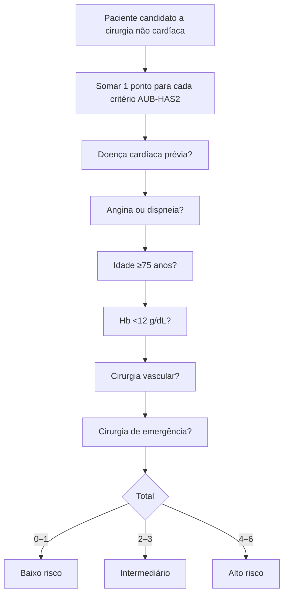
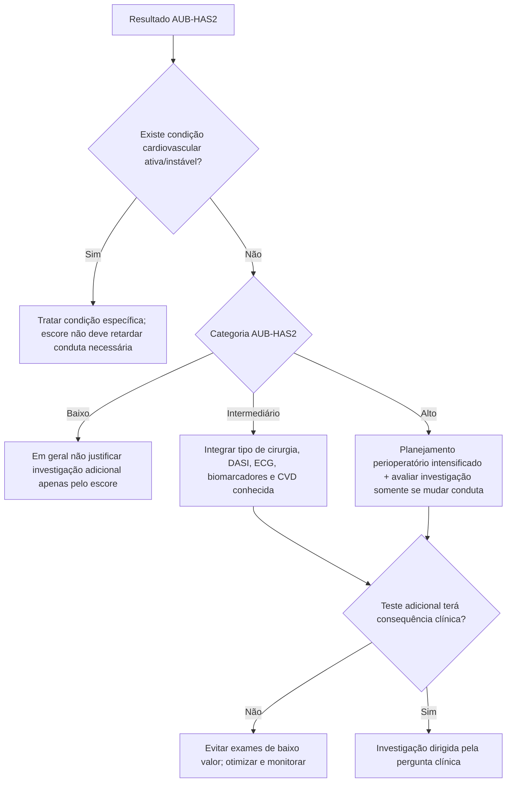

# AUB-HAS2 — índice cardiovascular pré-operatório

## O que é

O AUB-HAS2 foi desenvolvido pela American University of Beirut como índice simples para estratificar risco cardiovascular após cirurgia não cardíaca. Ele usa apenas seis elementos clínicos/laboratoriais facilmente obtidos.

Cada item vale **1 ponto**:

1. história de doença cardíaca;
2. sintomas de doença cardíaca — angina ou dispneia;
3. idade **≥75 anos**;
4. anemia, definida no modelo como **hemoglobina <12 g/dL**;
5. cirurgia vascular;
6. cirurgia de emergência.

**Escore: 0–6.**

## Classificação

- **0–1:** baixo risco;
- **2–3:** risco intermediário;
- **>3:** alto risco.

O desfecho do modelo original/validações é composto por **morte, infarto do miocárdio ou AVC em 30 dias**, portanto não é diretamente intercambiável com o endpoint do RCRI ou do Gupta MICA.

## Árvore de cálculo

## Árvore de uso clínico

## Validação

O índice foi derivado em coorte prospectiva de **3.284 pacientes** submetidos a cirurgia não cardíaca e posteriormente avaliado em grande base ACS NSQIP.

Uma validação de 2020 incluiu **1.167.278 cirurgias não cardíacas** e mostrou discriminação superior ao RCRI em múltiplos subgrupos cirúrgicos.

Subanálises também demonstraram desempenho consistente por idade, sexo e cirurgia de emergência/eletiva.

## Vantagens

- seis variáveis simples;
- não exige classificação detalhada em dezenas de tipos cirúrgicos;
- inclui anemia e emergência, variáveis clinicamente relevantes não presentes no RCRI;
- pode ser calculado rapidamente em consulta/pré-admissão.

## Limitações

1. O endpoint é diferente do RCRI/Gupta; percentuais não devem ser comparados diretamente como se fossem a mesma coisa.
2. “História de doença cardíaca” e “angina/dispneia” exigem caracterização clínica adequada.
3. O escore não incorpora diretamente capacidade funcional estruturada.
4. Alto risco não significa indicação automática de teste de isquemia.
5. Baixo risco não exclui doença cardiovascular ativa detectada por história/exame.

## Comparação conceitual com RCRI e Gupta MICA

| Método | Vantagem principal | Limitação principal |
|---|---|---|
| RCRI | Simples, histórico e amplamente conhecido | Pode subestimar alguns grupos modernos, especialmente vascular |
| Gupta MICA | Percentual individualizado, inclui idade/ASA/procedimento/status funcional | Mais complexo e dependente da categoria cirúrgica |
| AUB-HAS2 | Seis critérios simples e ampla validação | Endpoint composto diferente e menor granularidade |

A melhor prática não é “escolher o escore que dá o risco mais baixo”, mas usar uma metodologia validada adequada ao contexto e registrar suas limitações.

## Fontes verificadas

1. Dakik HA, Chehab O, Eldirani M, et al. A New Index for Pre-Operative Cardiovascular Evaluation. *J Am Coll Cardiol.* 2019;73(24):3067-3078. PMID **31221255**. DOI **10.1016/j.jacc.2019.04.023**.
2. Dakik HA, Sbaity E, Msheik A, et al. AUB-HAS2 Cardiovascular Risk Index: Performance in Surgical Subpopulations and Comparison to the Revised Cardiac Risk Index. *J Am Heart Assoc.* 2020;9(10):e016228. DOI **10.1161/JAHA.119.016228**.
3. Thompson A, Fleischmann KE, Smilowitz NR, et al. 2024 AHA/ACC perioperative guideline. *Circulation.* 2024;150:e351-e442. PMID **39316661**. DOI **10.1161/CIR.0000000000001285**.

## Status de revisão

`VERIFICAÇÃO HUMANA NECESSÁRIA`: manter a classificação de risco como suporte à decisão e não atribuir percentuais individuais não reproduzidos diretamente da tabela/coorte correspondente.
