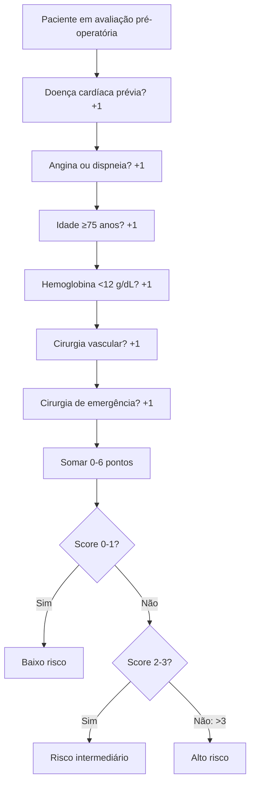
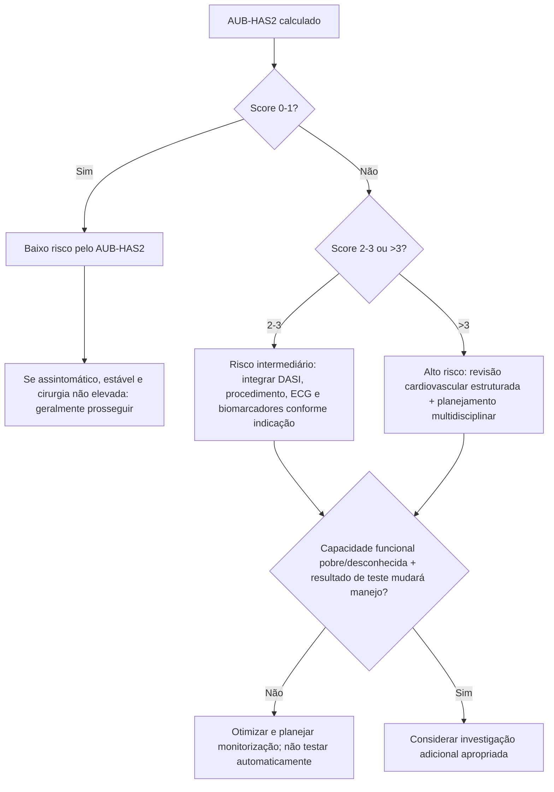

# AUB-HAS2 Cardiovascular Risk Index

## Endpoint

Prediz o risco de **morte, infarto do miocárdio ou AVC em 30 dias** após cirurgia não cardíaca.

## Componentes — 1 ponto cada

- **H**istory of heart disease: história de doença cardíaca;
- **A**ngina/dyspnea: angina ou dispneia;
- **A**ge: idade ≥75 anos;
- **A**nemia: hemoglobina <12 g/dL;
- **S**urgery vascular: cirurgia vascular;
- **S**urgery emergency: cirurgia de emergência.

Pontuação total: **0 a 6**.

## Classificação utilizada pela ESC 2022

- **0–1:** baixo risco;
- **2–3:** risco intermediário;
- **>3:** alto risco.

A ESC 2022 relata taxa pós-operatória **>10%** para escores >3.

Em análise ampla do ACS-NSQIP publicada por Dakik et al., houve aumento progressivo do composto morte/IAM/AVC conforme a pontuação; na subpopulação de cirurgia geral, o desfecho variou de aproximadamente 0,3% com score 0 para 29% com score >3. Esses números **não devem ser extrapolados como taxa universal** para todas as especialidades, pois a taxa absoluta varia conforme o procedimento.

## Árvore de cálculo

## Árvore de uso clínico

## Por que é útil

- Apenas seis variáveis, todas disponíveis na avaliação clínica/laboratorial inicial.
- Incorpora **anemia**, **sintomas** e **urgência**, ausentes do RCRI clássico.
- É listado entre os scores de risco perioperatório nas diretrizes ESC 2022 e AHA/ACC 2024.

## Limitações

- O risco absoluto varia de acordo com a especialidade cirúrgica.
- O item “história de doença cardíaca” precisa de definição consistente no formulário institucional.
- O escore estratifica risco; não prescreve isoladamente teste de estresse, CCTA, coronariografia ou cancelamento cirúrgico.
