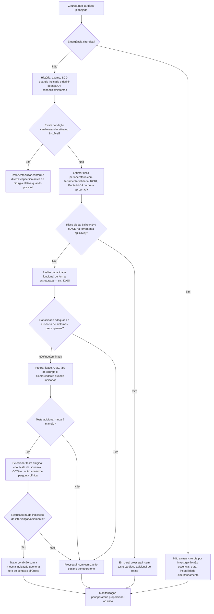
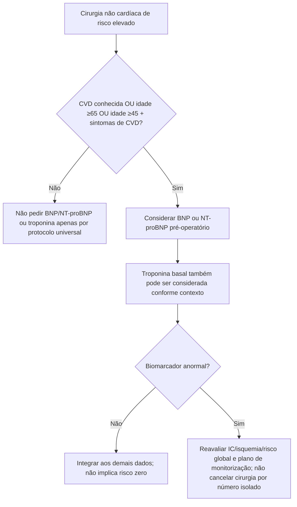
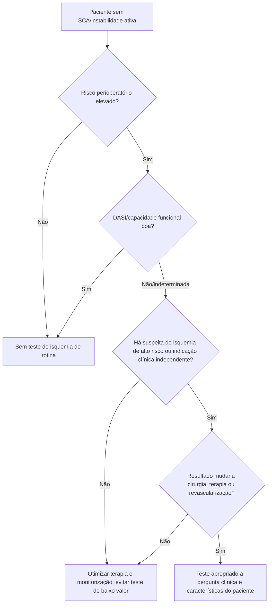

# Avaliação cardiovascular pré-operatória — ACC/AHA 2024

## Objetivo

A avaliação pré-operatória não deve ser uma bateria fixa de exames. O objetivo é identificar doença cardiovascular que:

1. modifica o risco da cirurgia;
2. precisa ser tratada independentemente da cirurgia;
3. altera o momento, local, monitorização ou técnica perioperatória;
4. ou exige decisão compartilhada entre cardiologia, cirurgia e anestesia.

A diretriz AHA/ACC 2024 recomenda uma abordagem **escalonada** e desestimula teste cardiovascular quando o resultado não mudará conduta.

## Árvore-mestre

## 1. Ferramentas de risco

A diretriz 2024 considera útil o uso de ferramenta validada em pacientes com doença cardiovascular conhecida que serão submetidos a cirurgia não cardíaca.

Entre os modelos citados estão:

- **RCRI (Lee)**;
- **Gupta/NSQIP MICA**;
- **ACS NSQIP Surgical Risk Calculator**;
- **SORT**;
- **Geriatric-Sensitive Perioperative Cardiac Risk Index**;
- **AUB-HAS2**;
- Goldman Cardiac Risk Index histórico.

### Regra da Corvia

Uma ferramenta só deve virar calculadora interativa se:

- a fórmula completa e os coeficientes puderem ser auditados na fonte primária/licença aplicável;
- as categorias cirúrgicas puderem ser reproduzidas sem aproximações ocultas;
- houver validação automática com casos de teste.

Ferramentas proprietárias/complexas sem coeficientes abertos devem ser **explicadas e vinculadas**, não reconstruídas por engenharia reversa.

## 2. Capacidade funcional: DASI em vez de “achismo”

Em cirurgia de risco elevado, avaliação estruturada da capacidade funcional, como DASI, é considerada razoável (**COR 2a, LOE B-NR** na diretriz).

A referência tradicional de baixa capacidade é **<4 METs**, mas DASI fornece medida mais estruturada. A diretriz cita DASI **≤34** associado a maior chance de morte ou IAM em 30 dias.

## 3. Biomarcadores pré-operatórios

Em pacientes submetidos a cirurgia não cardíaca de risco elevado com:

- doença cardiovascular conhecida, **ou**
- idade **≥65 anos**, **ou**
- idade **≥45 anos com sintomas sugestivos de CVD**,

é razoável medir **BNP ou NT-proBNP** antes da cirurgia para complementar a estratificação (**COR 2a, LOE B-NR**).

Na mesma população, troponina cardíaca pré-operatória **pode ser razoável** para complementar risco (**COR 2b, LOE B-NR**).

## Árvore de biomarcadores

## 4. Teste de estresse: seletivo, não reflexo

Em paciente com:

- risco perioperatório elevado por ferramenta validada;
- capacidade funcional **<4 METs ou indeterminada**;
- cirurgia de risco elevado;

um teste de estresse pode ser considerado **em pacientes selecionados**, sobretudo se existe suspeita de isquemia de alto risco e se o resultado realmente mudará manejo.

A diretriz também reforça um princípio crucial:

> Indicações para angiografia/revascularização antes da cirurgia devem ser essencialmente as mesmas que existiriam fora do contexto perioperatório.

Não se deve realizar revascularização profilática apenas para “liberar” cirurgia na ausência de indicação cardiovascular independente.

## Árvore: quando testar isquemia

## 5. ECG e ecocardiograma não são exames universais

O valor de ECG e TTE depende do risco, sintomas e doença conhecida. Ecocardiograma é particularmente útil quando há:

- suspeita de IC nova ou piora clínica;
- suspeita de valvopatia moderada/importante;
- dispneia sem explicação adequada;
- mudança clínica que possa refletir disfunção ventricular.

Repetir TTE em paciente estável apenas porque haverá cirurgia pode gerar atraso sem benefício.

## 6. O resultado final não deve ser “liberado” ou “não liberado”

Um relatório cardiovascular pré-operatório de maior qualidade deve registrar:

- procedimento e urgência;
- condições cardiovasculares relevantes;
- ferramenta(s) de risco e limitações;
- capacidade funcional estruturada;
- exames adicionais somente quando indicados;
- risco estimado e fatores modificáveis;
- recomendações de medicação/monitorização;
- necessidade de cuidado pós-operatório intensificado;
- condições que exigiriam reavaliação antes da cirurgia.

## Fontes verificadas

1. Thompson A, Fleischmann KE, Smilowitz NR, et al. 2024 AHA/ACC/ACS/ASNC/HRS/SCA/SCCT/SCMR/SVM Guideline for Perioperative Cardiovascular Management for Noncardiac Surgery. *Circulation.* 2024;150(19):e351-e442. PMID **39316661**. DOI **10.1161/CIR.0000000000001285**.
2. Correction. *Circulation.* 2024;150(21):e466. PMID **39556658**. DOI **10.1161/CIR.0000000000001298**.
3. Cohn SL. 2024 ACC/AHA guideline on perioperative cardiovascular management before noncardiac surgery: What's new? *Cleve Clin J Med.* 2025;92(4):213-219. PMID **40169218**. DOI **10.3949/ccjm.92a.24125**.

## Status de revisão

`VERIFICAÇÃO HUMANA NECESSÁRIA`: antes de codificar automaticamente caminhos de teste, auditar as Recommendation Tables completas e thresholds específicos de biomarcadores do protocolo adotado; a árvore deve apoiar, não substituir, julgamento do cardiologista/anestesista.
