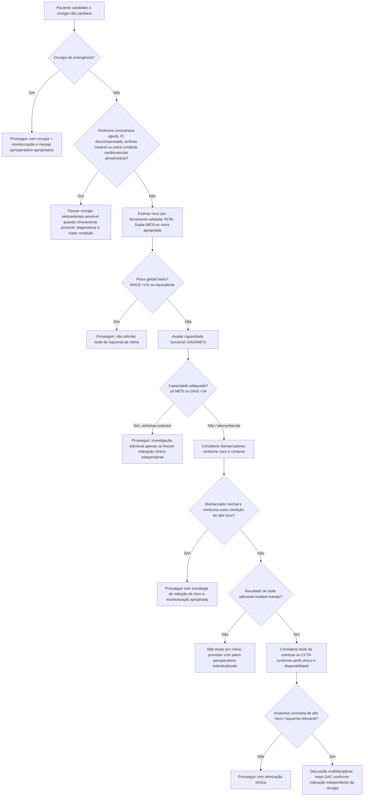
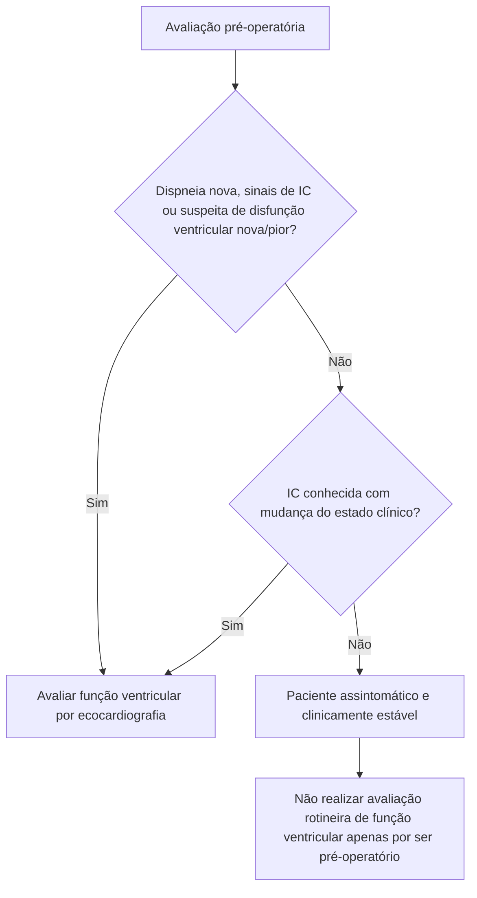

# Avaliação cardiovascular pré-operatória — algoritmo integrado

## Princípio

A avaliação pré-operatória deve responder a três perguntas, nesta ordem:

1. **Há condição cardiovascular instável que precisa ser tratada independentemente da cirurgia?**
2. **Qual é o risco combinado do paciente e do procedimento?**
3. **Um exame adicional tem probabilidade real de mudar a decisão, o tratamento ou o planejamento anestésico/cirúrgico?**

A diretriz AHA/ACC 2024 reforça que rastreamento e tratamento cardiovasculares no perioperatório devem obedecer às mesmas indicações utilizadas fora do contexto cirúrgico, evitando investigação excessiva e atraso sem benefício.

## Árvore de decisão principal

## Pontos de corte operacionais da AHA/ACC 2024

- **Risco elevado:** tradicionalmente RCRI >1 ou risco de MACE calculado >1%.
- **Capacidade funcional pobre:** <4 METs ou **DASI ≤34**.
- Biomarcadores considerados anormais no algoritmo AHA/ACC 2024: **troponina acima do percentil 99 do ensaio**, **BNP >92 ng/L** ou **NT-proBNP ≥300 ng/L**.
- Teste de estresse pode ser considerado em cirurgia de risco elevado quando coexistem capacidade funcional pobre/desconhecida e risco cardiovascular elevado por ferramenta validada.
- Teste de estresse rotineiro não é recomendado em paciente de baixo risco, procedimento de baixo risco ou paciente com capacidade funcional adequada e sintomas estáveis.
- CCTA pode ser considerada em cenário semelhante quando a detecção de anatomia coronária de alto risco puder mudar a conduta.

## Quando solicitar ecocardiograma

## Mensagem para o laudo

O risco deve ser comunicado em **termos absolutos**, quando possível, e não apenas como “baixo/moderado/alto”. A ferramenta de risco é parte da avaliação; não substitui sintomas, estado funcional, fragilidade, urgência da cirurgia, tipo de anestesia e presença de doença cardiovascular ativa.

## Limitações

- As classificações de risco cirúrgico e as recomendações específicas podem variar entre AHA/ACC, ESC e SBC.
- A decisão de adiar cirurgia tempo-sensível deve ser compartilhada com cirurgia, anestesia e equipe clínica responsável.
- Nenhum escore isolado deve determinar teste invasivo ou revascularização.
