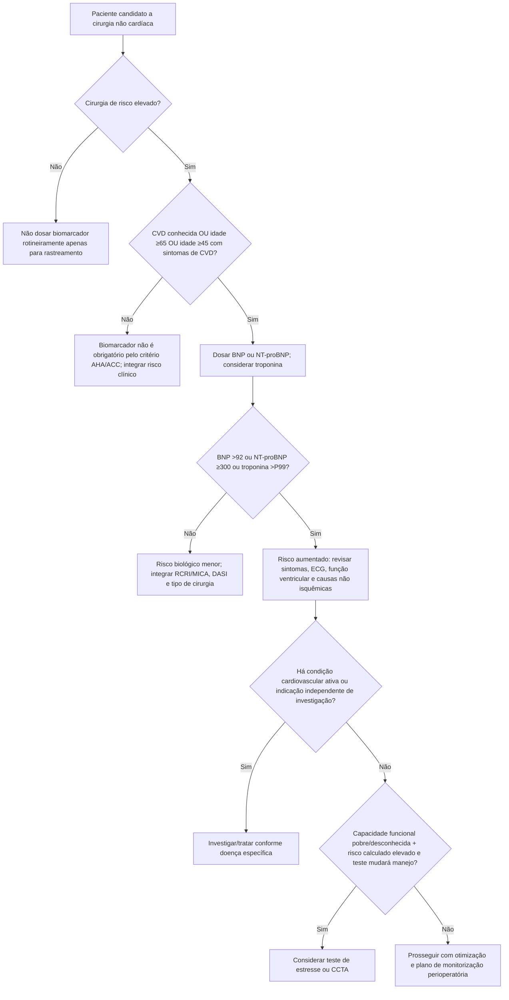

# Biomarcadores no pré-operatório

## Quem deve ser considerado para dosagem

Na AHA/ACC 2024, em pacientes submetidos a cirurgia não cardíaca de **risco elevado**, é razoável medir BNP ou NT-proBNP quando houver:

- doença cardiovascular conhecida; **ou**
- idade ≥65 anos; **ou**
- idade ≥45 anos com sintomas sugestivos de doença cardiovascular.

Nessa mesma população, a medida pré-operatória de troponina pode ser considerada para complementar a estratificação.

## Limiares usados no algoritmo AHA/ACC 2024

O algoritmo considera anormal:

- **BNP >92 ng/L**;
- **NT-proBNP ≥300 ng/L**;
- **troponina acima do percentil 99 do limite superior de referência do ensaio**.

Esses limiares são pontos operacionais do algoritmo; não substituem a interpretação do contexto clínico, idade, função renal, fibrilação atrial, IC e o método laboratorial utilizado.

## Árvore de decisão

## Evidência do NT-proBNP

Na coorte prospectiva internacional com 10.402 pacientes ≥45 anos submetidos a cirurgia não cardíaca com internação, valores pré-operatórios de NT-proBNP se associaram de modo escalonado ao composto de morte vascular e MINS em 30 dias:

- <100 pg/mL: referência;
- 100 a <200 pg/mL: incidência do desfecho primário **12,3%**;
- 200 a <1500 pg/mL: **20,8%**;
- ≥1500 pg/mL: **37,5%**.

A mortalidade por todas as causas em 30 dias também aumentou de **0,3%** (<100 pg/mL) para **4,0%** (≥1500 pg/mL).

## O que um biomarcador elevado NÃO significa

- Não significa automaticamente DAC obstrutiva.
- Não é indicação automática de coronariografia.
- Não deve gerar teste de estresse se o resultado não tiver potencial de alterar conduta.
- Ele sinaliza risco e deve levar a uma avaliação clínica mais cuidadosa, incluindo causas de estresse miocárdico/hemodinâmico além de isquemia.

## Vigilância pós-operatória

A AHA/ACC 2024 admite vigilância com troponina em 24 e 48 horas após cirurgia de risco elevado em pacientes selecionados com doença cardiovascular, sintomas de CVD ou idade ≥65 anos associada a fatores de risco cardiovasculares.
