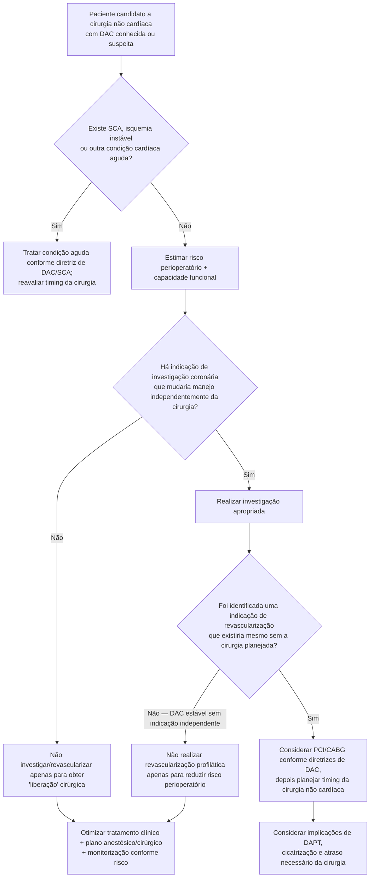

# CARP — Coronary Artery Revascularization Prophylaxis

O CARP é um dos estudos fundamentais para evitar uma estratégia historicamente comum: detectar doença coronariana estável no pré-operatório e realizar PCI/CABG **apenas para tentar reduzir o risco da cirurgia vascular**.

O estudo testou diretamente essa hipótese.

## Desenho

Em 18 centros Veterans Affairs, pacientes com risco cardiovascular aumentado e doença coronariana clinicamente significativa que seriam submetidos a cirurgia vascular eletiva foram randomizados para:

- **revascularização coronária antes da cirurgia vascular**; ou
- **não realizar revascularização profilática** antes da cirurgia.

Dos 5.859 pacientes avaliados para operações vasculares, **510** preencheram critérios e foram randomizados.

As indicações de cirurgia vascular foram:

- aneurisma de aorta abdominal em expansão: **33%**;
- doença arterial oclusiva de membros inferiores: **67%**.

No grupo revascularização, **59%** foram tratados com PCI e **41%** com cirurgia de revascularização miocárdica.

## Resultados principais

A estratégia de revascularização atrasou a cirurgia vascular:

- mediana até a cirurgia vascular: **54 dias** no grupo revascularização;
- **18 dias** no grupo sem revascularização;
- **P<0,001**.

Após mediana de 2,7 anos:

- mortalidade após estratégia de revascularização: **22%**;
- sem revascularização profilática: **23%**;
- RR **0,98**; IC95% **0,70–1,37**; P=0,92.

IAM pós-operatório em até 30 dias da cirurgia vascular:

- revascularização: **12%**;
- sem revascularização: **14%**;
- P=0,37.

Portanto, em pacientes selecionados com **sintomas cardíacos estáveis**, a revascularização coronária profilática antes de cirurgia vascular não melhorou desfechos de longo prazo nem reduziu significativamente o IAM perioperatório.

## Árvore de decisão

## O que o CARP não significa

O estudo **não demonstra** que revascularização coronária nunca deve ser feita antes de cirurgia não cardíaca.

A interpretação correta é:

- **não criar uma indicação de PCI/CABG exclusivamente por causa da cirurgia**;
- se o paciente possui uma indicação coronária legítima e independente — por síndrome coronariana aguda, anatomia/prognóstico ou sintomas conforme as diretrizes vigentes — essa condição deve ser tratada por seus próprios méritos;
- após PCI/CABG, o novo problema passa a incluir timing cirúrgico, antiagregação e risco de interrupção da terapia antitrombótica.

## Limitações e aplicabilidade

- O CARP estudou pacientes selecionados para **cirurgia vascular eletiva** e com DAC estável suficiente para randomização.
- Populações coronarianas de risco extremo não devem ser extrapoladas mecanicamente do ensaio.
- Técnicas de PCI, stents, terapia antitrombótica e prevenção cardiovascular evoluíram desde 2004.
- O princípio do estudo, entretanto, permanece incorporado na estratégia contemporânea: **indicar revascularização pelas mesmas razões pelas quais seria indicada fora do contexto cirúrgico**.

## Regra prática

**Não transforme uma cirurgia programada em indicação de revascularização coronária.** Trate a DAC conforme sua indicação própria; a avaliação perioperatória deve evitar tanto subtratamento de doença ativa quanto procedimentos profiláticos sem benefício demonstrado.
