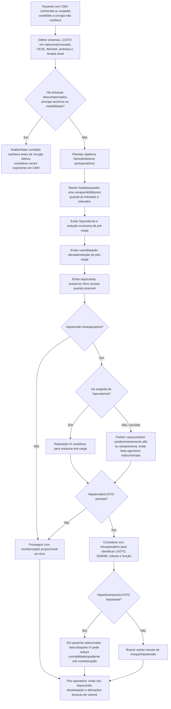

# Cardiomiopatia hipertrófica com LVOTO no perioperatório

Na cardiomiopatia hipertrófica obstrutiva, o gradiente da via de saída do ventrículo esquerdo é **dinâmico**. Pode piorar rapidamente com:

- redução de pré-carga;
- redução de pós-carga;
- aumento de contratilidade;
- taquicardia;
- perda de ritmo sinusal.

Por isso, o manejo perioperatório não deve seguir reflexivamente estratégias usadas para outras causas de hipotensão ou congestão.

## Árvore de decisão

## Terapia crônica

A diretriz perioperatória recomenda **continuar betabloqueadores e/ou bloqueadores de canal de cálcio não diidropiridínicos** usados para CMH, evitando interrupção desnecessária.

Na CMH obstrutiva sintomática, a diretriz específica de CMH considera betabloqueadores não vasodilatadores a primeira linha; verapamil/diltiazem são alternativas em pacientes apropriados.

## Quatro objetivos hemodinâmicos

### 1. Preservar pré-carga

Hipovolemia e diurese excessiva podem reduzir o volume ventricular e **aumentar o gradiente de LVOTO**.

Isso não significa “dar volume sempre”: sobrecarga também pode causar congestão. O objetivo é **euvolemia**, com correção de hipovolemia quando presente.

### 2. Preservar pós-carga

Vasodilatação abrupta reduz pressão sistêmica e pode intensificar a obstrução dinâmica.

Em hipotensão associada a CMH obstrutiva, a diretriz favorece vasoconstritores sem efeito beta-adrenérgico predominante, citando **fenilefrina ou vasopressina** como exemplos.

### 3. Evitar aumento de contratilidade

Inotrópicos beta-adrenérgicos podem piorar o gradiente em LVOTO. Se a hipotensão for decorrente de obstrução dinâmica, “mais inotropismo” pode piorar o problema.

### 4. Evitar taquicardia e preservar ritmo sinusal

Taquicardia reduz enchimento diastólico; perda da contração atrial pode ser mal tolerada em ventrículo rígido/hipertrófico. Dor, hipovolemia, anemia, hipóxia e arritmias devem ser tratadas rapidamente.

## Eco intraoperatório

Se houver hipotensão inexplicada ou refratária, ecocardiografia intraoperatória pode ajudar a diferenciar:

- LVOTO dinâmica;
- hipovolemia;
- disfunção ventricular;
- SAM com insuficiência mitral;
- outras causas de instabilidade.

Essa distinção é crucial porque tratamentos hemodinâmicos podem ser opostos.

## Monitorização

Em CMH obstrutiva de maior risco, podem ser considerados:

- pressão arterial invasiva;
- acesso venoso/monitorização hemodinâmica conforme porte da cirurgia;
- disponibilidade de ecocardiografia intraoperatória;
- pós-operatório monitorizado ou terapia intensiva em casos selecionados.

Não existe indicação universal de monitorização invasiva para todos os pacientes com CMH.

## Regra prática

**Na CMH obstrutiva, a pergunta diante da hipotensão é “o gradiente aumentou?” antes de simplesmente aumentar inotropismo ou reduzir mais a pós-carga.** Preserve pré-carga, pós-carga e ritmo; limite taquicardia e contratilidade excessiva; use imagem quando a fisiologia não estiver clara.
