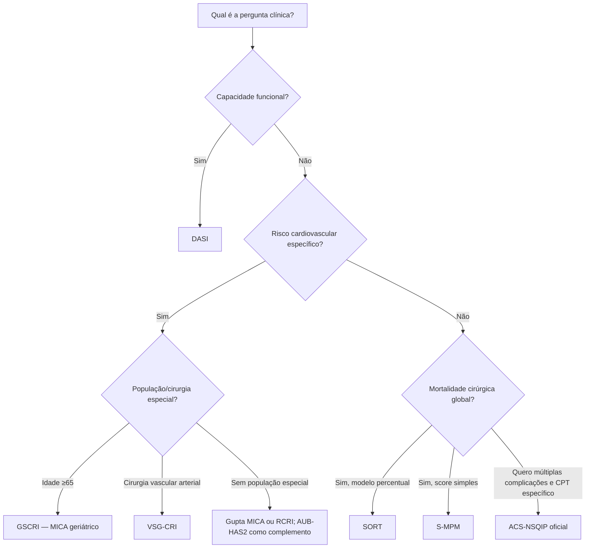
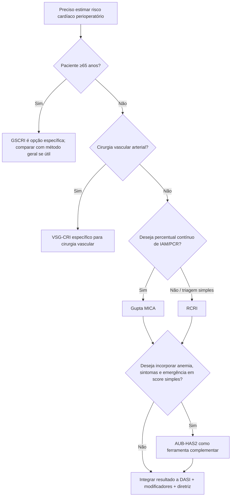

# Qual metodologia usar?

Não existe um “melhor score” universal. Antes de calcular, definir **qual pergunta se deseja responder**.

## Árvore principal

## Segunda árvore: qual score cardiovascular?

## O que cada ferramenta responde

| Ferramenta | Pergunta | Saída principal |
|---|---|---|
| RCRI | risco cardíaco clássico | 0–6 pontos / classes |
| Gupta MICA | IAM ou PCR | percentual individual |
| GSCRI | IAM/PCR no paciente ≥65 anos | percentual individual |
| VSG-CRI | complicações cardíacas em cirurgia vascular arterial | pontos/categoria |
| AUB-HAS2 | morte/IAM/AVC | 0–6 pontos/categoria |
| DASI | capacidade funcional | 0–58,2 pontos |
| SORT | mortalidade global em 30 dias | percentual individual |
| S-MPM | mortalidade global em 30 dias | 0–9 pontos/classes |
| ACS-NSQIP | múltiplas complicações por procedimento | vários riscos percentuais |

## Regras de segurança

1. **Não somar scores diferentes.**
2. **Não fazer média dos percentuais.**
3. Sempre identificar endpoint e horizonte temporal.
4. O score não prevalece sobre SCA, IC descompensada ou arritmia instável.
5. Teste adicional só deve ser solicitado quando puder mudar manejo.
6. DASI/fragilidade podem modificar a interpretação mesmo quando o risco numérico parece baixo.

## Sugestão para a interface Corvia

A tela pode apresentar dois eixos separados:

- **Risco cardiovascular:** RCRI, MICA, GSCRI/VSG-CRI/AUB-HAS2 conforme indicação.
- **Risco cirúrgico global:** SORT/S-MPM/ACS-NSQIP.

O DASI deve ficar entre os dois como **modificador funcional**, não como “mais um risco percentual”.
