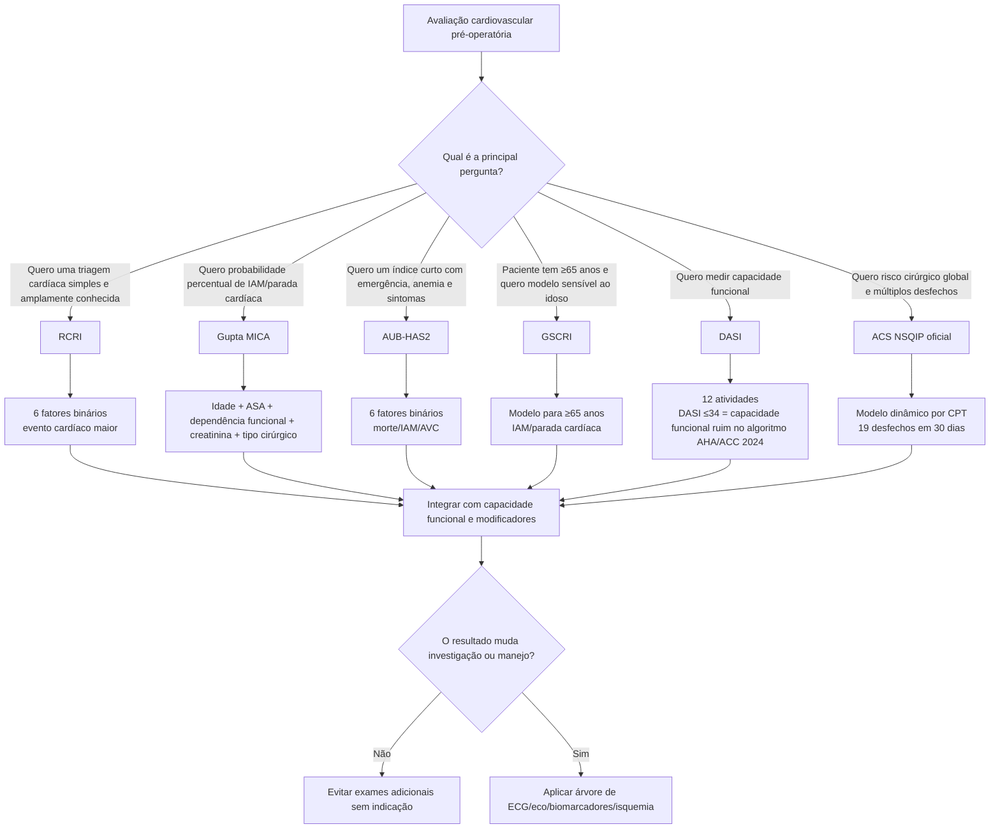

# Seleção da metodologia de risco

Nenhuma ferramenta responde todas as perguntas do pré-operatório. O primeiro passo é definir **qual desfecho se deseja estimar** e qual população está sendo avaliada.

## Árvore de seleção

## Comparação resumida

| Método | Principal saída | Pontos fortes | Limitação central |
|---|---|---|---|
| **RCRI** | classes/pontos | simples, histórico, amplamente conhecido | pouca granularidade e não inclui idade/capacidade funcional |
| **Gupta MICA** | % IAM/PCR em 30 dias | individualização maior; inclui cirurgia e status funcional | implementação depende de regressão/categorias cirúrgicas |
| **AUB-HAS2** | baixo/intermediário/alto | seis perguntas simples; inclui emergência, anemia e sintomas | desfecho inclui AVC, diferente de outros modelos |
| **GSCRI** | risco IAM/PCR | específico para ≥65 anos | equação completa deve ser validada antes de cálculo local |
| **DASI** | 0–58,2 | capacidade funcional estruturada e recomendada em diretriz | não é escore de MACE; não diagnostica isquemia |
| **ACS NSQIP** | múltiplos riscos em 30 dias | amplo, procedimento-específico, atualizado | ferramenta externa/dinâmica; não deve ser automatizada na Corvia |

## Recomendação operacional para a função Corvia

Uma avaliação completa pode apresentar **mais de um eixo**, sem somar escores entre si:

1. **Risco cardiovascular:** RCRI e/ou Gupta MICA; AUB-HAS2 como alternativa complementar.
2. **Capacidade funcional:** DASI.
3. **Paciente idoso:** destacar GSCRI como metodologia geriátrica quando ≥65 anos.
4. **Risco cirúrgico global:** abrir ACS NSQIP oficial quando desejado.
5. **Modificadores de risco:** tratados fora dos escores por árvore clínica.

## Regra prática

**Não fazer média entre escores e não escolher o maior ou menor valor como “verdade”.** Cada modelo tem população, desfecho e variáveis diferentes. Divergência entre métodos é informação clínica que deve motivar revisão dos fatores responsáveis pela diferença.
