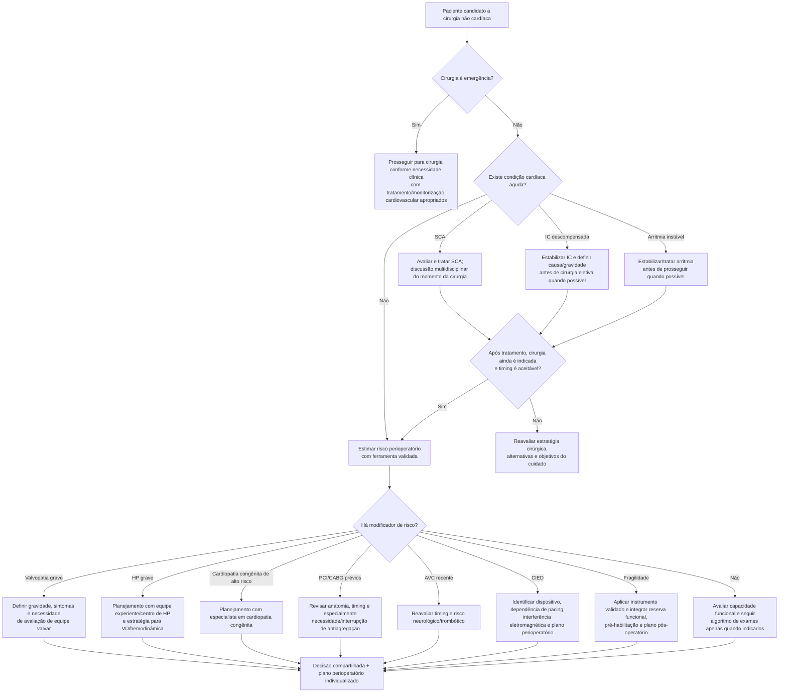

# Condições cardíacas agudas versus modificadores de risco

Uma das decisões mais importantes da avaliação pré-operatória ocorre **antes de qualquer escore**: definir se a cirurgia precisa acontecer imediatamente, se existe doença cardiovascular aguda que exige avaliação/tratamento antes de cirurgia eletiva ou se o paciente está estável, porém apresenta um **modificador de risco** que muda o planejamento.

A diretriz AHA/ACC 2024 organiza a avaliação de forma escalonada e enfatiza que o rastreamento e o tratamento cardiovascular no contexto cirúrgico devem seguir, em geral, as mesmas indicações utilizadas fora do perioperatório, evitando tanto atraso desnecessário quanto investigação excessiva.

## Condições cardíacas agudas no algoritmo

O algoritmo AHA/ACC 2024 destaca:

- **síndrome coronariana aguda**;
- **arritmia cardíaca instável**;
- **insuficiência cardíaca descompensada**.

Na cirurgia eletiva, a presença de uma dessas condições favorece **pausar a progressão automática para o centro cirúrgico**, tratar/avaliar a condição aguda e realizar discussão multidisciplinar sobre adiamento, estratégia alternativa ou, em cenários específicos, cuidados proporcionais aos objetivos do paciente.

Isso é diferente de afirmar que todo paciente com doença coronariana, insuficiência cardíaca ou arritmia precisa ter sua cirurgia adiada: o ponto central é a **instabilidade/atividade clínica atual**.

## Modificadores de risco AHA/ACC 2024

Depois da estimativa inicial de risco, o algoritmo solicita atenção especial aos seguintes modificadores:

- doença valvar grave;
- hipertensão pulmonar grave;
- cardiopatia congênita de risco elevado;
- stent coronário prévio ou cirurgia de revascularização miocárdica prévia;
- AVC recente;
- dispositivo eletrônico cardiovascular implantável — marcapasso/CDI;
- fragilidade.

Esses fatores não são simplesmente “mais um ponto” do RCRI. Eles podem exigir equipe especializada, definição do momento da cirurgia, escolha do local, monitorização específica ou estratégia anestésica/procedimental própria.

## Árvore de decisão

## Como essa árvore se conecta aos escores

Os escores entram **depois** da triagem de urgência e condições cardiovasculares agudas. Eles respondem perguntas quantitativas, mas não anulam os modificadores:

- **RCRI / Gupta MICA / AUB-HAS2 / GSCRI / VSG-CRI:** risco cardiovascular por diferentes endpoints/populações;
- **DASI:** capacidade funcional;
- **FRAIL Scale:** reserva/fraqueza fisiológica como modificador;
- **SORT / S-MPM:** mortalidade cirúrgica global.

Um paciente pode ter um RCRI aparentemente baixo e, ainda assim, demandar planejamento complexo por **hipertensão pulmonar grave, valvopatia grave, CIED ou fragilidade**.

## Regra prática

**Primeiro identifique urgência e instabilidade. Depois estime risco. Só então use capacidade funcional, modificadores e exames adicionais para decidir como — e não apenas se — a cirurgia deve prosseguir.**
