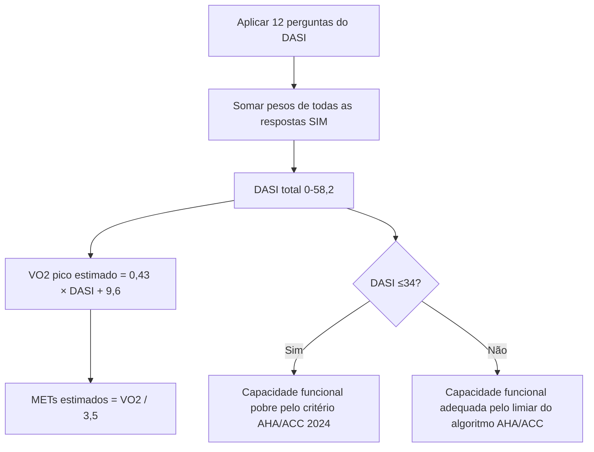
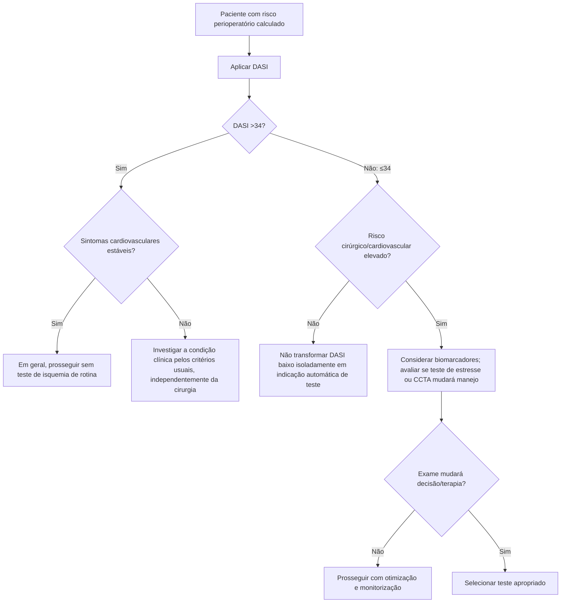

# Duke Activity Status Index — DASI

## Por que usar

A estimativa clínica informal de capacidade funcional é imprecisa. No estudo prospectivo internacional METS, o DASI apresentou valor prognóstico para desfechos perioperatórios e passou a ocupar posição central na avaliação funcional estruturada.

A AHA/ACC 2024 define **capacidade funcional pobre como <4 METs ou DASI ≤34** para decisões de teste de estresse/CCTA no algoritmo perioperatório.

## Questionário e pesos

Somar os pesos apenas quando a resposta for “sim”:

| Atividade | Peso |
|---|---:|
| Cuidar de si mesmo | 2,75 |
| Andar dentro de casa | 1,75 |
| Andar 1–2 quarteirões em terreno plano | 2,75 |
| Subir um lance de escadas ou um morro | 5,50 |
| Correr curta distância | 8,00 |
| Trabalho doméstico leve | 2,70 |
| Trabalho doméstico moderado | 3,50 |
| Trabalho doméstico pesado | 8,00 |
| Jardinagem/atividade equivalente | 4,50 |
| Relação sexual | 5,25 |
| Atividade recreativa moderada | 6,00 |
| Esporte vigoroso | 7,50 |

**DASI total: 0 a 58,2 pontos.**

A equação original para estimar VO₂ de pico é:

`VO₂ pico estimado (mL/kg/min) = 0,43 × DASI + 9,6`

`METs estimados = VO₂ pico / 3,5`

## Árvore de cálculo

## Árvore de uso pré-operatório

## Interpretação correta

- DASI é **medida funcional**, não um escore anatômico de DAC.
- DASI baixo não diagnostica isquemia.
- DASI >34, em paciente estável, ajuda a evitar exames desnecessários.
- DASI ≤34 ganha relevância quando combinado a **risco perioperatório elevado** e quando um exame adicional pode mudar a conduta.

## Validação brasileira

A versão em português brasileiro foi submetida a tradução, adaptação transcultural e validação em pacientes com doença cardiovascular por Coutinho-Myrrha e colaboradores.
