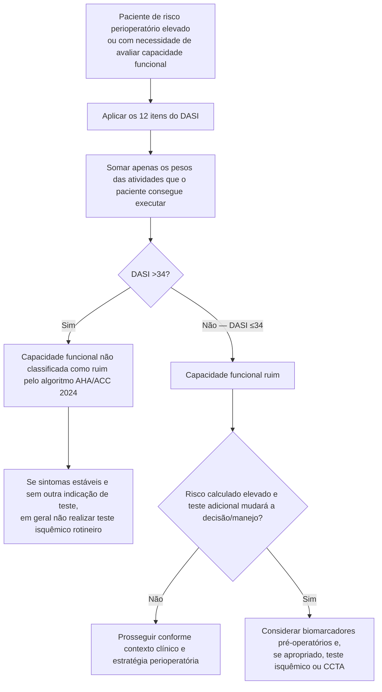

# Duke Activity Status Index (DASI)

O DASI é um questionário de 12 atividades cotidianas. A pontuação é obtida somando o peso de cada atividade que o paciente consegue realizar. A pontuação varia de **0 a 58,2**; valores maiores indicam melhor capacidade funcional.

A AHA/ACC 2024 considera razoável usar avaliação estruturada da capacidade funcional, como o DASI, em pacientes submetidos a cirurgia não cardíaca de risco elevado. No algoritmo da diretriz, **DASI ≤34** é classificado como capacidade funcional ruim.

## Itens e pesos

| Atividade que o paciente consegue realizar | Pontos |
|---|---:|
| Cuidar de si mesmo (alimentar-se, vestir-se, banho, usar banheiro) | 2,75 |
| Caminhar dentro de casa | 1,75 |
| Caminhar 1–2 quarteirões em terreno plano | 2,75 |
| Subir um lance de escadas ou uma ladeira | 5,5 |
| Correr uma curta distância | 8,0 |
| Trabalho doméstico leve | 2,7 |
| Trabalho doméstico moderado | 3,5 |
| Trabalho doméstico pesado | 8,0 |
| Trabalho no quintal/jardim | 4,5 |
| Relações sexuais | 5,25 |
| Atividade recreativa moderada | 6,0 |
| Esporte extenuante | 7,5 |

## Árvore de decisão

## Por que usar DASI em vez de perguntar apenas “sobe dois lances de escada?”

No estudo METS, a estimativa subjetiva do médico sobre capacidade funcional teve desempenho limitado. A avaliação estruturada pelo DASI apresentou valor prognóstico perioperatório e foi posteriormente incorporada ao algoritmo AHA/ACC.

## Interpretação prática

- **DASI >34:** capacidade funcional considerada adequada no ponto de decisão da diretriz AHA/ACC 2024.
- **DASI ≤34:** capacidade funcional ruim; isso **não significa solicitar teste isquêmico automaticamente**.
- O próximo passo depende do risco calculado, de modificadores de risco e de a investigação adicional ter potencial real para modificar a estratégia cirúrgica.

## Limitações

- É autorrelato; limitações ortopédicas, neurológicas ou culturais podem reduzir a pontuação sem refletir reserva cardiovascular isoladamente.
- DASI não diagnostica isquemia.
- O escore não substitui avaliação de sintomas, doença cardiovascular ativa ou risco intrínseco do procedimento.
- A conversão de DASI para VO2/METs por equações históricas pode superestimar capacidade funcional em alguns pacientes; para esta ferramenta perioperatória, o ponto de decisão principal será a **pontuação DASI diretamente**, conforme a AHA/ACC 2024.

## Regra prática

**DASI deve responder “qual é a capacidade funcional?”; ele não responde sozinho “o paciente pode operar?”.** A decisão final integra risco clínico, cirurgia, modificadores de risco e utilidade potencial de exames adicionais.
