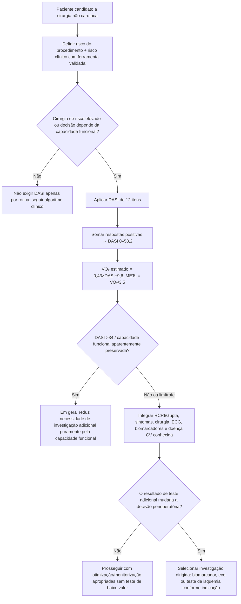
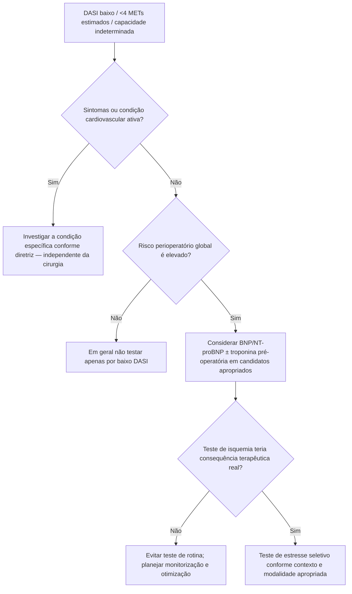

# Duke Activity Status Index (DASI) no pré-operatório

## Por que usar um instrumento estruturado

A diretriz AHA/ACC perioperatória de 2024 considera razoável, em pacientes submetidos a cirurgia não cardíaca de risco elevado, usar uma avaliação **estruturada** da capacidade funcional, como o DASI, para melhorar a estratificação de risco.

Isso é importante porque estimativas subjetivas do clínico — por exemplo “parece ter >4 METs” — podem ter desempenho inferior a um questionário validado.

## Os 12 itens do DASI

Cada atividade respondida como “sim” soma um peso específico:

| Atividade | Peso |
|---|---:|
| Cuidar de si mesmo: comer, vestir-se, banho, banheiro | 2,75 |
| Caminhar dentro de casa | 1,75 |
| Caminhar 1–2 quarteirões no plano | 2,75 |
| Subir um lance de escadas ou uma ladeira | 5,50 |
| Correr curta distância | 8,00 |
| Trabalho doméstico leve | 2,70 |
| Trabalho doméstico moderado | 3,50 |
| Trabalho doméstico pesado | 8,00 |
| Jardinagem | 4,50 |
| Relação sexual | 5,25 |
| Atividade recreativa moderada | 6,00 |
| Esporte extenuante | 7,50 |

**Escore total:** 0 a **58,2**.

Existe uma versão brasileira do questionário com adaptação e validação transcultural.

## Fórmulas verificadas

A fórmula clássica de Hlatky estima VO₂ pico:

**VO₂ pico estimado (mL/kg/min) = 0,43 × DASI + 9,6**

Conversão aproximada para METs:

**METs = VO₂ pico / 3,5**

Equivalente:

**METs ≈ 0,123 × DASI + 2,74**

O DASI máximo de 58,2 corresponde a aproximadamente 9,9 METs pela equação.

## O que o DASI mede — e o que não mede

Ele mede **capacidade funcional autorreferida**. Não é CPET e não mede diretamente VO₂. Estudos contemporâneos mostram que a equação pode **superestimar VO₂ pico**, especialmente em subgrupos como idosos e pessoas com maior IMC.

Portanto, o DASI deve ser interpretado como ferramenta clínica de risco e capacidade funcional, não como substituto perfeito de ergoespirometria.

## Evidência perioperatória

Na diretriz AHA/ACC 2024:

- **<4 METs** permanece uma referência tradicional de baixa capacidade funcional;
- DASI é recomendado como forma estruturada de avaliação em cirurgia de risco elevado;
- no estudo METS, avaliação subjetiva pelo médico não se associou adequadamente ao desfecho, enquanto o DASI se associou a morte/IAM em 30 dias;
- **DASI ≤34** foi associado a maior chance de morte ou IAM em 30 dias em análise citada pela diretriz.

Importante: **DASI ≤34 não significa automaticamente “pedir teste de isquemia”**. O score deve alimentar o algoritmo global.

## Árvore de decisão: DASI no pré-operatório

## Árvore: capacidade funcional ruim não é sinônimo de isquemia

## Limitação recente — 2026

Estudo de 2026 em adultos >60 anos demonstrou superestimação sistemática do VO₂ pelo DASI em comparação ao CPET submáximo, com maior viés conforme IMC. Isso reforça que:

- a equação é uma **estimativa**;
- números de METs não devem ser tratados como medição direta;
- se VO₂ objetivo mudará uma decisão de alto impacto, CPET pode ser mais apropriado em cenários selecionados.

## Fontes verificadas

1. Hlatky MA, Boineau RE, Higginbotham MB, et al. A brief self-administered questionnaire to determine functional capacity (the Duke Activity Status Index). *Am J Cardiol.* 1989;64(10):651-654. PMID **2782256**. DOI **10.1016/0002-9149(89)90496-7**.
2. Thompson A, Fleischmann KE, Smilowitz NR, et al. 2024 AHA/ACC/ACS/ASNC/HRS/SCA/SCCT/SCMR/SVM Guideline for Perioperative Cardiovascular Management for Noncardiac Surgery. *Circulation.* 2024;150(19):e351-e442. PMID **39316661**. DOI **10.1161/CIR.0000000000001285**.
3. Coutinho-Myrrha MA, Dias RC, Fernandes AA, et al. Duke Activity Status Index for cardiovascular diseases: validation of the Portuguese translation. *Arq Bras Cardiol.* 2014. PMCID **PMC4028943**.
4. Hollingsworth K, Zhao Y, Charchaflieh JG, Carr ZJ. Reducing systematic overestimation bias in the Duke Activity Status Index estimated peak oxygen uptake. *A A Pract.* 2026;20(3):e02160. PMID **41729842**. DOI **10.1213/XAA.0000000000002160**.

## Status de revisão

`VERIFICAÇÃO HUMANA NECESSÁRIA`: antes de publicar uma calculadora interativa, validar automaticamente soma máxima 58,2 e conferir a redação final em português dos 12 itens contra a versão brasileira publicada.
