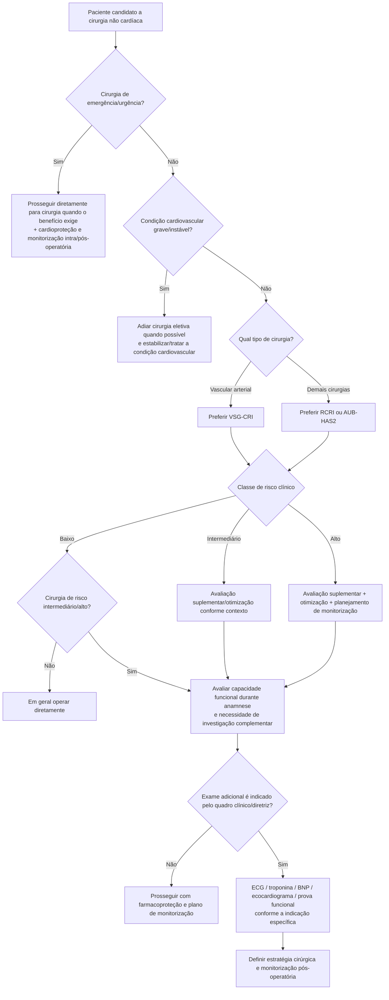

# SBC 2024 — avaliação cardiovascular perioperatória

A Diretriz SBC 2024 propõe um fluxo brasileiro que combina **urgência da operação, presença de condição cardiovascular grave/instável, risco clínico por escore, risco intrínseco da cirurgia e estratégia de monitorização**.

## Árvore-mestre

## Condições cardiovasculares graves/instáveis destacadas pela SBC

A Tabela 2 da diretriz inclui situações como:

- síndrome coronariana aguda;
- doença instável da aorta torácica;
- edema agudo pulmonar;
- choque cardiogênico;
- insuficiência cardíaca NYHA III/IV;
- angina CCS III/IV;
- estenose aórtica ou mitral importante sintomática;
- bradiarritmias ou taquiarritmias graves, incluindo BAV total e TV;
- fibrilação atrial com alta resposta ventricular, **FC >120 bpm**;
- hipertensão não controlada, **PA >180 × 110 mmHg**.

A presença de uma dessas condições muda a prioridade: o objetivo passa a ser estabilizar a doença cardiovascular antes da cirurgia eletiva, quando o contexto permite.

## Escolha do escore segundo a SBC 2024

### Operações gerais

A diretriz privilegia:

- **RCRI**;
- **AUB-HAS2**.

### Operações vasculares arteriais

A SBC recomenda alterar a ferramenta para **VSG-CRI**, por ser desenvolvida especificamente em cirurgia vascular arterial.

## Classes usadas no fluxograma central da SBC

| Método | Baixo | Intermediário | Alto |
|---|---:|---:|---:|
| RCRI | 0–1 | 2 | 3–6 |
| AUB-HAS2 | 0–1 | 2–3 | 4–6 |
| VSG-CRI | 0–4 | 5–6 | ≥7 |

## Capacidade funcional

A SBC 2024 recomenda determinar a capacidade funcional durante a anamnese de pacientes programados para operações de risco intermediário ou alto, usando como referência prática a capacidade de **subir dois lances de escada**. Na Corvia, o DASI pode complementar essa avaliação com um instrumento estruturado.

## Idoso e fragilidade

A diretriz recomenda:

- avaliar rotineiramente fragilidade em idosos submetidos a cirurgia de risco intermediário ou alto — **Classe IIa**;
- mensurá-la objetivamente com instrumento específico — **Classe IIa**.

## Regra prática

**No modelo brasileiro, a pergunta não é somente “qual o RCRI?”.** Primeiro exclui-se instabilidade cardiovascular; depois escolhe-se o escore adequado ao tipo de cirurgia, integra-se o risco intrínseco do procedimento e só então se define investigação e monitorização.
