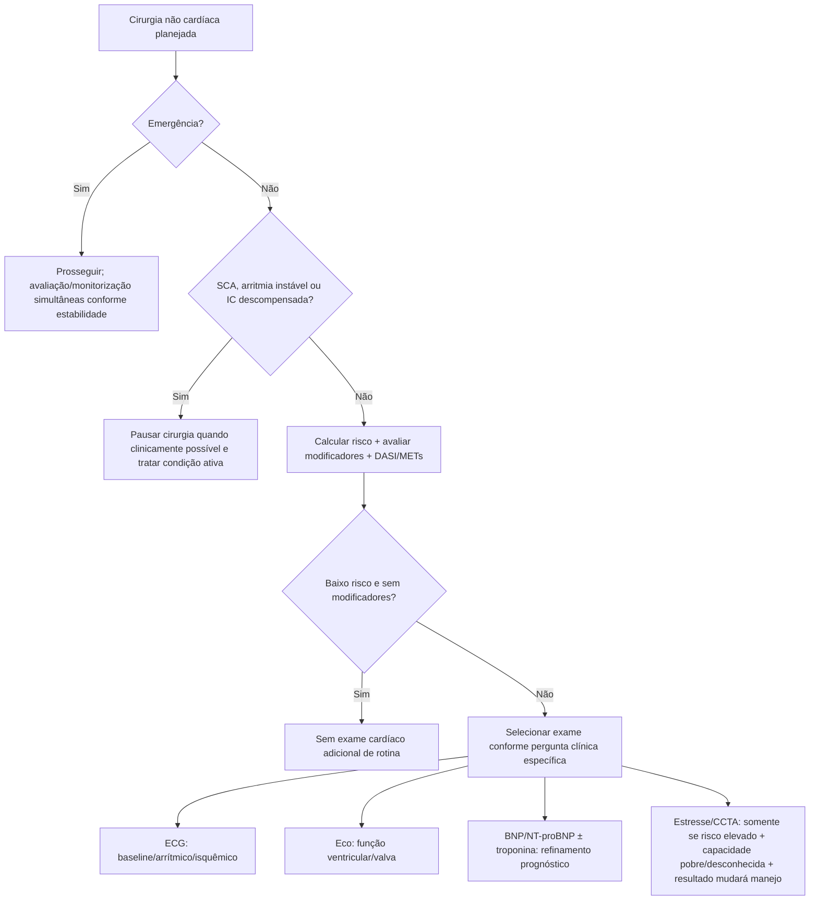
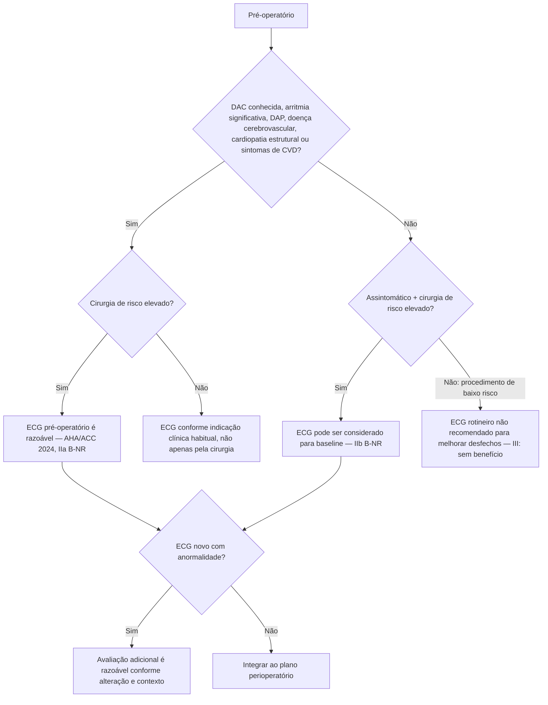
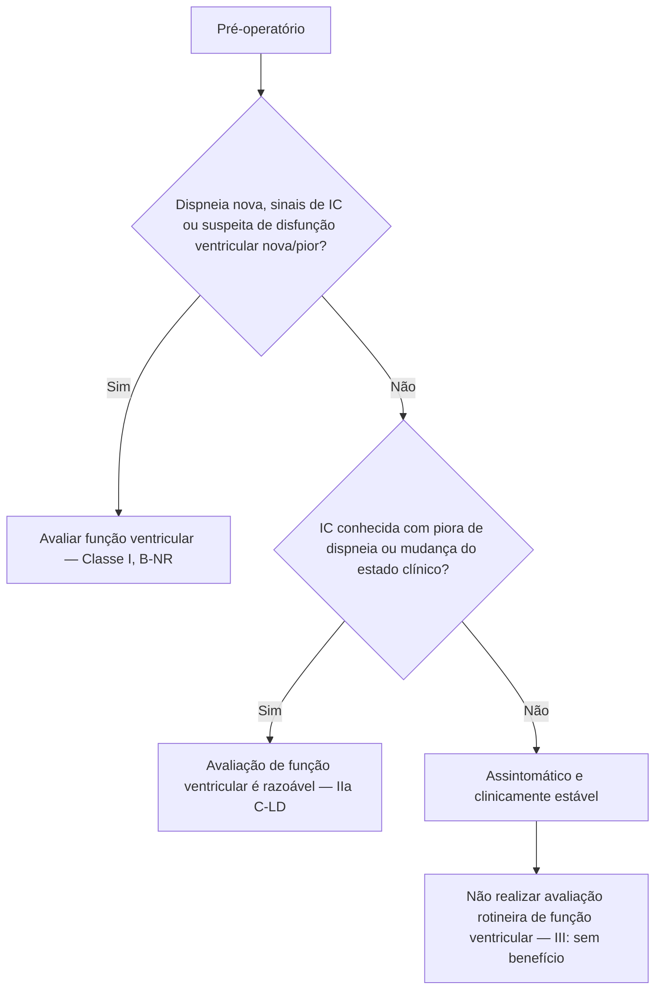
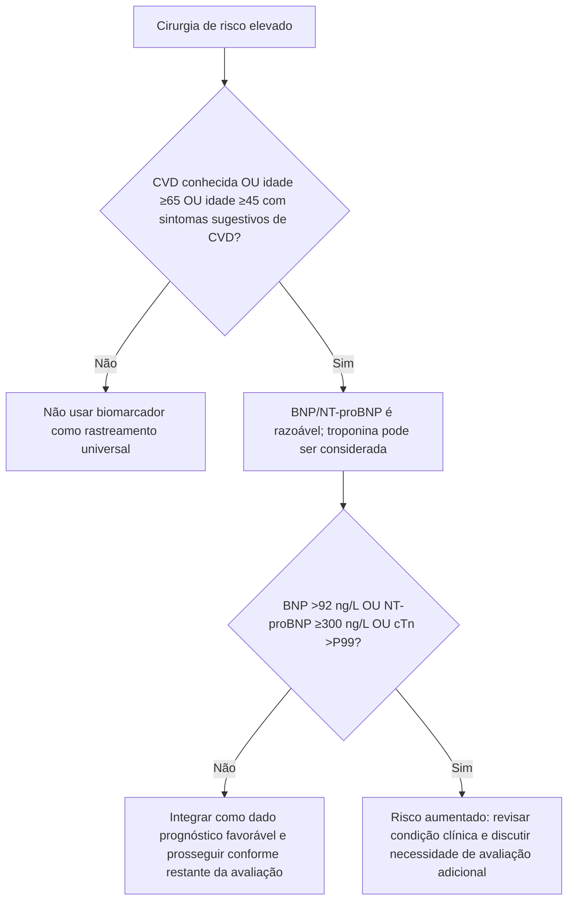
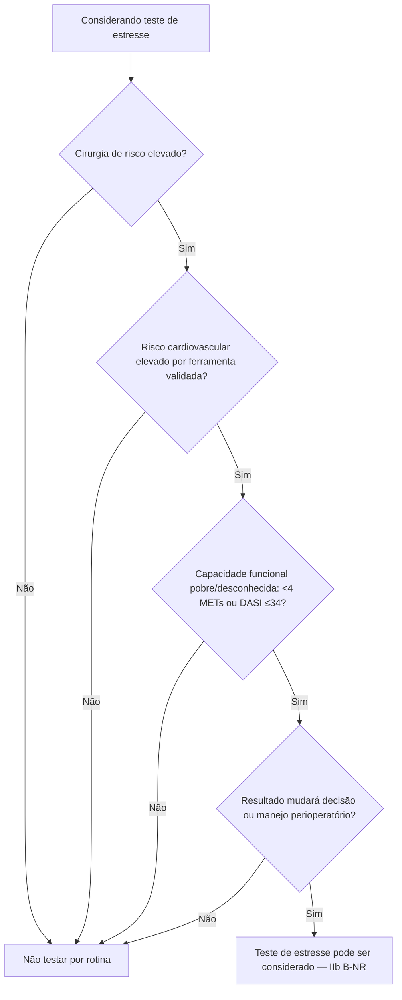
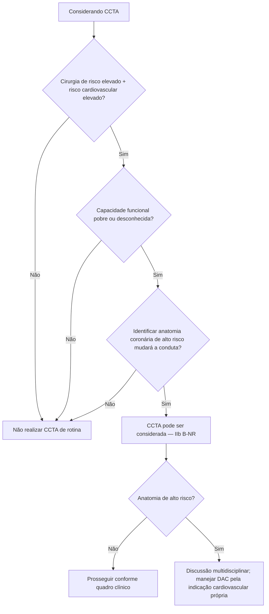

# Qual exame cardiovascular pedir antes da cirurgia?

## Regra-mãe

**Não pedir um exame apenas porque existe uma cirurgia programada.** A investigação deve ser indicada quando o resultado puder modificar diagnóstico, tratamento, timing cirúrgico, técnica anestésica ou intensidade da monitorização.

## Árvore geral de investigação

# ECG de 12 derivações

Sintomas/sinais relevantes citados pela diretriz incluem dor torácica, dispneia, palpitações não diagnosticadas, taquicardia, síncope e sopro.

# Ecocardiograma / avaliação de função ventricular

Em suspeita de estenose/regurgitação valvar moderada ou grave, a ecocardiografia segue a indicação valvar específica e o impacto esperado sobre a cirurgia.

# Biomarcadores

# Teste de estresse

AHA/ACC 2024 classifica teste de estresse rotineiro como **sem benefício** quando o paciente tem baixo risco perioperatório, capacidade funcional adequada com sintomas estáveis ou será submetido a procedimento de baixo risco.

## Contraindicações gerais relevantes ao teste de estresse

A diretriz cita como contraindicações gerais: SCA, IC descompensada, estenose aórtica grave/sintomática, arritmia não controlada, hipertensão arterial importante (exemplo ≥200/110 mmHg), dissecção aguda de aorta, pericardite/miocardite, embolia pulmonar e hipertensão pulmonar grave.

# CCTA

No algoritmo AHA/ACC, anatomia coronária de alto risco inclui **tronco da coronária esquerda ≥50%** ou **doença de três vasos ≥70%**.

## Mensagem final

A melhor avaliação pré-operatória não é a que pede mais exames; é a que identifica **quem não precisa deles** e reserva investigação adicional para situações em que o resultado realmente muda a estratégia.
