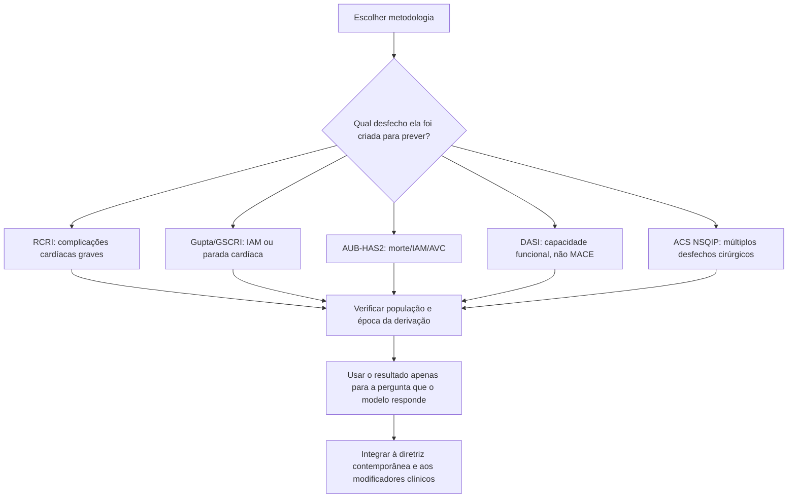

# Como ler os estudos dos escores

Um escore de risco não deve ser julgado apenas pelo número que produz. É necessário saber **qual população o originou, qual desfecho ele prevê, como foi validado e se continua aplicável à cirurgia contemporânea**.

## 1. Lee 1999 — RCRI

**Desenho:** derivação e validação prospectiva de um índice simples para complicações cardíacas em cirurgia não cardíaca de grande porte.

**Resultado metodológico:** seis fatores independentes foram transformados em um escore aditivo de 1 ponto cada. As classes originais apresentaram taxas de complicação cardíaca grave de aproximadamente:

- Classe I, 0 fatores: **0,4%**;
- Classe II, 1 fator: **0,9%**;
- Classe III, 2 fatores: **7,0%**;
- Classe IV, ≥3 fatores: **11,0%**.

**Implicação:** simplicidade e ampla validação explicam sua permanência nas diretrizes, mas as taxas absolutas são históricas e não equivalem automaticamente ao risco individual contemporâneo.

## 2. Gupta 2011 — MICA

**Base:** ACS-NSQIP.

**Desfecho:** infarto do miocárdio ou parada cardíaca perioperatória em 30 dias.

**Cinco preditores principais:** tipo de cirurgia, status funcional, creatinina, classe ASA e idade.

**Desempenho:** na publicação, o modelo apresentou discriminação superior ao RCRI quando aplicado à base de validação. O modelo produz uma **probabilidade percentual**, e não apenas classes aditivas.

**Implicação:** é útil quando se deseja granularidade maior e incorporação do tipo cirúrgico/status funcional. A transcrição dos coeficientes da implementação Corvia permanece sujeita a conferência humana contra a publicação primária completa.

## 3. Hlatky 1989 — DASI

**Objetivo:** criar um questionário curto capaz de estimar capacidade funcional a partir de atividades do cotidiano.

**Estrutura:** 12 atividades ponderadas, totalizando **0 a 58,2 pontos**.

**Implicação perioperatória contemporânea:** o DASI não foi originalmente criado como escore cirúrgico, mas posteriormente demonstrou utilidade prognóstica no perioperatório e foi incorporado pela AHA/ACC como avaliação estruturada da capacidade funcional.

## 4. METS 2018 — capacidade funcional antes de cirurgia

**Desenho:** coorte prospectiva internacional em pacientes submetidos a cirurgia não cardíaca de grande porte.

**Pergunta clínica:** comparação entre avaliação subjetiva da capacidade funcional pelo médico e medidas estruturadas/objetivas, incluindo DASI e teste cardiopulmonar de exercício.

**Mensagem:** a estimativa subjetiva do médico teve desempenho limitado para identificar baixa capacidade funcional; o **DASI forneceu informação prognóstica útil** e ajudou a deslocar as diretrizes para avaliação funcional estruturada.

**Aplicação atual:** AHA/ACC 2024 usa **DASI ≤34** como ponto de decisão para capacidade funcional ruim no algoritmo pré-operatório.

## 5. Dakik 2019 — AUB-HAS2

**Desfecho:** morte, IAM ou AVC em 30 dias.

**Seis itens:** história cardíaca, sintomas cardíacos, idade ≥75 anos, hemoglobina <12 g/dL, cirurgia vascular e cirurgia de emergência.

**Taxas de evento na derivação por pontuação 0, 1, 2, 3 e >3:** **0%, 0,5%, 2,0%, 5,6% e 15,7%**.

**Validação externa:** **0,3%, 1,6%, 5,6%, 11,0% e 17,5%**, respectivamente.

**Discriminação:** AUC de **0,90** na derivação e **0,82** na validação externa relatada no estudo original.

**Implicação:** escore curto, totalmente reproduzível e particularmente adequado a uso interativo quando se quer incorporar emergência, anemia e sintomas.

## 6. Alrezk 2017 — GSCRI

**População:** pacientes **≥65 anos** submetidos a cirurgia não cardíaca.

**Derivação:** 210.914 pacientes geriátricos do ACS-NSQIP 2013.

**Validação:** 172.905 pacientes geriátricos do ACS-NSQIP 2012.

**Variáveis finais:** AVC prévio, ASA, categoria cirúrgica, status funcional, creatinina >1,5 mg/dL, diabetes e insuficiência cardíaca.

**AUC na validação:** **0,76 para GSCRI**, **0,70 para Gupta MICA** e **0,63 para RCRI**.

**Implicação:** reforça que modelos gerais podem perder desempenho em idosos. A calculadora local não deve ser ativada até que todos os coeficientes da regressão sejam transcritos e conferidos diretamente da fonte primária.

## 7. Bilimoria 2013 — ACS NSQIP universal

**Base:** mais de **1,4 milhão de pacientes**, cobrindo **1.557 procedimentos CPT** na publicação original.

**Objetivo:** produzir estimativas de múltiplas complicações, mortalidade e desfechos de interesse para planejamento e consentimento informado.

**Desempenho original:** estatística C aproximadamente **0,944 para mortalidade** e **0,816 para morbidade**.

**Implicação:** é uma ferramenta cirúrgica global, não exclusivamente cardíaca. O modelo oficial é atualizado pelo ACS; por isso a Corvia deve direcionar para o calculador oficial em vez de congelar uma versão local.

# Árvore: do estudo ao uso clínico

## Regra prática

**Não comparar percentuais de escores diferentes como se medissem a mesma coisa.** Um resultado só é interpretável quando o desfecho, a população e o horizonte temporal do modelo estão explícitos.
