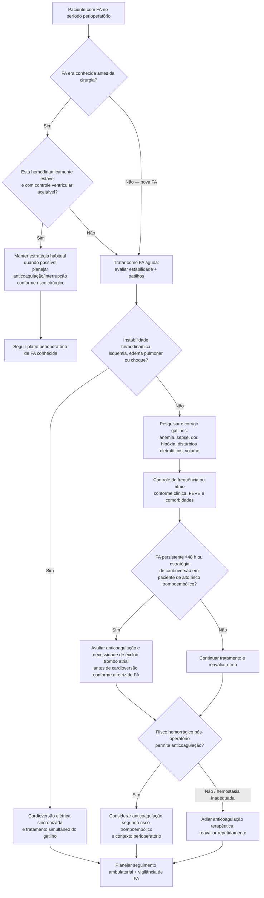

# Fibrilação atrial no perioperatório

A FA perioperatória deve ser dividida em dois cenários distintos:

1. **FA já conhecida e estável** antes da cirurgia;
2. **FA de início recente** durante ou após cirurgia não cardíaca.

A segunda situação não deve ser descartada como fenômeno puramente transitório. Dados observacionais mostram recorrência substancial e associação com AVC/TIA no seguimento.

## Árvore de decisão

## Gatilhos reversíveis precisam ser tratados

A AHA/ACC 2024 considera razoável abordar causas médicas que precipitam FA rápida, incluindo explicitamente:

- **anemia**;
- **sepse**;
- dor e estresse fisiológico;
- hipóxia;
- distúrbios hidroeletrolíticos;
- alterações volêmicas;
- outras causas clínicas conforme o cenário.

Tratar apenas a frequência cardíaca sem corrigir o gatilho pode falhar.

## Controle de frequência e ritmo

Em paciente estável, a escolha depende de:

- função ventricular;
- pressão arterial;
- sintomas;
- duração da FA;
- comorbidades;
- possibilidade de anticoagulação;
- risco de recorrência e duração esperada do fator precipitante.

A diretriz perioperatória utiliza **FC <110 bpm** como objetivo razoável de controle em muitos pacientes estáveis, mas isso não substitui julgamento clínico individual.

Em instabilidade hemodinâmica atribuível à FA, **cardioversão elétrica sincronizada** é a estratégia de urgência.

## Anticoagulação na nova FA pós-operatória

A AHA/ACC 2024 considera que, em pacientes com FA de início recente no contexto de cirurgia não cardíaca, iniciar anticoagulação no pós-operatório **pode ser benéfico** depois de ponderar:

- risco tromboembólico;
- risco hemorrágico;
- hemostasia cirúrgica;
- necessidade de nova intervenção;
- função renal;
- duração/recorrência da FA.

Não existe regra de “FA pós-operatória = anticoagular imediatamente”. O timing é parte da decisão.

## Por que não considerar a FA pós-operatória sempre transitória

Em coorte de pacientes com nova FA após cirurgia não cardíaca, ao longo de mediana de **5,4 anos**, a FA pós-operatória esteve associada a:

- AVC/TIA: **18,9 versus 10,0 por 1.000 pessoas-ano**;
- HR para AVC/TIA **2,69**; IC95% 1,35–5,37;
- nova FA documentada: **136,4 versus 21,6 por 1.000 pessoas-ano**;
- diferença absoluta de recorrência de FA em 5 anos: **39,3%**;
- HR para FA subsequente **7,94**; IC95% 4,85–12,98.

A diretriz de FA de 2023 também ressalta que AF identificada após cirurgia não cardíaca apresenta recorrência relevante em 5 anos.

## Seguimento depois da alta

A AHA/ACC 2024 recomenda que nova FA perioperatória leve a **seguimento ambulatorial**, incluindo:

- reavaliação do risco tromboembólico;
- decisão sobre continuidade/início de anticoagulação;
- vigilância de recorrência de FA;
- revisão de gatilhos e fatores de risco modificáveis.

A intensidade e a duração do monitoramento devem ser individualizadas; não existe um único dispositivo ou período obrigatório para todos.

## Regra prática

**Nova FA pós-operatória é um diagnóstico clínico que merece seguimento, não apenas uma arritmia da recuperação anestésica.** Corrija gatilhos, trate instabilidade, controle frequência/ritmo de forma apropriada e reavalie anticoagulação quando a hemostasia permitir.
