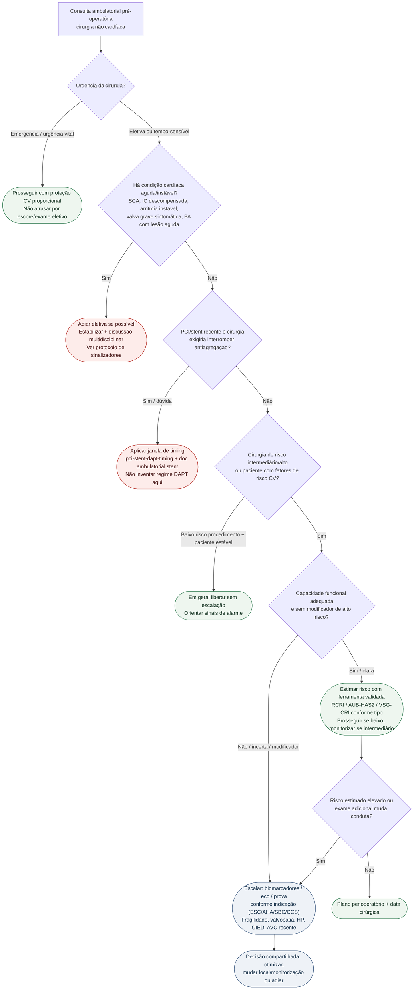

# Fluxograma ambulatorial: quando escalar o risco cardiovascular pré-operatório

Prosa: [`sinalizadores-ambulatoriais-para-adiar-cirurgia-eletiva-nao-cardiaca`](sinalizadores-ambulatoriais-para-adiar-cirurgia-eletiva-nao-cardiaca.md). Timing stent: [`stent-coronario-recente-e-cirurgia-eletiva-janela-de-risco-ambulatorial`](stent-coronario-recente-e-cirurgia-eletiva-janela-de-risco-ambulatorial.md).

## Árvore de decisão

## Notas

- **D1** = gate de segurança (AHA/ACC 2024; SBC 2024) — precede qualquer escore.
- **D2** = modificador PCI/stent; detalhes em docs de timing existentes (sem doses neste fluxograma).
- **D4/C5** = escalação só quando muda conduta (ESC 2022; CCS 2017 para biomarcadores em risco intermediário/alto).
- Não substitui [`algoritmo-integrado-avaliacao-cardiovascular-pre-operatoria-aha-acc-2024`](algoritmo-integrado-avaliacao-cardiovascular-pre-operatoria-aha-acc-2024.md) nem [`fluxograma-avaliacao-cardiovascular-pre-operatoria-esc-2022`](fluxograma-avaliacao-cardiovascular-pre-operatoria-esc-2022.md).
