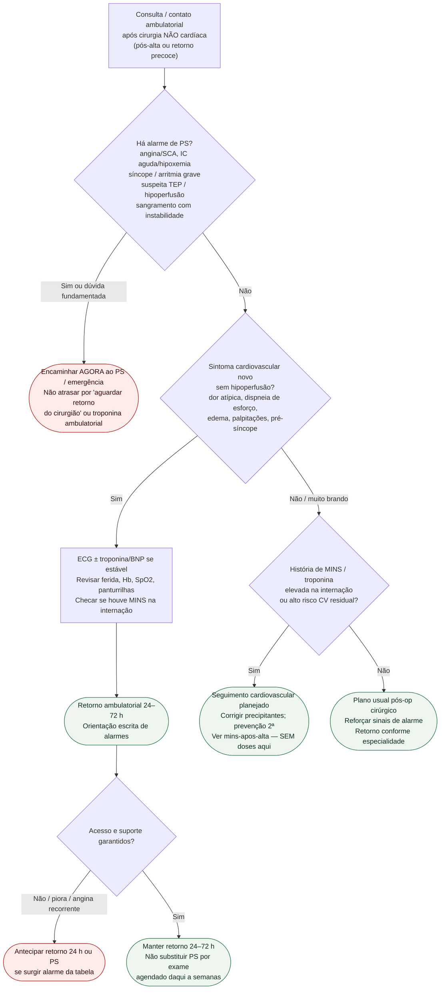

# Fluxograma ambulatorial: sintomas cardíacos pós-operatórios — destino

Prosa: [`sinalizadores-ambulatoriais-sintomas-cardiacos-pos-cirurgia-nao-cardiaca-quando-encaminhar`](sinalizadores-ambulatoriais-sintomas-cardiacos-pos-cirurgia-nao-cardiaca-quando-encaminhar.md). Braço MINS: [`mins-apos-alta-seguimento-ambulatorial-alarme-e-retorno`](mins-apos-alta-seguimento-ambulatorial-alarme-e-retorno.md). Vigilância hospitalar: [`mins-lesao-miocardica-pos-operatoria-vigilancia-e-arvore-de-decisao`](mins-lesao-miocardica-pos-operatoria-vigilancia-e-arvore-de-decisao.md).

## Árvore de decisão

## Notas

- **D1** = gate de segurança (isquemia, IC aguda, arritmia/síncope, TEP, hipoperfusão — AHA/ACC 2024 / ESC 2022).
- **D2** = sintoma ambulatorial controlável → destino clínico precoce + ECG/biomarcadores se estável.
- **D3** = ponte para seguimento pós-MINS (VISION prognóstico; AHA/ACC: follow-up cardiovascular razoável).
- Não decide doses de antitrombóticos, diuréticos nem antiarrítmicos; não substitui a árvore hospitalar de MINS nem o pacote pré-op #836.
