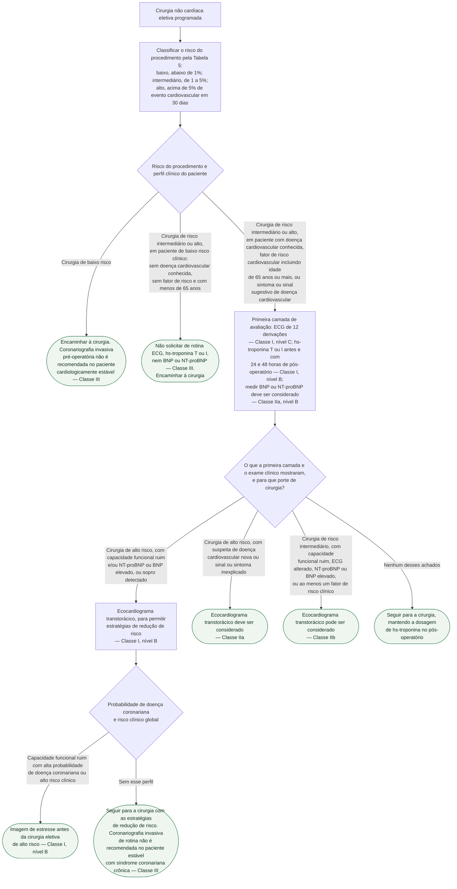
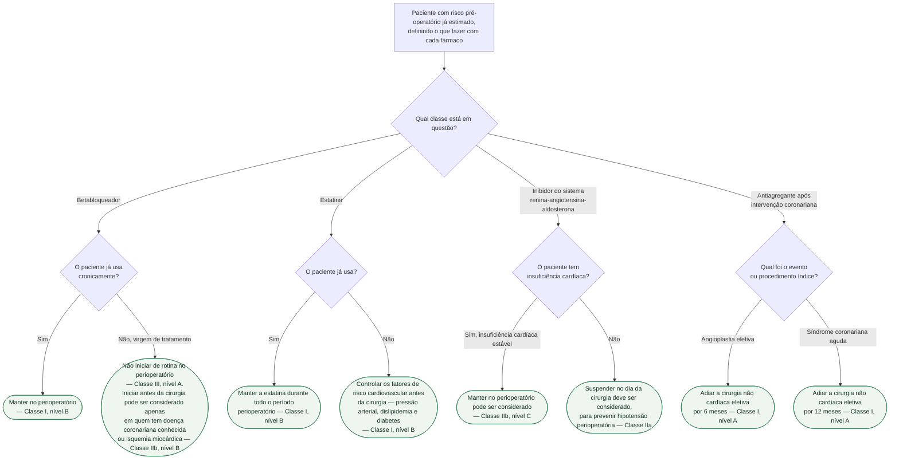

# Fluxograma: Avaliação cardiovascular pré-operatória em cirurgia não cardíaca (ESC 2022)

A diretriz de 2022 organiza a avaliação pré-operatória em torno de uma pergunta
que costuma ser pulada: **este paciente precisa de algum exame?** A resposta
negativa não é descuido — é recomendação formal. Pedir ECG, troponina e peptídeo
natriurético de rotina em paciente de baixo risco para cirurgia de baixo ou
intermediário risco é **Classe III**, e amostragem universal de biomarcador para
estratificação também.

Duas outras coisas que a árvore torna difíceis de confundir:

- **Manter e iniciar betabloqueador são decisões opostas.** Manter em quem já usa
  é **Classe I, nível B**. Iniciar de rotina no perioperatório é **Classe III,
  nível A** — recomendado contra, com o nível de evidência mais forte que existe.
- **O risco do procedimento vem antes do risco do paciente.** Sem classificar a
  cirurgia em baixo, intermediário ou alto risco, nenhuma das outras
  recomendações se aplica corretamente, porque quase todas são condicionadas a
  essa faixa.

## O risco cirúrgico do procedimento (Tabela 5 da diretriz)

Estimativa de evento cardiovascular em 30 dias, por tipo de procedimento:

| Faixa | Risco em 30 dias | Exemplos citados na diretriz |
|---|---|---|
| Baixo | menos de 1% | mama, dentária, tireoide, oftalmológica, ginecológica menor, ortopédica menor como meniscectomia, reconstrutiva, cirurgia superficial, ressecção transuretral de próstata, ressecção pulmonar menor por videotoracoscopia |
| Intermediário | de 1 a 5% | carótida assintomática e sintomática, correção endovascular de aneurisma de aorta, cirurgia de cabeça e pescoço, intraperitoneal como esplenectomia, hérnia de hiato e colecistectomia, intratorácica não maior, neurológica ou ortopédica maior como quadril e coluna, angioplastia arterial periférica, transplante renal |
| Alto | mais de 5% | — |

## Árvore de decisão: quem investigar antes da cirurgia

## Árvore de decisão: manejo farmacológico perioperatório

## Capacidade funcional: o exame mais barato da lista

A diretriz transforma capacidade funcional em pergunta objetiva: **ajustar a
avaliação de risco pela capacidade autorrelatada de subir dois lances de escada
deve ser considerado** em quem vai para cirurgia de risco intermediário ou alto —
**Classe IIa**. Não custa nada, não depende de agenda de exame, e é o que separa
o paciente que segue direto do paciente que ganha ecocardiograma.

**Fragilidade tem rastreio próprio.** A partir dos 70 anos, antes de cirurgia de
risco intermediário ou alto, rastrear fragilidade com instrumento validado deve
ser considerado — **Classe IIa**. Fragilidade e capacidade funcional não são a
mesma coisa e não se substituem.

## O que as árvores não mostram

**Cessação de tabagismo com mais de 4 semanas de antecedência é Classe I,
nível B** para reduzir complicação e mortalidade pós-operatórias. Vale para todos
os ramos, e por isso saiu do diagrama.

**Função renal e obesidade têm recomendação própria.** Rastrear doença renal
pré-operatória com creatinina sérica e taxa de filtração glomerular é Classe I
antes de cirurgia de risco intermediário ou alto; e avaliar aptidão
cardiorrespiratória no paciente obeso, com atenção especial a esses mesmos
portes de cirurgia, também é Classe I.

**Cirurgia eletiva em insuficiência cardíaca descompensada não é para ser
feita** — a diretriz é explícita. O ecocardiograma que embasa essa decisão não
deve ter mais de 6 meses, ou deve ser refeito imediatamente antes se houver
piora clínica.

**Betabloqueador para prevenir fibrilação atrial pós-operatória em cirurgia não
cardíaca é Classe III.** É um uso diferente do da árvore — lá a pergunta é sobre
proteção miocárdica, aqui é sobre arritmia —, e nos dois a resposta é não iniciar.

**Vigilância pós-operatória não é opcional no paciente que entrou na árvore
grande.** A recomendação de hs-troponina é explicitamente seriada: antes, com
24 horas e com 48 horas. Medir só no pré-operatório cumpre metade da
recomendação e perde exatamente a lesão miocárdica pós-operatória, que é
assintomática na maioria dos casos.
