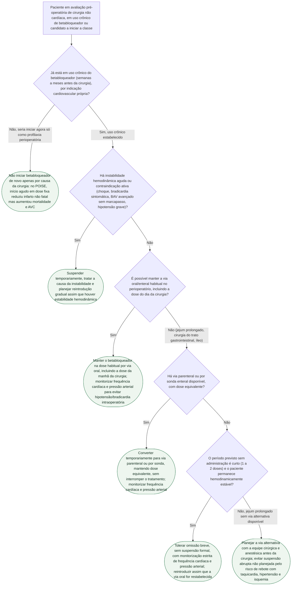

# Fluxograma: betabloqueador crônico no perioperatório — continuar ou suspender

"Suspender o betabloqueador antes da cirurgia por segurança" e "iniciar betabloqueador para proteger o coração" são os dois erros simétricos que o POISE (2008) já havia desarmado: início agudo em dose fixa **aumentou morte e AVC**, apesar de reduzir infarto não fatal. Uma metanálise de 2024, com mais de 1,3 milhão de pacientes, revisita a questão numa amostra muito maior e encontra um sinal semelhante de risco de AVC associado ao uso perioperatório de betabloqueador — mas sem diferença significativa em mortalidade ou infarto, e com efeito protetor de mortalidade num subgrupo específico. A árvore abaixo trata o caso mais comum do consultório — o paciente que **já usa** betabloqueador cronicamente — e mantém a recomendação central inalterada por essa evidência mais recente: não suspender por rotina, mas vigiar ativamente a hemodinâmica.

## Árvore de decisão

## O que a árvore não mostra

**A metanálise de 2024 (Herrera Hernández et al., *Medical Sciences*, 28 estudos, 1.342.430 pacientes, PMID 39584914) é a evidência mais robusta em volume já reunida sobre o tema, e o resultado é misto, não uma condenação da classe.** Uso perioperatório de betabloqueador associou-se a mais AVC (RR 1,42; IC95% 1,03–1,97; p=0,03), sem diferença significativa em mortalidade (RR 0,62; IC95% 0,38–1,01; p=0,05) nem em infarto do miocárdio (RR 0,82; IC95% 0,53–1,28; p=0,36), e a mais hipotensão (RR 1,46; IC95% 1,26–1,70; p<0,01) e bradicardia (RR 2,26; IC95% 1,37–3,74; p<0,01). É esse último par — hipotensão e bradicardia — que a própria metanálise aponta como mecanismo plausível do excesso de AVC, replicando exatamente o achado do POISE original.

**Achado que sustenta manter a terapia, não suspendê-la, num subgrupo específico:** a análise de subgrupo da metanálise de 2024 mostrou **efeito protetor de mortalidade em pacientes de maior risco cardiovascular** — história de fibrilação atrial, insuficiência cardíaca crônica ou outras arritmias. Nesses pacientes, a indicação do betabloqueador é o próprio motivo pelo qual a droga está sendo usada — suspendê-la para "reduzir risco cirúrgico" retiraria justamente a proteção que a evidência mostra mais forte.

**Limitação declarada pelos próprios autores, e por isso repetida aqui:** boa parte dos estudos incluídos na metanálise **não distinguiu uso crônico de início perioperatório novo** — a heterogeneidade estatística foi alta (I² de até 100% para mortalidade). Isso significa que o sinal de AVC não pode ser atribuído com segurança só ao paciente que já usa a classe cronicamente; parte do efeito pode vir de estudos com início agudo, o mesmo cenário que o POISE já havia identificado como o problema. A árvore acima trata separadamente os dois cenários (D1) exatamente por essa razão — misturar início agudo com continuação crônica é o erro de leitura mais provável ao citar esta metanálise.

**A recomendação de continuar o betabloqueador crônico no perioperatório é da ESC 2022** (Halvorsen et al., PMID 36017553): manter a medicação sem suspender, evitando o risco de rebote de hipertensão, taquicardia e isquemia associado à descontinuação abrupta — recomendação que a metanálise de 2024 não contradiz, mas reforça a necessidade de vigilância hemodinâmica ativa nos ramos C3–C5 desta árvore.

**A coorte HOPE (Rudolph et al., *British Journal of Anaesthesia*, 2026, PMID 41506973), já publicada neste acervo em documento próprio, levanta um sinal semelhante em desenho observacional retrospectivo**: uso crônico de betabloqueador associou-se a mais AVC isquêmico em 30 dias (RR ajustado 1,26; IC95% 1,17–1,36) e em 365 dias (RR ajustado 1,22; IC95% 1,16–1,28), mais forte em pacientes ASA 1–2 do que ASA 3–4. Os próprios autores da coorte HOPE são explícitos: **o estudo não randomizou pacientes para manter, iniciar ou suspender a droga**, e prescrição crônica de betabloqueador é, em si, um marcador de doença cardiovascular de base — o achado não justifica suspensão automática, é gerador de hipótese para pesquisa futura, não mudança de conduta.

**Em nenhum ramo desta árvore a decisão final é "suspender por rotina" um betabloqueador crônico sem instabilidade hemodinâmica ativa (D2) ou sem impossibilidade real de administração (D3–D5)** — o único ramo que evita a droga por completo (C1) é o de início agudo sem indicação cardiovascular própria, que é exatamente o cenário testado e reprovado pelo POISE original.
