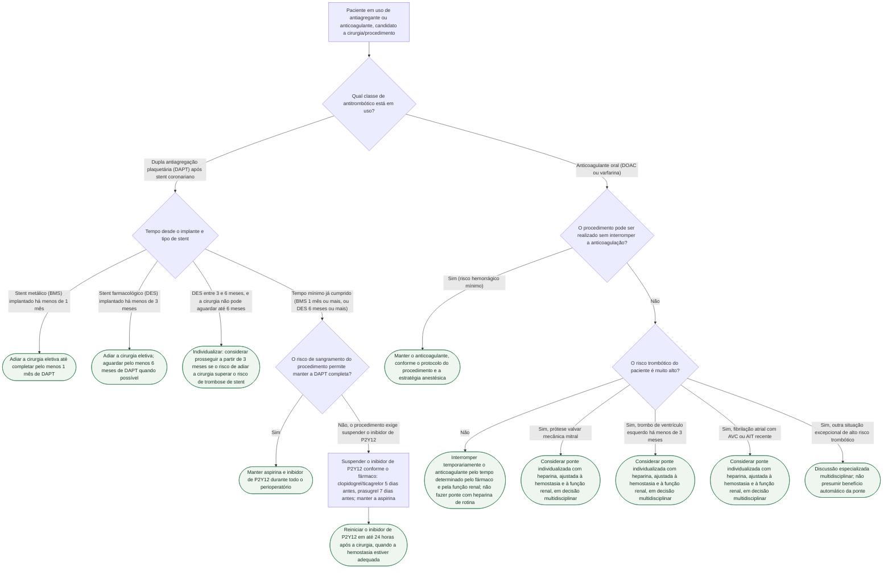

# Fluxograma: manejo perioperatório de antiagregantes (DAPT/stent) e anticoagulantes orais

Duas perguntas diferentes se escondem sob "o que fazer com o sangue fino antes da cirurgia": uma é sobre **dupla antiagregação plaquetária depois de stent coronariano**, onde o prazo mínimo protege contra trombose de stent; a outra é sobre **anticoagulante oral crônico**, onde a decisão central não é *se* suspender, mas *se vale a pena fazer ponte* com heparina durante a suspensão. As duas exigem árvores próprias, porque misturá-las nivela riscos que não são comparáveis.

## Árvore de decisão

## O que a árvore não mostra

**Ponte com heparina não é sinônimo de segurança — na maioria dos pacientes ela soma sangramento sem reduzir tromboembolismo proporcionalmente.** A pergunta correta diante de um anticoagulante suspenso não é "o paciente usa anticoagulante, então precisa de ponte?", e sim se o risco trombótico durante os poucos dias sem cobertura é alto o bastante para justificar o risco hemorrágico adicional da heparina — na maioria dos pacientes comuns, a resposta é não.

**DOAC e varfarina não seguem o mesmo cronograma.** DOACs têm meia-vida relativamente curta e, em geral, não precisam de ponte em nenhum cenário; varfarina exige mais tempo para redução e recuperação do efeito. A função renal pesa sobretudo na duração do efeito de alguns DOACs, e procedimentos com anestesia neuraxial ou risco hemorrágico muito alto exigem cronograma específico — não existe uma janela universal aplicável a todos os anticoagulantes.

**Reinício pós-operatório depende sempre da hemostasia, em qualquer ramo desta árvore**: se a hemostasia não estiver adequada, adiar o reinício e reavaliar o sangramento antes de retomar qualquer antitrombótico.