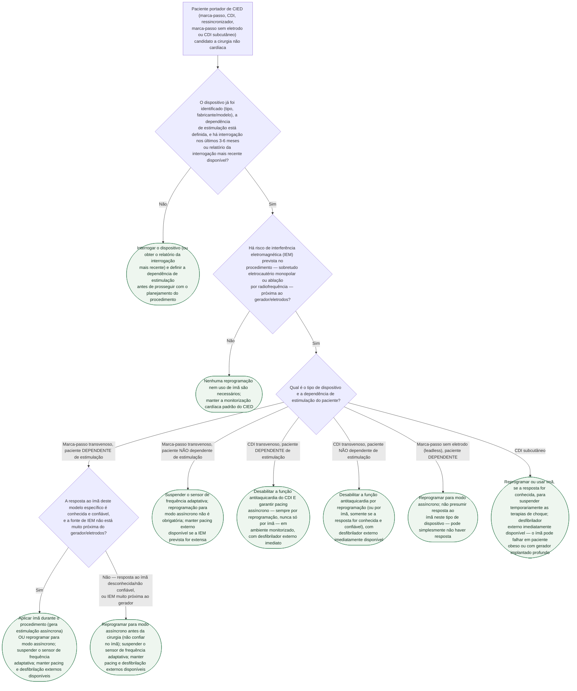

# Fluxograma: Manejo perioperatório de marca-passo, CDI e outros dispositivos cardíacos eletrônicos implantáveis (CIED)

Paciente com dispositivo cardíaco eletrônico implantável (DCEI/CIED — marca-passo, cardiodesfibrilador implantável, ressincronizador, marca-passo sem eletrodo ou CDI subcutâneo) precisa de um **plano do dispositivo** antes de cirurgia não cardíaca, não apenas de uma anotação "portador de MP/CDI". A principal ameaça não é o dispositivo falhar sozinho — é a interferência eletromagnética (IEM) gerada pelo próprio procedimento, sobretudo pelo eletrocautério monopolar, interagir com ele de forma imprevisível. A *Practice Advisory* 2020 da ASA detalha o preparo pré-operatório, a monitorização intraoperatória e a reavaliação pós-operatória; a diretriz AHA/ACC 2024 fecha o algoritmo de decisão por tipo de dispositivo e dependência de estimulação. A árvore abaixo integra as duas fontes.

## Árvore de decisão

## A regra que mais gera erro na prática: ímã em marca-passo não é o mesmo que ímã em CDI

- **Marca-passo**: a aplicação do ímã costuma iniciar estimulação assíncrona numa frequência fixa, com intervalo atrioventricular fixo — mas a resposta ao ímã é **programável**, e alguns marca-passos (inclusive alguns modelos sem eletrodo/leadless) têm resposta ao ímã diferente do esperado, ou nenhuma resposta. Não presumir a resposta sem confirmar contra o modelo específico.
- **CDI**: a aplicação do ímã **nunca** altera o modo de estimulação de um CDI — isso só acontece por reprogramação. O que o ímã faz num CDI, quando funciona, é suspender a terapia antitaquicardia (choque), não mudar o modo de estimulação. Em muitos CDIs não há forma confiável de confirmar que o ímã de fato suspendeu a terapia; em paciente obeso ou com gerador implantado profundo (CDI subcutâneo), a aplicação pode simplesmente falhar em provocar qualquer resposta.

## Monitorização, enquanto a alteração estiver em vigor

Monitorização e exibição contínua do eletrocardiograma do início da anestesia até a transferência do paciente para fora da sala, sem interrupção; oximetria de pulso e pulso periférico contínuos; equipamento de reserva (pacing e desfibrilação externos) imediatamente disponível antes, durante e depois de qualquer procedimento com potencial de IEM. Diante de interação inesperada e inexplicada entre o procedimento e o dispositivo, a conduta é **interromper o procedimento** até que a fonte de interferência seja eliminada ou controlada.

## Passo pós-operatório que vale para todo ramo em que houve reprogramação ou desabilitação de terapia

Qualquer alteração feita para o procedimento — modo assíncrono, terapia antitaquicardia desabilitada, sensor de frequência adaptativa suspenso — precisa ser **restaurada antes de o paciente sair para um ambiente sem monitorização contínua**. A ASA 2020 trata reprogramação pré-operatória e pós-operatória como duas pontas do mesmo processo, não etapas independentes; a falha em reativar a terapia de um CDI após a cirurgia já foi associada a mortes evitáveis. Reinterrogar o dispositivo é recomendado quando há indicação clínica — os gatilhos mais citados são cirurgia de urgência sem interrogação pré-operatória disponível, suspeita de alteração permanente causada pelo ímã ou de mau funcionamento do dispositivo, e IEM ocorrida em proximidade próxima ao gerador durante o procedimento.

## O que este documento não cobre

Ressonância magnética e radioterapia em portador de CIED têm corpo de evidência e recomendação próprios, fora do escopo deste fluxograma, que é estritamente sobre cirurgia não cardíaca com eletrocautério/ablação como principal fonte de interferência. A evidência de segurança de RM (registro MagnaSafe) está em documento próprio desta mesma pasta, `ressonancia-magnetica-em-portador-de-marca-passo-e-cdi-o-registro-magnasafe.md`.

## Regra prática

O magneto não é uma solução universal. O plano seguro depende de três perguntas — o paciente depende de pacing? haverá IEM relevante? o que exatamente este dispositivo faz quando recebe um magneto? — e de uma quarta, obrigatória depois: quem vai restaurar a programação antes da alta para ambiente não monitorizado?
